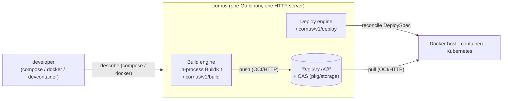
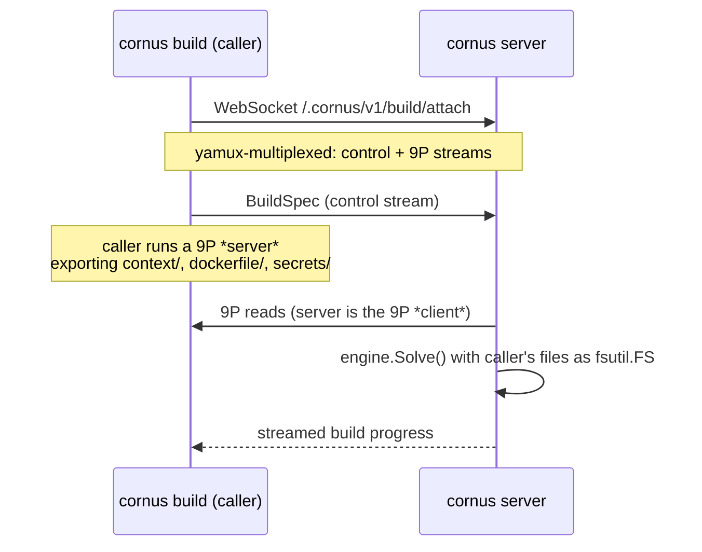
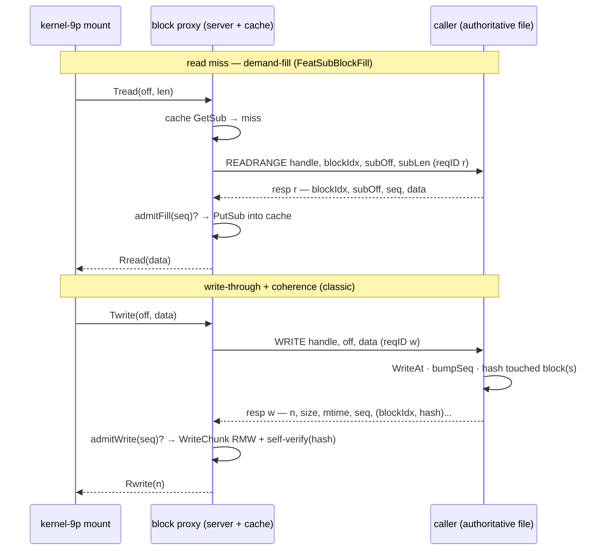

# Cornus Architecture

This document explains how Cornus is built and why. It is the canonical
architecture reference for the project; if you are here to *use* Cornus, start
with the [README](./README.md) instead.

Cornus is a **single Go binary** that bundles the three services an internal
platform team usually runs separately — a container registry, an image build
engine, and a deploy engine — into one process, so a small team can go from
`docker compose up` to a workload running on Kubernetes without standing up a
registry, a BuildKit daemon, and a GitOps controller of their own.

The rest of this document is organized top-down. Read [The big picture](#the-big-picture)
for the mental model, then dive into whichever subsystem you are working on.

- [The big picture](#the-big-picture)
- [Where everything lives](#where-everything-lives)
- [The server](#the-server)
- [Registry and content store](#registry-and-content-store)
- [Build engine](#build-engine)
- [Storage remoting: the wire transport and block protocol](#storage-remoting-the-wire-transport-and-block-protocol)
- [Deploy engine](#deploy-engine)
- [The workload-to-workload hub](#the-workload-to-workload-hub)
- [Docker-compatible clients](#docker-compatible-clients)
- [The local web UI](#the-local-web-ui)
- [Connection profiles and remote clusters](#connection-profiles-and-remote-clusters)
- [Security](#security)
- [Observability](#observability)
- [Testing and the E2E harness](#testing-and-the-e2e-harness)
- [Building and releasing](#building-and-releasing)
- [Running with the right privileges](#running-with-the-right-privileges)
- [Design decisions we have closed](#design-decisions-we-have-closed)

## The big picture

Cornus exists to carry a **Docker workflow — `docker compose`, the `docker` CLI,
devcontainers — all the way to a running workload on a Docker host, a containerd
host, a daemonless OCI-runtime host, or Kubernetes**, from one Go binary, without
the team first standing up a
registry, a `buildkitd`, and a GitOps controller of their own. The same
`compose.yaml` that runs locally is what ships to the cluster, and when the work
runs on a remote server the caller's files and secrets stay on the caller's
machine. That end-to-end path is the flow everything else serves. It has four
steps, and each is realized by a specific component:

1. **Describe.** The developer points a Docker-compatible client at a compose
   project or a deploy spec. `cornus compose`, the `docker` CLI frontend, and
   devcontainers all speak to a single client-side agent
   (`cmd/cornus/internal/clientagent`) that translates them into Cornus's
   `DeploySpec` / build requests (`pkg/api`) — so the `docker` / `compose`
   commands talk to Cornus directly rather than to a local Docker daemon.
2. **Build.** Source becomes an OCI image via an **in-process BuildKit solver**
   (`pkg/build/builder`) — the full `buildx` feature set (cache / secret / ssh
   mounts, named contexts, remote cache) with no separate `buildkitd`. A build
   can instead run on a remote Cornus server while the caller's directories,
   secrets, and SSH agents are streamed over **9P-on-WebSocket**
   (`pkg/build/buildwire` + `pkg/wire`), optionally lazily so only the bytes a
   build actually reads cross the wire.
3. **Publish.** The built image lands in a **tiny OCI Distribution v1.1 registry**
   (`pkg/registry`, `/v2/*`) backed by a persistent **content-addressable store**
   (`pkg/storage`) whose persistence is pluggable behind a minimal `ObjectStore`
   (filesystem, in-memory, S3, and behind a build tag GCS / Azure Blob). This is
   a waypoint the flow assumes — an image has to live somewhere addressable — not
   the point of the tool.
4. **Deploy and run.** One **`DeploySpec`** is imperatively reconciled onto
   whichever runtime you have by a pluggable **deploy engine** (`pkg/deploy`): a
   **dockerhost** REST backend, a native **containerd** backend with CNI bridge
   networking (no dockerd), a daemonless **bare** OCI-runtime backend, or a
   **client-go Kubernetes** backend, all behind one interface, with a shared host-privilege policy (`pkg/deploy/hostpolicy`) and
   network-driver injection. The target runtime — dockerd, containerd, an OCI runtime, or the kubelet — pulls the image from the registry over OCI and starts it. From
   there a per-pod **caretaker** sidecar (`pkg/caretaker`) wires client-local bind
   mounts, proxying, and DNS; a workload-to-workload **hub** overlay
   (`pkg/hub` / `pkg/kubehub`) gives services mTLS discovery of each other; and
   `exec`, `port-forward`, and public **tunnels** (`pkg/tunnel`) reach the running
   workload.


```mermaid
flowchart LR
    dev["developer\n(compose / docker / devcontainer)"]
    subgraph binary["cornus (one Go binary, one HTTP server)"]
        direction TB
        build["Build engine\nin-process BuildKit\n/.cornus/v1/build"]
        registry[("Registry /v2/*\n+ CAS (pkg/storage)")]
        deploy["Deploy engine\n/.cornus/v1/deploy"]
        build -- "push (OCI/HTTP)" --> registry
    end
    target["Docker host · containerd · Kubernetes"]
    dev -- "describe (compose / docker)" --> binary
    deploy -- "reconcile DeploySpec" --> target
    registry -- "pull (OCI/HTTP)" --> target
```

Two things this picture makes explicit that the storage-centric framing hid: the
deploy engine never handles image bytes — it hands the target a **reference** and
the target's own runtime pulls from the registry; and the three subsystems meet
over the **OCI HTTP protocol** (`/v2/*`), not through Go APIs, which is what lets
them evolve independently or be pointed at an external registry.

A few properties are worth internalizing before reading further, because they
recur everywhere:

- **One process, lazily assembled.** A single `http.ServeMux` fronts all three
  subsystems. The build engine and the deploy backend are constructed on first
  use, so the server starts cleanly even where no Docker host is reachable or the
  build engine cannot initialize.
- **Loose coupling over OCI, not Go.** The build and deploy engines never import
  the registry or its content store; they interact with it as ordinary OCI
  clients (push / pull over `/v2/*`). The content store is the registry's private
  backing store, not a substrate the other two reach into — which is why any of
  the three can evolve, or be pointed at an external registry, independently.
- **BuildKit is contained.** The build engine embeds BuildKit's solver in-process,
  but its heavy dependency tree is deliberately walled off. The deploy and wire
  transports link *zero* BuildKit packages, which is checked, not just intended.
- **Remote work streams over 9P-on-WebSocket.** Both remote builds and
  client-local bind mounts let a caller run work on a remote server while its
  files stay on the caller's machine, served on demand over a 9P filesystem
  tunneled through a single WebSocket.

## Where everything lives

The module layout mirrors the subsystem boundaries. Use this as a map for "where
do I go to change X."

```
# Binaries
cmd/cornus            kong CLI: serve / setup / config / build / push / deploy / exec / port-forward / socks5 / tunnel / ingress-tunnel / compose / web / daemon / hub / token / activity / observe / storage / health / version
cmd/cornus/internal/composecli   `cornus compose` command group
cmd/cornus/internal/webbff       shared value-returning operation core + HTTP BFF and MCP adapters
cmd/cornus/internal/clientagent  unified client-side background agent (one control socket; hosts compose projects + docker frontends)
cmd/cornus/internal/supervisor   in-house supervisor tree (isolated, restartable children; idle-exit)
cmd/cornus/internal/agentproc    daemon process lifecycle (discover/spawn/reuse/stop/state)
cmd/cornus/internal/clientconn   connection-profile resolver injected into every client command
cmd/cornus/internal/daemonize    `-d`/`--daemon` detached re-exec for the agent
cmd/cornus-e2e        Starlark E2E runner (separate dev-tooling binary)

# Server and shared types
pkg/server            unified HTTP server (/v2/*, /.cornus/v1/*, /healthz, /readyz)
pkg/api               shared request/response types (DeploySpec, DeployStatus, ...)
pkg/config            runtime config + on-disk layout (DataDir -> blobs/ repos/ uploads/ buildkit/)
pkg/authtoken         JWT claims + issuer shared by the token CLI and the server verifier
pkg/authscope         claim -> scope policy for JWTs cornus verifies but did not mint

# Registry
pkg/storage           sha256 CAS: blobs, chunked uploads, manifests + tags, catalog, GC
pkg/registry          OCI Distribution v1.1 /v2/* handlers (own implementation, persistent)

# Build subsystem
pkg/build/builder     in-process BuildKit solver + bufconn loopback client (linux)
pkg/build/builderctr  managed privileged builder container + real mount-capability probe
pkg/build/buildwire   remote build transport: 9P-over-WebSocket (caller dirs + secrets)
pkg/build/internal/lazyctx   lazy build-context image/manifest store

# Wire transports (BuildKit-free)
pkg/wire              WebSocket / yamux / tagged-stream primitives shared by attach transports
pkg/deploywire        remote deploy transport: deploy-attach sessions + client-local 9P mounts

# Deploy subsystem
pkg/deploy            Backend interface + helpers (labels, restart, replicas, stdio Bridge)
pkg/deploy/hostpolicy shared host-privilege policy (privileged / bind allowlist)
pkg/deploy/dockerhost Docker Engine REST backend (hand-rolled, no moby client)
pkg/deploy/containerdhost native containerd backend (containerd client + CNI bridge; linux)
pkg/deploy/barehost    daemonless OCI-runtime backend (runc/crun/youki direct; linux)
pkg/deploy/incushost   Incus backend (OCI app containers via the incus Go client; linux)
pkg/deploy/internal/hostrun daemon-agnostic host machinery shared by bare + containerd (spec/netns/hosts/volumes/CNI/stats; linux)
pkg/deploy/kubernetes client-go backend
pkg/deploy/kubernetes/internal/netdriver   network-driver injection
pkg/caretaker         per-pod sidecar runtime: mount, proxy, dns, hub roles
pkg/hub               workload-to-workload overlay: registry, relay, policy, discovery, mTLS
pkg/kubehub           Kubernetes-native hub Store backend (client-go; kept out of pkg/hub)
pkg/tunnel            public-tunnel provider seam (ngrok / ssh / cloudflare / tailscale), server-hosted

# Client surfaces
pkg/client            HTTP client for a cornus server's /.cornus/v1/* endpoints
pkg/compose           Compose file parser + translation to api.DeploySpec
pkg/devcontainer      devcontainer.json (JSONC) parser -> compose.Project + lifecycle hooks
pkg/dockerproxy       Docker Engine REST subset translated into deploy-attach sessions
pkg/attachsession     one deploy-attach hold (background-rooted, ready/self-exit); shared by dockerproxy + the client reconcile engine
pkg/portfwd           client-side port-forward engine: local listeners -> per-connection tunnels
pkg/clientconfig      kubeconfig-style connection profiles (contexts, TLS, port-forward, kube-auth)
pkg/svcforward        automatic SPDY port-forward to an in-cluster cornus Service
pkg/kubeauth          TokenRequest-minted, audience-scoped ServiceAccount credentials
pkg/kubefwd           client-side direct-to-pod port-forward dialer (server-proxy fallback)
pkg/kubeclient        shared kubeconfig load + cornus.app pod resolution
pkg/clientconduit     session conduit-mode seam (per-port forward or SOCKS5)
pkg/socks5            hand-rolled no-auth CONNECT SOCKS5 split-tunnel proxy
pkg/tokencache        short-lived client credentials kept between CLI runs (OS keyring, 0600 file fallback)
pkg/webui             embedded SolidJS distribution + SPA fallback handler

# Cross-cutting
pkg/logging           process-wide slog.Default setup
pkg/hostenv           in-container detection + host-path Mapper (identity when not translating)
pkg/hostcheck         startup/preflight verdict over what a containerized server can safely do
pkg/observability     OpenTelemetry setup (traces / metrics / logs) for the server + caretaker
pkg/e2e               Starlark E2E harness (builtins + Target abstraction)

# Packaging and fixtures
Dockerfile, deploy/k8s, deploy/helm/cornus   packaging
web                   SolidJS / Vite frontend, design system, browser tests, and mock BFF
.github/workflows     ci.yml (per-PR gate) + e2e.yml (full suite on main) + release.yml
LICENSE, NOTICE       Apache-2.0 + carry-forward notice
testdata              sample Dockerfile and demo.yaml
```

## The server

`pkg/server` is the one HTTP process. A single mux routes the registry under
`/v2/*`, the build and deploy APIs under `/.cornus/v1/*`, and liveness/readiness under
`/healthz` and `/readyz`. Because the build engine and deploy backend are built
lazily on first use, an operator can run a registry-only or deploy-only server
without the other subsystems' prerequisites being present.

The server is also where the operational guardrails live:

- **Readiness is real.** `/readyz` flips to serving via an `atomic.Bool` and back
  to 503 on shutdown; `/healthz` stays pure liveness.
- **Concurrency and serialization.** Builds run under a `CORNUS_BUILD_CONCURRENCY`
  semaphore (default `NumCPU`). Apply/delete for a given deployment name are
  serialized by a per-name mutex so two callers cannot race on the same workload.
- **Request-size caps.** The build-context tar is capped at 2 GiB
  (`CORNUS_MAX_BUILD_CONTEXT_BYTES`) and blob PUTs at 10 GiB (over-limit returns
  413 and aborts the upload session).
- **In-band build failures.** A build streams its output after the HTTP 200 has
  been sent, so a failure that happens mid-stream arrives as a `BUILD FAILED:`
  trailer in the body. Clients must scan the stream — the status code alone is not
  the source of truth.
- **Deploy-side stream errors are surfaced, not swallowed.** Logs, stats, and
  archive GET write their 200 lazily, on the backend's first output byte, so a
  failure before any output returns a real 4xx/5xx with an error body; an error
  after output has started is stamped into the `X-Cornus-Stream-Error` HTTP
  trailer, which `pkg/client` checks after EOF while still delivering the partial
  bytes. (The Docker API proxy deliberately skips the trailer — the docker CLI
  ignores HTTP trailers.)
- **Fail-closed config.** Malformed policy environment
  (`CORNUS_API_POLICY`, `CORNUS_HUB_POLICY`, `CORNUS_HUB_REGISTER_POLICY`) is a
  hard startup error, never fail-open.

Shutdown closes the lazily-built engine and deploy backend, releasing the
BuildKit data-dir lock.

## Registry and content store

The registry is split in two: **`pkg/storage`** owns the content-addressable
store and all registry semantics, and **`pkg/registry`** is a thin set of
OCI-protocol HTTP handlers on top.

The `/v2/*` handlers are written directly against the CAS rather than reusing
go-containerregistry's in-memory `pkg/registry` — that package keeps manifests
in memory only, and Cornus's registry must persist across restarts.
go-containerregistry is still used on the *client* side (`crane`, `remote`).

The supported surface is a practical subset of OCI Distribution v1.1: ping, blob
HEAD/GET (with `Range` support), monolithic/chunked/cross-repo-mount blob upload,
blob and manifest delete (manifests by digest only), manifest PUT/GET, paginated
tags and `_catalog` listing, and the Referrers API.

### Pluggable persistence

Persistence is a plugin point, and the abstraction is deliberately tiny. A
backend implements only a minimal `ObjectStore` (`Get`/`Put`/`Stat`/`Delete`/
`List`/`Close`, all context-threaded). *Every* registry semantic — sha256
addressing, digest verification, resumable upload staging, manifest/tag/repo
indexing — lives once in the `Backend` layer (`pkg/storage/cas.go`) above that
interface. The content-addressed key layout is:

```
blobs/sha256/<aa>/<hex>          blob content
repos/<repo>/manifests/<hex>     value = media type
repos/<repo>/tags/<tag>          value = digest
```

Two backends ship. `filesystem.go` is the native, zero-dependency default.
`blob.go` wraps a gocloud `*blob.Bucket`, giving `mem://`, `s3://`, and — only in
a `-tags cloudblob` build, because those drivers pull in the Google/Azure SDKs —
`gs://` and `azblob://`. `open.go` routes a storage ref (bare path, `file://`,
`mem://`, `s3://...`) to a backend; S3-compatible servers such as MinIO get an
explicit aws-sdk-go-v2 client with a custom endpoint and path-style addressing.
Select it with `cornus serve --storage <ref>` / `CORNUS_STORAGE`; empty defaults
to the on-disk `DataDir` layout.

**Resumable uploads are capability-based.** A backend that implements
`NativeUploader` handles the OCI PATCH/PUT upload flow natively; others fall back
to local staging. The filesystem backend appends to a session file and commits by
renaming into the blob path. The S3 backend is the interesting case: each OCI
PATCH is a separate HTTP request, so *all* upload state must live server-side.
Parts stream into an S3 multipart upload, and a JSON sidecar carries the part
ETags, the sub-5-MiB pending tail, and the running sha256 state (via
`encoding.BinaryMarshaler`) — keeping local staging at O(<5 MiB) regardless of
blob size.

### Miss fallbacks: pull-through mirror and local-store re-export

A `/v2/*` manifest/blob miss can fall through to a read-only **source** rather than
returning 404. All sources share one seam (`imageSource` in `pkg/registry`): the
handler tries the local store first, then the configured source. Three sources
ship, mutually exclusive:

- **Pull-through mirror** (`CORNUS_REGISTRY_MIRROR=<host>`, `mirror.go`). The miss
  is fetched from an upstream OCI registry (via go-containerregistry `remote`) and
  served; with `CORNUS_REGISTRY_MIRROR_CACHE` (default on) it is also persisted
  into the CAS, so later pulls resolve locally.
- **Local-store re-export** (`CORNUS_REGISTRY_SOURCE=host-native`, resolved per
  backend). This is the **default on a host backend**: the image already lives in
  the backend's own store, so a separate cornus registry is redundant. host-native
  makes `/v2/*` a *view* over that store:
  - under `dockerhost` (`daemon_source.go`) a miss is fetched with `docker save`
    (`GET /images/{ref}/get`) and reconstructed into an OCI-consistent image with
    go-containerregistry's `tarball` package (the hand-rolled Docker REST client
    avoids the moby-client dependency, and the pinned `docker/docker` is too old
    for go-containerregistry's `daemon` package). A server-routed build lands in
    the daemon via a docker-archive exporter piped into `POST /images/load` instead
    of a push, and a deploy skips the pull when the daemon already has the image
    (avoiding a self-pull round-trip).
  - under `containerd` (`containerd_store_linux.go`) it backs `/v2/*` with the host
    containerd's native content store and image service **directly, read-write**
    (`registry.Store`, not the read-only `imageSource` seam) — a push writes blobs
    into the content store (by digest, with the containerd GC-ref labels) and
    records the tagged image, and a pull reads them back. So a `cornus build` that
    pushes to `/v2/*` imports straight into the store the deploy backend runs from;
    no build-worker configuration is needed. Blobs are already digest-addressable,
    so digests are preserved (unlike the docker-save path).

With no `--storage`, host-native keeps **no separate CAS** (the registry's `store`
is the local runtime's, or nil for docker-daemon): `_catalog`/tags reflect only the
local store, and GC is a no-op (lifecycle is `docker image prune`). The docker-daemon
view is **read-only** — an in-process `/v2/*` push would 405, so `cornus build`
routes through the server (which docker-loads) — and its `docker save` recomputes
digests, so pull by tag. The containerd view is read-write, so pushes work directly.
To keep a classic push-able CAS set `CORNUS_REGISTRY_SOURCE=off`, or pass an explicit
`--storage` for a union CAS+source view; a mirror or a non-host backend
(`bare`/`kubernetes`) keeps the classic CAS too. These modes are for local
development, not a shared high-fanout registry.

### Garbage collection and crash-safety

Storage GC is on-demand mark-and-sweep (`pkg/storage/gc.go`). Roots are every
repo's tags plus manifest markers; the mark phase parses manifests and indexes
(config, layers, nested `manifests[]`, `subject`); the sweep removes unreachable
blobs. `POST /.cornus/v1/gc` triggers it (gated on the `gc` policy action) and also
prunes the build engine's local cache on a 7-day TTL. Setting
`CORNUS_GC_INTERVAL` (a Go duration) additionally runs the same GC periodically
in the background: unset disables it entirely (no goroutine, no ticker), while
a malformed or non-positive value is a hard startup error — a typo'd schedule
must not silently disable reclamation. With more than one replica,
`CORNUS_GC_LEASE` (`kube`, `kube:<name>`, or `kube:<ns>/<name>`) gates each tick
behind a per-tick compare-and-swap on a `coordination.k8s.io` Lease, so replicas
never sweep concurrently — a refused acquire just skips the tick (a missed sweep
beats a concurrent one). It requires `CORNUS_GC_INTERVAL` and is fail-closed on
misconfiguration. Stale upload staging is swept at startup on a 24h TTL.

No repair pass is needed after a crash because `PutManifest` writes in
dependency order — **blob, then manifest marker, then tag** — so a crash leaves
at worst a GC-reclaimable orphan, never a tag pointing at missing data.

## Build engine

### The in-process solver

`pkg/build/builder/engine_linux.go` embeds BuildKit's solver in-process,
mirroring what `buildkitd` does in `newController` but dropping its OTEL/tracing.
The wiring runs `worker/runc.NewWorkerOpt` -> `base.NewWorker` ->
`worker.Controller`, registers the `dockerfile.v0` and `gateway.v0` frontends,
and stands the controller up on a `grpc.Server` bound to an in-memory `bufconn`
listener.

The clever part: the engine then drives that controller with BuildKit's **own**
`client.New(..., WithContextDialer(bufconn))`. Reusing the real client means all
of BuildKit's client-side machinery — sessions, secret and auth providers,
filesync, exporters — works unchanged, so cache mounts and secret mounts need
zero reimplementation. BuildKit is pinned at `github.com/moby/buildkit@v0.18.2`.
A non-Linux stub returns `ErrUnsupported`.

The worker is selectable. The default is the runc worker above;
`CORNUS_BUILD_WORKER=containerd` swaps in BuildKit's **containerd worker**
(`worker/containerd`), which delegates snapshots and content to a host
containerd at `CORNUS_CONTAINERD_ADDRESS` in namespace
`CORNUS_CONTAINERD_NAMESPACE` (default `cornus` — deliberately the same
namespace the containerd deploy backend manages) with snapshotter
`CORNUS_CONTAINERD_SNAPSHOTTER` (default `overlayfs`). Because the worker sets
its ImageStore to containerd's image service, a tagged build lands in the host
containerd's image store *in addition to* the registry push — so a subsequent
containerd-backend deploy of that image needs no registry round trip.
Everything downstream of `base.NewWorker` (controller, frontends, GC policy,
`engine.lock`) is worker-agnostic and unchanged. Lazy builds
(`--lazy` / `CORNUS_LAZY_BUILD`) are **not supported** on the containerd worker
— the lazy plumbing injects a snapshotter wrapper that only exists on the runc
path — and are rejected with a clear error rather than silently degraded.

The engine is a **process singleton per data dir**: `builder.New` takes a
non-blocking flock on `<data-dir>/engine.lock` and fails fast, because BuildKit's
boltdb has no lock timeout and two engines on one data dir would deadlock
silently.

Both local builds and remote builds funnel through a single seam,
`engine.Solve(SolveInput)`, which assembles the `SolveOpt` from pluggable
`fsutil.FS` mounts plus an optional secret store. Those are cross-platform
interfaces, so the remote *client* path links no BuildKit and works from any OS.
Per-build behavior — cache-key remapping, lazy routing, frontend attributes —
lives once in this seam.

### Privileged builder delegation

The server does not equate uid 0 with BuildKit capability. Before selecting the
local engine it probes a real bind mount (`builderctr.CanMount`), because a root
process can still be blocked by its container or seccomp policy and a rootless
user-namespace process can be capable. When the probe fails,
`pkg/server.resolveBuilder` uses an explicit `CORNUS_BUILDER_URL`, or — when
automatic delegation and a local Docker runtime are available — lazily starts or
adopts a managed privileged builder through `pkg/build/builderctr`.

Delegation introduces no second build protocol. The server streams
`POST /.cornus/v1/build` to the upstream builder and raw-splices the authenticated
build-attach WebSocket before its yamux handshake, so the existing control, 9P,
secret, and SSH-agent streams pass through unchanged. The managed helper is
supervised, uses host networking, keeps its cache in a dedicated volume, and by
default builds its image around the currently running executable. That preserves
the server's exact version and build tags without requiring a separately published
builder artifact. It also receives the delegating server's resolved registry
export mode; a builder must not try to push into the read-only Docker-daemon view
that the server itself would populate with `docker load`.

### Remote builds over 9P

A build can run on a remote Cornus server using the **caller's** directories and
secrets, the way `docker buildx` drives a remote `buildkitd` — except the whole
file transport is tunneled over one WebSocket.


```mermaid
sequenceDiagram
    participant C as cornus build (caller)
    participant S as cornus server
    C->>S: WebSocket /.cornus/v1/build/attach
    Note over C,S: yamux-multiplexed: control + 9P streams
    C->>S: BuildSpec (control stream)
    Note over C: caller runs a 9P *server*<br/>exporting context/, dockerfile/, secrets/
    S->>C: 9P reads (server is the 9P *client*)
    S->>S: engine.Solve() with caller's files as fsutil.FS
    S-->>C: streamed build progress
```

`cornus build --builder ws://host/.cornus/v1/build/attach` opens the WebSocket,
multiplexes it with **yamux** into a control stream and a **9P** stream, and
serves the caller's files as a 9P server (`github.com/hugelgupf/p9`). The server
is the 9P *client*: it wraps each subtree as an `fsutil.FS` fed to BuildKit's
`LocalMounts`, plus a secret store for `RUN --mount=type=secret`, and runs the
in-process solver. The caller never has to be reachable, the build stays
BuildKit-native, and **caches stay on the server**.

**This is a trust boundary, and it is treated as one** (`confinedfs.go`). The
server is a 9P client sending arbitrary walk/open/create ops, and raw `localfs`
does *not* confine it — it would follow `..`, follow symlinks out of the tree,
and allow writes. So every exported subtree is wrapped in a `confinedAttacher`
that:

1. rejects `..`, path separators, and non-single-element walk components;
2. confines symlinks — a final-component symlink is transmitted *as* a symlink
   (docker-parity; it resolves harmlessly container-side) but reading or walking
   *through* a symlink that escapes root is denied; and
3. refuses all mutating operations — the export is strictly read-only.

The context and each named context additionally honor **`.dockerignore`**, so
ignored files (`.git`, secrets, `node_modules`) never leave the caller's machine.
Net posture: `cornus build --builder` grants the remote builder read-only access
to exactly the context, dockerfile, and named-context directories, with no
traversal outside them.

**SSH agent forwarding** (`RUN --mount=type=ssh`) rides the same session: the
server stands up a temp unix socket per declared id, points BuildKit's
`sshprovider` at it, and tunnels each connection back over a new yamux stream to
the caller's local `$SSH_AUTH_SOCK`.

### Build caches

The `inline`, `registry`, and `local` remote-cache backends are exposed via
`--cache-to`/`--cache-from` (buildx syntax) on both local and remote builds.

`type=local` caches get special treatment. BuildKit resolves a local cache's
`dest=`/`src=` to a real directory on whichever process runs the solve — the
*server*, for a remote build. Rather than force the caller to know a server-side
path, the engine treats that value as an opaque **key** and maps it to
`<Root>/localcache/<key>` (path-traversal confined), auto-deriving the key from
the target image's repository when it is omitted.

### Lazy build contexts

A large `--build-context` directory can be served to the build **on demand**
rather than eagerly synced. Measured: a 20 MB context whose build reads 11 bytes
transfers 11 bytes over the wire. BuildKit's laziness is snapshotter-level, not
source-level, so three cooperating mechanisms are all required (no BuildKit fork —
every seam is public). Opt in with `cornus build --lazy`.

1. **An image-shaped source.** The named context is routed as
   `context:<name>=oci-layout://` backed by a session-attached content store; the
   layer digest is a deterministic metadata manifest of the tree, and the layer
   blob never materializes.
2. **A remote snapshotter named `"stargz"`.** The name is load-bearing — it is
   BuildKit's only gate into the label-carrying skip-extract path. On a lazy layer
   it registers a committed snapshot and returns `ErrAlreadyExists` so extraction
   is skipped; the backing is a host bind locally, or a kernel-9p mount proxied
   over yamux to the caller remotely. Because the name routes *all* layers through
   this path, ordinary layers fall back cleanly.
3. **A contenthash pre-seed.** The RUN cache key for a read-only bind mount is
   normally computed by walking every file over the backing. Instead the caller
   computes per-file digests locally and writes them into BuildKit's cache context
   before the solve, so the scan is skipped and only RUN-touched files cross the
   wire.

The manifest, the per-file digests, and the 9P export must apply the *identical*
`.dockerignore` predicate or the seed mismatches the mount. The snapshotter
wrapper is a verified no-op for ordinary builds; lazy is a per-build routing
decision.

## Storage remoting: the wire transport and block protocol

Everywhere Cornus runs work on one machine using files that live on another —
[remote builds](#remote-builds-over-9p), [lazy build contexts](#lazy-build-contexts),
and [client-local bind mounts](#client-local-bind-mounts) — the same substrate
carries the bytes. "Storage remoting" here is *filesystem* remoting, not blob
remoting: what crosses the wire is a POSIX subtree served over 9P (and, for the
writable-cached case, a bespoke block protocol), never CAS objects. The content
store (`pkg/storage`) is reached only as an OCI client over `/v2/*`, as
[the big picture](#the-big-picture) notes; it is not what this section is about.

This section documents the shared machinery the build and deploy sections above
and below stand on: the multiplexed transport (`pkg/wire`), the three ways a mount
is served, the block protocol, and the server-side block cache
(`pkg/blockcache`). The transport is **BuildKit-free by construction** — verified
via `go list -deps` — so `pkg/deploywire` and `pkg/dockerproxy` link it without
dragging in the solver's dependency tree.

### The transport: one WebSocket, yamux, tagged streams

Every remote session — a build, a deploy-attach, a caretaker connection — is a
**single WebSocket** (`github.com/coder/websocket`, binary frames, 64 MiB read
limit) carrying a **yamux** session multiplexed into independent streams. Each
stream begins with a **1-byte tag** written before any payload
(`wire.openTagged` / `wire.acceptTagged`), which names the stream's role:

| Tag | Role |
|-----|------|
| `C` | control — the session spec goes out, progress/status comes back (newline-delimited JSON) |
| `9` | eager 9P export (build only): context, dockerfile, secrets |
| `L` | on-demand 9P backing: one stream per lazy context / per client-local mount |
| `b` | writable, cache-coherent **block-protocol** backing |
| `M` | caretaker mount relay (one per pod-local mount) |
| `S` | SSH-agent forwarding (build `RUN --mount=type=ssh`) |
| `K`/`k`, `E`/`e`, `F`, `A`, `D`/`I` | credential, egress, port-forward, agent-relay, and hub streams (see the [caretaker](#the-caretaker-sidecar) and [hub](#the-workload-to-workload-hub) sections) |
| `S` (caretaker) | structured filesystem operation on a pod's volumes — one stream per op, server-initiated like `F` (see [the local web UI](#the-local-web-ui)) |

The invariant that makes this legible is fixed for every consumer: **the caller
is the 9P server (it exports its own local files) and the Cornus server is the 9P
client** (`github.com/hugelgupf/p9`). The machine that *has* the files serves
them; the machine that *needs* them (the BuildKit solver, or a container runtime
via a kernel-9p mount) reads them. When a NAT'd caller cannot be dialed directly,
the Cornus server is the [rendezvous](#client-local-bind-mounts): the pod's
caretaker dials one pod-scoped connection and the server bridges each `M` stream
to a fresh `L`/`b` backing on the caller.

**QoS matters because bulk file data and latency-sensitive control share the
pipe.** Cornus ships a **forked yamux** (`third_party/yamux`) whose scheduler
maps each tag to a send class (`wire.streamClassForTag`): control is `ClassHigh`
(a heavy weighted-round-robin share), the file backings `L`/`M`/`b` are
`ClassBulk` (they yield to control and share fairly among themselves), everything
else is `ClassNormal`; yamux's own session frames (window updates, FIN, ping) are
`ClassUrgent`, always ahead of data. Data frames are capped at 128 KiB so a bulk
mount cannot monopolize the send loop. The stream window is raised from yamux's
256 KiB default to 16 MiB so several 1 MiB blocks are in flight per stream (the
default would drip a 1 MiB frame through ~4 window refills, erasing the cache's
throughput win), and the send path is a batched, pipelined mode
(`SendBatchedPipelined`, `PipelineDepth 4`) that issues one `conn.Write` per
frame. A real-TCP A/B (`pkg/wire/qosab`) measured a large single-stream
throughput win (clean-LAN +141%) with equal-or-better control latency under bulk
saturation and ~46% fewer allocations. UDP flows (the [hub](#the-workload-to-workload-hub))
ride a 2-byte length-prefixed datagram framing (`wire.WriteDatagram` /
`ReadDatagram`) so message boundaries survive the byte-stream relay.

### Three ways to serve a mount

The 9P backing is a **unix socket the server stands up for the kernel-9p client
to mount** (`trans=unix,version=9p2000.L,msize=1048576`); each kernel connection
to it is tunneled over a fresh tagged yamux stream to the caller
(`wire.backing9PSocket` / `tunnel9P`). How that tunnel is served is chosen
per mount by the mount's declared properties (`deploywire.LocalMount`,
`api.Mount`):

1. **Blind pipe** (default, and any writable-uncached mount). The server splices
   raw 9P frames between the kernel mount and the caller's export — no
   interpretation. A read-write mount uses the caller's *writable* confined
   export so container writes land back in the caller's directory.
2. **Read-only caching proxy** (`Immutable && ReadOnly`; `wire.ServeCachingProxy`).
   The server **terminates 9P in a userspace `p9.Server`** answering the kernel,
   while a `p9.Client` speaks to the caller, and file reads are served from the
   server-side **block cache** so a chunk pulled once is never re-fetched over the
   WebSocket — across reads, across mounts, and across server restarts. This is
   the path immutable build contexts and immutable deploy mounts take; the 9P
   client `msize`, the cache chunk, and the kernel `msize` are all 1 MiB so one
   kernel read maps to one chunk. Opt in with `--local-mount SRC:DST:ro` on a
   mount the caller flags immutable.
3. **Writable block proxy** (`AsyncCached && !ReadOnly`; `wire.ServeBlockProxy`).
   The server still terminates kernel-9p in a userspace `p9.Server`, but instead
   of tunneling 9P to the caller it speaks the **block protocol** (below) — a
   block-indexed, hash-inline protocol that keeps a *writable* server-side cache
   coherent with the caller's authoritative file. Pair it with a `cache=mmap`
   kernel mount (async writeback). This is aimed at database-shaped workloads on a
   client-served directory, where blind-piped 9P would be punishingly chatty.

In every mode the caller endpoint reuses the [same confinement guard as a
build](#remote-builds-over-9p) (`wire.confinedfs`): the untrusted 9P/block *client*
cannot escape the export root via `..` or symlinks, and read-only exports refuse
all mutating ops.

### The block protocol

The block protocol (`pkg/wire/blockproto.go`, `blockmsg.go`, `blockserver.go`,
`blockproxy.go`) is Cornus's own binary file-I/O protocol on the
**server↔caller** hop for writable, cache-coherent mounts (the `b` backing). It
replaces tunneling 9P over the muxed stream: the server keeps a userspace
`p9.Server` toward the kernel mount but speaks *this* protocol to the caller, who
remains the authoritative file owner. Its data path is **block-indexed** (a block
is the cache chunk, 1 MiB by default) and carries a per-block **xxh3 content
hash** plus a **per-file write sequence** inline on every read and write, so
read-cache coherence needs no separate side channel.

- **Framing.** A `u32` big-endian length prefix, then a fixed 12-byte header —
  `op(1) flags(1) reserved(2) reqID(8)` — then the payload. Requests flow
  server→caller; a response echoes its `reqID` and may span several frames, the
  last carrying `flagFinal`. `flagErr` marks a payload that is a `u32` Linux
  errno (mapped through `p9/linux`); `flagEOF` marks an errno-free end of file.
- **Ops.** Metadata ops (`opWalk`, `opGetAttr`, `opOpen`, `opCreate`,
  `opReaddir`, `opClunk`, …) mirror the `p9.File` surface the kernel front-end
  drives. The block-native core is `opRead` / `opWrite` / `opStatBlock` (whole
  blocks, hash+seq inline) and `opReadRange` (a sub-block-aligned demand-fill
  read).
- **HELLO negotiation.** The one versioned handshake. Each side sends
  `helloParams{version, chunkSize, maxInflight, features}`; the proxy sends then
  reads, the caller reads then sends (role-split so a synchronous transport never
  deadlocks). **Version and chunk size must match exactly.** The feature set is
  intersected (`local & peer`), so a peer that predates a feature bit transparently
  keeps the classic full-block path.
- **Full-duplex mux.** The proxy drives many requests concurrently over one
  stream, matched by `reqID` with out-of-order completion, bounded by an
  in-flight semaphore (`blockMaxInflight = 64`). A `cancelConn` around the
  kernel-facing socket trips the mount context on unmount, releasing any request
  parked on an unresponsive caller so the `p9.Server` can drain.
- **Caller side** (`ServeBlockServer`): services requests against the confined
  writable export, computing each block's xxh3 hash and bumping the per-file
  write sequence inline. Reads and writes run bounded-concurrent (16 each);
  `fsync`/`setattr` first drain in-flight writes as an ordering barrier.
- **Proxy side** (`ServeBlockProxy`): `ReadAt` serves from the cache and
  miss-fills over the protocol; `WriteAt` writes through to the caller and then
  reconciles the cache. **The proxy is the coherence authority**: a per-file
  `blockSeqTable` gates every cache write/fill by the caller-assigned write
  sequence, so out-of-order responses converge to the latest write and a stale
  fetch never overwrites a newer write. A block whose cached base is contradicted
  by the caller's authoritative hash is dropped and re-filled, never mis-served.

Three optional **coherence features** trade the classic scheme's cost (a 1 MiB
read-back + hash on every small write) for cheaper ones without changing the
1 MiB transfer/addressing unit, negotiated only when *both* endpoints advertise
them:

- **`FeatSubBlockHash`** hashes only the touched 4 KiB sub-blocks of a write — a
  4 KiB DB-page write costs a 4 KiB read+hash, not 1 MiB.
- **`FeatDeferHash`** defers coherence hashing from every write to the next
  `fsync`: writes go through unhashed and the caller hashes each dirty unit once
  at fsync, reconciling the cache in a batch.
- **`FeatSubBlockFill`** makes read misses fetch only the touched sub-block range
  (`opReadRange`) instead of a whole 1 MiB block, tracking presence per
  sub-block; it implies `FeatSubBlockHash`. A background, bounded, single-flighted
  **speculative prefetcher** grows an adaptive window on sequential access (capped
  by readahead) and stays at pure demand on random access.

Operators tune this per deployment via `CORNUS_BLOCK_COHERENCE`
(comma-separated `subhash`, `defer`, `subfill`) and `CORNUS_BLOCK_READAHEAD`
(prefetch cap, proxy-side only) — set on **both** the server and the deploy
caller, or negotiation silently intersects the feature away. The database
starting point is `CORNUS_BLOCK_COHERENCE=subhash,subfill` with
`CORNUS_BLOCK_READAHEAD=64k`: measured, this cut a cold random SQLite scan's read
amplification from ~36x (1 MiB block per point query) to ~7 KiB/query, and a
2 ms-link scan from ~16.9 s to ~0.62 s. TCP head-of-line blocking under packet
loss is the remaining ceiling the block protocol cannot address — it would need a
lower-layer transport change (e.g. QUIC).

**Frame layout on the wire.** Every frame is a length-prefixed fixed header
followed by an op-specific payload. All integers are big-endian; a payload is a
cursor-encoded run of scalars, length-prefixed `blob`s (`u32` length + bytes),
and `str`s (encoded like a blob).

```
Frame
  u32  length        = 12 + len(payload)
  u8   op            opHello · opRead · opWrite · opReadRange · opBlockResp · ...
  u8   flags         bit0 FINAL · bit1 ERR (payload = u32 errno) · bit2 EOF
  u16  reserved      0
  u64  reqID         request id; every response frame echoes it
  ..   payload       op-specific (below)

HELLO payload (opHello, sent by both ends; proxy writes first, caller reads first)
  u16  version       blockProtoVersion = 1        (must match exactly)
  u32  chunkSize     block size, e.g. 1 MiB       (must match exactly)
  u16  maxInflight   64
  u32  features      SubBlockHash|DeferHash|SubBlockFill; effective set = local AND peer
```

The block-native data ops, request over response (`seq` is the caller's per-file
write sequence, `hash` is the block's xxh3):

```
READ       req   u64 handle · u64 blockIdx · u32 nBlocks
                 one response frame per block, streamed; FINAL on the last,
                 EOF once end-of-file is reached
           resp  u64 blockIdx · u64 seq · u64 hash · blob data

READRANGE  req   u64 handle · u64 blockIdx · u32 subOff · u32 subLen
                 demand-fill: only [subOff, subOff+subLen) within one block
           resp  u64 blockIdx · u32 subOff · u64 seq · blob data

WRITE      req   u64 handle · u64 off · blob data
           resp  u32 n · u64 size · u64 mtimeNs · u64 seq · <coherence tail>
             tail, by negotiated feature:
               classic       u16 count · count x ( u64 blockIdx · u64 hash )
               subblock-hash u16 count · count x ( u64 blockIdx · u32 subOff · u32 subLen · u64 hash )
               defer-hash    u16 0        no inline hashes; reconciled at FSYNC

FSYNC      req   u64 handle
           resp  empty                    classic / sub-block modes
                 under defer-hash: streamed dirty-unit frames, FINAL on the last:
                 u16 count · count x ( u64 blockIdx · u32 subOff · u32 subLen · u64 hash )
```

Metadata ops (`opWalk`, `opGetAttr`, `opOpen`, `opCreate`, `opReaddir`, …) carry
the corresponding `p9.File` arguments and results through the same `reqID`-matched
framing; their `QID` / `Attr` / `Dirent` codecs (`blockmsg.go`) are shared by both
endpoints so the two encodings cannot drift.

**A read miss and a write, end to end.** Both ride the same request mux; the
proxy is the coherence authority when the response lands — `seq` gates the cache
mutation and `hash` verifies it.


```mermaid
sequenceDiagram
    participant K as kernel-9p mount
    participant P as block proxy (server + cache)
    participant C as caller (authoritative file)
    Note over K,C: read miss — demand-fill (FeatSubBlockFill)
    K->>P: Tread(off, len)
    P->>P: cache GetSub → miss
    P->>C: READRANGE handle, blockIdx, subOff, subLen  (reqID r)
    C-->>P: resp r — blockIdx, subOff, seq, data
    P->>P: admitFill(seq)? → PutSub into cache
    P-->>K: Rread(data)
    Note over K,C: write-through + coherence (classic)
    K->>P: Twrite(off, data)
    P->>C: WRITE handle, off, data  (reqID w)
    C->>C: WriteAt · bumpSeq · hash touched block(s)
    C-->>P: resp w — n, size, mtime, seq, (blockIdx, hash)...
    P->>P: admitWrite(seq)? → WriteChunk RMW + self-verify(hash)
    P-->>K: Rwrite(n)
```

### The server-side block cache

Both cached modes share `pkg/blockcache`: a per-file, fixed-chunk (1 MiB) cache
behind a pluggable `Store` — an on-disk sparse-file store (`NewDiskStore`, the
default, survives restarts) or an in-memory `MemStore` for tests — with an aging
`Prune`. A cache entry is a `FileID` with **two identity policies** sharing one
key format:

- **Read-only (content-version).** `Size` and `MTimeNs` are part of the key, so
  any change to the origin file yields a *new* entry and stale chunks are never
  served — they simply age out. This is the immutable-context / build-context
  model behind the caching proxy.
- **Writable (stable-bucket).** `Size`/`MTimeNs` are zeroed out of the key, so
  the `(Mount, Path)` bucket is stable for the life of the path and a file's
  blocks are shared across its versions. Validity is judged **per block** by the
  stored xxh3 hash plus the session write sequence and an open-time size+mtime
  hint — the model the block protocol needs, where a file is mutated in place.
  `Mount` is deployment-scoped so distinct workloads never share a bucket.

The writable store additionally tracks per-sub-block presence bitmaps (for
demand-fill), and its `WriteChunk` does a read-modify-write with a self-verify:
if a partial write's resulting local hash disagrees with the caller's
authoritative hash, the base diverged and the chunk is dropped rather than
storing wrong bytes. The in-process `pkg/wire/sqliteab` harness
(SQLite → 9P VFS → block proxy → yamux → block server) is the durable instrument
that validates every feature combination on both stores under `-race`.

**On-disk layout.** `DiskStore` (`pkg/blockcache/diskstore.go`) keeps each cached
file as a **sparse data file plus a JSON sidecar index**, sharded by the first two
hex chars of the key to bound directory fan-out:

```
<file-cache-dir>/
  <aa>/
    <key>.data    sparse; ftruncated to the entry length. chunk idx lives
                  verbatim at byte offset idx*chunkSize (a hole = not yet filled)
    <key>.idx     JSON sidecar (below). the presence bitmap — not the file's
                  apparent size — is the authority for which chunks are populated

key = FileID.Key() = sha256_hex( mount, path, size, mtime, writable )   NUL-separated
      writable buckets hash size=mtime=0, so the key is stable across a path's versions
```

The sidecar (`diskIndex`) is the staleness validator plus the presence and hash
metadata (Go marshals each `[]byte` bitmap as base64):

```
{
  "size": <int>, "mtime_ns": <int>,   // read-only: id echo (validator); writable: 0/0
  "writable": <bool>,
  "cur_size": <int>,                  // backing length (the ftruncate target)
  "chunk_size": <int>,                // must equal the store's chunk size, else stale
  "bitmap":     "<base64>",           // 1 bit per CHUNK — whole 1 MiB chunk present
  "sub_bitmap": "<base64>",           // 1 bit per 4 KiB SUB-BLOCK — demand-fill presence
  "hashes":     [<u64>, ...],         // parallel to chunk index; 0 = unknown
  "hint_set": <bool>, "hint_size": <int>, "hint_mtime_ns": <int>   // writable open-time hint
}
```

Presence is two-level, and a read is served if the covering chunk bit **or** every
covering sub-block bit is set — so a chunk can be whole (one chunk bit) or
partially demand-filled (a subset of its 256 sub-block bits):

```
file offset    0          1 MiB      2 MiB      3 MiB
               +----------+----------+----------+----   <key>.data (sparse)
chunk index         0          1          2       ...
bitmap (chunk)      1          0          1              1 = whole chunk present
                               |
sub_bitmap                 11010000...  (256 bits, one per 4 KiB sub-block)
                           \__ chunk 1: only some sub-blocks demand-filled __/
```

**Crash-safety.** A chunk's bytes are `fsync`'d into `.data` *before* its presence
bit is set, and the sidecar is rewritten atomically (temp file + `rename`), so a
torn write never reads back as present. On load, an index whose `chunk_size` — or,
for a read-only entry, `size` / `mtime_ns` — disagrees with the requested `FileID`
is discarded and rebuilt, so a stale or partial file is a miss, never a wrong read.
Per-key striped `RWMutex`es (256 stripes) serialize a file's own reads and writes
without a global lock.

## Deploy engine

### The backend interface

The deploy engine is imperative and pluggable. Every backend implements the same
small interface — `Apply` / `Status` / `List` / `Delete` / `Name` / `Close` —
where `Apply` has create-or-recreate semantics keyed by a `cornus.app` label.
Cornus is deliberately **not an operator**: there is no CRD and no reconcile
loop. Because Cornus creates the objects itself, it mutates them directly at
Apply time.

Six backends ship:

| Backend | Talks to | Notes |
|---|---|---|
| `dockerhost` (default) | Docker Engine REST API over the unix socket | Hand-rolled (~5 endpoints), *not* `docker/docker/client` — that import would drag in the buildkit ↔ docker ↔ go-connections dependency diamond. |
| `podman` | Podman's NATIVE libpod REST API over its socket | Same Backend type and orchestration as `dockerhost`, a second engine behind the shared seam (`Engine`, `engine_iface.go`); deliberately NOT Podman's Docker-compat endpoints, whose open defects hit stats, attach and archive — the very paths this backend passes through. libpod also offers `tlsVerify` per pull, which removes the `registries.conf` prerequisite for cornus's plain-HTTP loopback registry. No default endpoint: `CORNUS_PODMAN_SOCKET` or `CORNUS_PODMAN_SERVICE`, never inferred. |
| `containerd` | containerd v1 client API over the containerd socket | Runs workloads natively on a bare containerd host — no dockerd. Linux-only (`//go:build linux` with an `ErrUnsupported` stub elsewhere). See [The containerd backend](#the-containerd-backend). |
| `bare` | A low-level OCI runtime CLI (runc/crun/youki) directly — **no daemon at all** | Daemonless: cornus becomes its own Podman, owning the image pull, rootfs assembly, process supervision, and cgroups that containerd's daemon otherwise provides. Linux-only (`//go:build linux` with an `ErrUnsupported` stub elsewhere). Selected with `CORNUS_DEPLOY_BACKEND=bare`; runtime binary via `CORNUS_BARE_RUNTIME`. See [The bare backend](#the-bare-backend). |
| `incus` | Incus daemon REST API (unix socket) via the official Go client | Deploys OCI images as Incus application containers (Incus 6.3+ OCI support, needs skopeo + umoci on the daemon host). Published ports become Incus `proxy` devices (replica 0 only); env → `environment.*`, labels/origin → `user.cornus.*` config keys; cp rides the instance file API, logs the console log (stdcopy-framed), exec the exec websocket. Attach is unsupported (Incus exposes a console, not docker-attach streams — use exec). Linux-only (`//go:build linux` with an `ErrUnsupported` stub elsewhere). Selected with `CORNUS_DEPLOY_BACKEND=incus`; socket/project via `CORNUS_INCUS_SOCKET`/`CORNUS_INCUS_PROJECT`. Pinned to incus `v6.18.0` (v6.19+ needs `runtime-spec v1.3.0`, incompatible with the vendored containerd). |
| `kubernetes` | client-go | Maps a `DeploySpec` to a Deployment plus a ClusterIP Service, and — when `DeploySpec.Ingress` opts in — a `networking.k8s.io/v1` Ingress (see [Automatic ingress](#automatic-ingress-kubernetes)). When `DeploySpec.Knative` opts in and the cluster serves `serving.knative.dev`, emits a `serving.knative.dev/v1` Service instead (see [Knative Serving descriptor](#knative-serving-descriptor-kubernetes-only)). Stop/Start scale to 0 and back; Restart stamps a pod-template annotation to trigger a rollout. Loads in-cluster or from a local kubeconfig, so a dev machine can target a kind cluster. |

The interface carries a documented, audited cross-backend contract, so behavior
cannot silently drift between backends:

- Stop/Start/Restart on a missing name wrap the shared `deploy.ErrNotFound`
  sentinel (the server maps it to 404 via `errors.Is`); `Delete` stays
  delete-if-exists.
- `spec.Command` is always arguments to the image ENTRYPOINT and
  `spec.Entrypoint` overrides it — docker semantics everywhere (the kubernetes
  backend maps Command to `Args` for exactly this reason; k8s `command` would
  silently replace the entrypoint).
- Non-TTY logs, exec, and attach output is stdcopy-framed on every backend, and
  log `--since` parses through one shared `deploy.ParseSince` (docker's
  grammar) — clients demux and parse unconditionally.
- Host-port publishing with `replicas > 1` binds replica 0 only (one DNAT target
  per host port) on both host backends; `Delete` reaps anonymous volumes
  (`docker rm -v` parity). Status *state* strings stay backend-specific by
  documented design — only `running` (and the Running bool) is portable.

`deploy.Bridge`, the half-close stdio splicer behind exec/attach on the host
backends, lives beside the interface as a shared helper.

Backend selection is `CORNUS_DEPLOY_BACKEND` (default `dockerhost`), governing
the **server**; the local `cornus deploy` CLI honors the same variable for its
host-level backends (dockerhost default, containerd, bare, incus) — deploying into a cluster
goes through a server via `cornus deploy --server ...` as a foreground
deploy-attach session. `cornus deploy --detach`/`-d` is the stateless variant:
it POSTs the spec and exits, leaving the workload running with no client session
(client-local mount sources are rejected up front — they need a live session —
and ports are not auto-forwarded); a remote `--delete` is the matching one-shot
teardown. The shipped k8s manifests and Helm chart set the backend
to `kubernetes` explicitly; an in-cluster server left on the default would fail
every deploy (no Docker socket in the pod). The host-privilege policy
(default-deny for `Privileged` and host bind sources, opted in via
`CORNUS_ALLOW_PRIVILEGED` / `CORNUS_ALLOW_BIND_SOURCES`) is shared by the
dockerhost, containerd, bare, and incus backends through `pkg/deploy/hostpolicy`.

### The containerd backend

`pkg/deploy/containerdhost` implements the full Backend surface directly
against a containerd daemon (the already-pinned v1.7.24 client), managing
containers in a dedicated namespace (`CORNUS_CONTAINERD_NAMESPACE`, default
`cornus`) at `CORNUS_CONTAINERD_ADDRESS` (default
`/run/containerd/containerd.sock`). Where dockerd provides a machinery, the
backend brings its own:

- **Image pulls** construct their own resolver: localhost registries are
  plain-HTTP automatically (the cornus registry next door),
  `CORNUS_CONTAINERD_INSECURE_REGISTRIES` extends that to an explicit list, and
  everything else (docker.io, HTTPS registries) resolves normally, including
  the anonymous bearer-token flow public registries require. Docker-style
  short names are normalized first (`nginx` -> `docker.io/library/nginx:latest`),
  matching dockerd. When the registry is unreachable but the ref already sits
  in the namespace's image store — e.g. just built by the containerd build
  worker — the local image is used, so same-host build-then-deploy needs no
  registry round trip. Image unpack and container rootfs snapshots use
  containerd's default snapshotter unless `CORNUS_CONTAINERD_SNAPSHOTTER`
  overrides it — set it to `native` when the containerd root itself sits on an
  overlay filesystem (docker-in-docker), where the kernel rejects
  overlay-upon-overlay mounts.
- **Networking is CNI bridge + portmap** (nerdctl-style). Every network —
  compose `networks:` or the implicit default — is a generated conflist under
  `<DataDir>/containerd/cni/conf/` with host-local IPAM on an allocated
  `10.4.<n>.0/24` (base via `CORNUS_CNI_SUBNET_BASE`; allocations persisted in
  `subnets.json`). Each instance gets its own named netns pinned under
  `/run/cornus/netns`, and published ports ride the portmap plugin (replica 0
  only — a host port DNATs to exactly one instance). Plugin binaries are found
  via `CORNUS_CNI_BIN_DIR`, `CNI_PATH`, or `/opt/cni/bin`; missing plugins fail
  Apply with an actionable error. **Inter-container name resolution is
  hosts-file sync** (nerdctl-style — the bridge CNI has no embedded resolver):
  each instance gets a per-instance hosts file under
  `<DataDir>/containerd/hosts/`, bind-mounted at `/etc/hosts`, whose
  cornus-managed marker block is rewritten on every apply, delete, netns
  repair, and startup reconcile (content outside the block is preserved). Per
  shared network, each service's name and aliases point at replica 0's IP —
  hosts files have no round-robin, so the lowest live replica is the
  deterministic pick — and each instance's own hostname is its instance ID.
- **Logs survive cornus restarts** via a binary log URI: tasks log through the
  hidden `cornus daemon containerd-log-shim` subcommand — invoked via its
  top-level `containerd-log-shim` alias, which the binary log URI targets because
  containerd's `NewBinaryCmd` cannot address a nested subcommand — that appends
  JSON-line records to `<DataDir>/containerd/logs/<id>.log`. The same URI is stamped into the
  restart-monitor label so monitor-restarted tasks keep logging with no cornus
  involvement. `Logs` reads/follows that file and emits the stdcopy framing the
  Backend contract requires. The file rotates at
  `CORNUS_CONTAINERD_LOG_MAX_BYTES` (default 16 MiB), keeping exactly one old
  generation (`<id>.log.1`); because the running shim holds the file open,
  rotation happens only on cornus-driven (re)starts, so the cap bounds growth
  across those, not within one uninterrupted run.
- **Restart policy is containerd's restart monitor** (a stock daemon plugin):
  `containerd.io/restart.*` labels carry the policy; Stop sets the
  explicitly-stopped label so an `unless-stopped`/`always` task is not
  resurrected, and Start clears it. Stop keeps the container, netns, CNI
  attachment, and log file; Start launches a fresh task (recreating netns + CNI
  after a host reboot).
- **A one-shot reconcile pass repairs stale netns pins at startup.** `/run` is
  tmpfs, so a host reboot loses every pinned netns bind mount under
  `/run/cornus/netns` while the OCI specs keep pointing at the dead paths,
  leaving the restart monitor unable to resurrect tasks. On backend
  construction (retried lazily from API entry points until a pass succeeds),
  the backend rebuilds netns + CNI attachment + pin for every persisted record
  whose desired state is running and whose pin is missing or stale — then the
  monitor's next resurrection attempt proceeds; cornus never starts the task
  itself, so it cannot race the monitor. Explicitly-stopped records and those
  with no restart policy (`restart: no`) are skipped.
- **Volumes are DataDir-backed binds**: named volumes at
  `<DataDir>/containerd/volumes/named/<name>` (survive Delete, shared across
  deployments), anonymous ones per instance (reaped with the deployment), both
  seeded copy-only-when-empty from the image's content via a snapshot view —
  the same semantics Docker provides natively and the kubernetes backend
  emulates with an init container.
- **Exec** drives `task.Exec` with piped stdio (stdcopy-framed when non-TTY,
  stdin EOF half-closes via `CloseIO`); **stats** converts task metrics (cgroup
  v1 or v2) into Docker's StatsJSON shape; **copy** operates on the running
  task's `/proc/<pid>/root` with every path confined through continuity's
  `fs.RootPath`; **port-forward** dials the instance's recorded CNI IP
  directly. **Limitations:** attach is output-only (the log shim owns the
  stdio fifos; attach-stdin errors), copy needs a running instance, and
  `Healthcheck` is ignored with a warning (containerd has no probe engine and
  nothing in cornus consumes health).

Client-local 9P mounts use the host-side `MountManager` path exactly like
dockerhost (the backend does not implement `MountingBackend`); the factory
whitelists `<DataDir>/mounts` for it.

### The bare backend

`pkg/deploy/barehost` (`CORNUS_DEPLOY_BACKEND=bare`) removes the *last* daemon.
The containerd backend is already daemonless of dockerd, but it still delegates
the lowest layer — content store, snapshotter/rootfs, **process supervision**,
and cgroups — to the containerd daemon. The bare backend owns all of that itself,
driving a low-level **OCI runtime CLI** (runc/crun/youki, or `runsc` for gVisor,
selected by `CORNUS_BARE_RUNTIME`, default `runc`) directly through
`containerd/go-runc`.
Architecturally this is **cornus becoming its own Podman**: daemonless, with a
per-container monitor (a conmon analogue) and a restart supervisor (a containerd
restart-monitor analogue). The payoff is that cornus manages workloads on a bare
host with only an OCI-runtime binary and CNI plugins installed — no dockerd, no
containerd, no kubelet. State lives under `<DataDir>/bare/`.

It honors the same **buildkit-free invariant** as the rest of `pkg/deploy` (zero
`moby/buildkit`, and — because it never loads a cgroup *manager* — zero
`cilium/ebpf` / `godbus/dbus`): it uses containerd's daemon-agnostic *libraries*
(`content/local`, the overlay/native snapshotters, `oci.GenerateSpec`, `rootfs`,
`mount`) plus `go-runc` and `go-cni` directly, never the containerd client. The
daemon-agnostic machinery that is genuinely identical to containerdhost —
OCI spec-opts, netns liveness, hosts-file sync, DataDir volumes + image seeding,
CNI bridge/portmap, and the Docker-stats encoder — is factored into a shared
internal package, `pkg/deploy/internal/hostrun`, that both backends call (each
supplies only the parts that differ: containerd reads container labels where bare
reads its own records, and each names its own `<DataDir>` sub-segment).

- **Image → rootfs is a daemonless pipeline.** An on-disk content store
  (`content/local` under `<DataDir>/bare/content`) plus a resolver (localhost is
  plain-HTTP automatically; `CORNUS_BARE_INSECURE_REGISTRIES` extends that; the
  "use the local image if the registry is unreachable but the ref is already
  present" behavior matches containerd) fetch manifest→config→layers. Layers
  unpack through `rootfs.ApplyLayers` onto the overlay snapshotter (with the same
  `native` fallback + kernel probe as the build engine;
  `CORNUS_BARE_SNAPSHOTTER` overrides — set `native` on overlay-backed hosts).
  Each instance's rootfs is a `snapshotter.Prepare` + `mount.All` into
  `<DataDir>/bare/bundles/<id>/rootfs`; `oci.GenerateSpec` (fed the shared
  `hostrun.SpecOpts`) writes `config.json` beside it, with `Linux.CgroupsPath`
  set explicitly since there is no daemon to assign it.
- **Networking, hosts-file DNS, and volumes are the shared `hostrun` machinery**,
  behaving exactly as the containerd backend's (CNI bridge + portmap, per-instance
  netns pinned under `/run/cornus/netns`, replica-0-only host-port publish,
  `CORNUS_CNI_*` knobs; per-instance `/etc/hosts` sync; DataDir named/anonymous
  volumes seeded copy-only-when-empty). A resolver on the netns gateway
  additionally answers guest DNS in-process (disable with `CORNUS_BARE_DNS=false`).
- **Supervision is cornus's own — the crux of being daemonless.** `runc create`/
  `start` sets up init and returns; nothing waits on PID1, re-applies restart
  policy, or owns the cgroup, and runc's `/run` state is tmpfs. So each instance
  is owned by a supervisor that runs `runc create → start`, waits on PID1 via a
  **pidfd** (race-free against PID reuse), evaluates the restart policy with
  capped backoff, and re-launches — a full restart-policy engine (`no`,
  `on-failure[:N]` — which the containerd restart monitor cannot express —
  `always`, `unless-stopped`). Two supervisor implementations share that engine:
  an in-process one (the default) and a **detached per-container shim**,
  `cornus daemon bare-shim` (a hidden subcommand, cornus's conmon), opted into with
  `CORNUS_BARE_SHIM` while it soaks — the shim survives a cornus restart because
  it is a separate `setsid` process holding a flock, a control socket, and the
  log fd. The shim also is the log writer (framing identical to the containerd
  log shim, so the `logs` reader transfers verbatim; logs persist across both
  cornus and container restarts).
- **The record store is the metadata-DB replacement.** `<DataDir>/bare/records/
  <id>/record.json` (atomic temp+rename) holds what containerd kept in boltdb +
  container labels: image/snapshot/chainID, netns + per-network IPs + ports +
  aliases, restart policy, and the desired-vs-observed supervision state
  (`desiredRunning` / `explicitlyStopped` replace the restart-monitor's status +
  explicitly-stopped labels one-for-one). `runc state` is the source of truth for
  *liveness*; the record is authoritative only for *desired* state + config.
- **Startup reconcile reattaches or rebuilds.** Because `/run` is tmpfs, a server
  restart or host reboot is classified per record: shim still alive → reattach and
  touch nothing; container alive but shim gone → re-adopt; all dead but the netns
  pin survives → relaunch per policy; netns pin gone (`hostrun.NetnsAlive` statfs
  check → host reboot) → full rebuild (`Prepare`+`mount.All` the rootfs from the
  surviving snapshot chain, rebuild netns + CNI + pin, re-sync `/etc/hosts`, then
  relaunch). Unlike containerdhost — which only repairs the spec and lets the
  external monitor relaunch — here cornus **is** the monitor, so reconcile
  relaunches directly; the per-record flock prevents a double-relaunch against a
  racing `Apply`. `Close()` deliberately kills nothing (detached shims + running
  containers persist).
- **cgroups / exec / stats / copy / port-forward** round out parity. cgroupfs is
  the default driver; `CORNUS_BARE_SYSTEMD_CGROUP` switches the runtime to the
  systemd driver. Exec drives `runc exec`; **stats** reads the instance cgroup
  files *directly* (v2 unified fully, v1 best-effort) into Docker's StatsJSON via
  the shared `hostrun` encoder — the file-parse route is what keeps the tree free
  of the cgroup-manager libraries; **copy** operates on `/proc/<runc-state-pid>/
  root`; **port-forward** dials the instance's recorded CNI IP through its netns.
- **Sandboxed runtimes (gVisor/`runsc`) adapt stats + copy.** A runtime whose
  basename is `runsc`/`gvisor` is flagged *sandboxed* at `New` (override with
  `CORNUS_BARE_STATS_SOURCE`), because the sentry owns the guest's cgroup
  accounting and filesystem — the host cgroup files and `/proc/<pid>/root` do not
  reflect them. **Stats** then reads runtime-native metrics (`runc events
  --stats`, mapped onto the same `hostrun` encoder) rather than the cgroup files,
  and **copy** runs `tar` *inside* the container over `runc exec` rather than
  through `/proc/<pid>/root`. Two caveats follow: copy needs a `tar` binary in the
  image, and per-container network counters are unavailable (the netstack is
  invisible on the host). Everything else is unchanged, and the cgroupfs runtimes
  are untouched.

Like the containerd backend, `bare` implements the optional interfaces for
**full parity**: `MountingBackend` (a co-located host-9P fast path, plus a
`CORNUS_BARE_REMOTE` companion-sidecar path for non-co-located mounts and for
rerouting port-forward/tunnel/exec-agent-forwarding), `EgressBackend`,
`RemoteCapable`, and `VolumeRemover` — copied from, and behaving as, the
containerdhost equivalents. Rootless is out of scope for now and errors clearly.

**Volumes** map onto each backend's native semantics. On Kubernetes an anonymous
volume becomes a dynamically-provisioned PVC bound to the deployment's lifetime
(`docker rm -v` parity); a named volume becomes one shared PVC that survives
delete and is shared across deployments (Docker named-volume semantics). An init
container seeds a fresh PVC from the image's baked content, copy-only-when-empty
so user writes persist. On dockerhost the same semantics come free via
`HostConfig.Mounts`.

**Cleanup is ownership-based, not call-sequence-based.** On Kubernetes, `Apply`
creates the Deployment first, then stamps the Service and each anonymous PVC with
an owner reference back to it. `Delete` is a single foreground-propagation
Deployment delete, and Kubernetes GC reclaims the dependents — so an interrupted
or out-of-band delete can no longer orphan them.

### Port forwarding

`cornus port-forward --server <url> <name> [LOCAL:]REMOTE ...` forwards a local
TCP port to a container port of a deployment's first instance — the daily
inner-loop need (curl an HTTP service, attach a debugger, reach a deployed
database) that no backend covered before: the host backends only published ports on
the deploy host, and the kubernetes backend ignored `PortMapping.Host` entirely
(a workload was reachable only cluster-internally by ClusterIP).

It reuses the exec/attach raw-tunnel shape end to end rather than inventing new
transport. The CLI binds one local listener per mapping and, for each accepted
connection, opens its own WebSocket tunnel (`GET /.cornus/v1/deploy/{name}/portforward`,
gated on the `deploy` API-policy action), writes a `PortForwardConfig` preamble
(the container port), and splices bytes with `wire.Pipe`. The server bridges that
tunnel to a new `Backend.ForwardPort` method, so the feature is backend-agnostic
and reaches ports the workload never published:

- **dockerhost** (and **containerd**, the same shape) normally inspects the
  container/instance for its IP and dials `IP:port` directly, then splices.
  This assumes the server can route to the Docker bridge / CNI network, which
  holds when the server runs on/with the daemon host (the normal deployment)
  — the same locality the backend already relies on. In remote mode
  (`CORNUS_DOCKER_REMOTE`/`CORNUS_CONTAINERD_REMOTE`), `ForwardPort` instead
  reroutes through that instance's always-on remote-companion caretaker,
  which shares the instance's network namespace: the server looks the
  companion's connection up in a per-instance registry (populated when the
  companion's `GET /.cornus/v1/caretaker/attach` dial declares its instance
  identity as a query parameter) and opens a server-initiated stream on it
  (`wire.OpenPortForward`, tag `'F'` — the one caretaker capability where the
  *server* opens the stream, every other tag being caretaker-initiated); the
  caretaker's `PortForwardRole` accepts it and dials `127.0.0.1:port` in the
  shared netns. `cornus tunnel` gets this for free, since it rides the same
  `ForwardPort` bridge.
- **kubernetes** rides the `pods/portforward` SPDY subresource through the API
  server (exactly as exec/attach ride `pods/exec`), so it works from an
  out-of-cluster kubeconfig with **no sidecar** and needs no route to the pod
  network. Kubernetes port-forward is TCP-only (the subresource cannot carry
  datagrams).

On a cluster connection profile the client does **not** route a kubernetes
forward through the server by default. The server runs under its own
ServiceAccount, which usually lacks `pods/portforward` RBAC, so a server-proxied
forward would silently fail. Instead the client dials the workload pod directly
with the developer's own kubeconfig (`pkg/kubefwd` — resolving the pod through the
shared `cornus.app` label lookup in `pkg/kubeclient`, a fresh SPDY connection per
accepted connection) and uses the server-proxied path above only as a
**pre-traffic fallback**, so no bytes are ever duplicated across the two dials.
The `via-server` toggle (see [Connection profiles](#connection-profiles-and-remote-clusters))
forces the server-routed path when it is wanted; the same direct-first,
proxy-fallback rule governs workload logs.

UDP mappings (`cornus port-forward name 5353:53/udp`) work on the dockerhost
and containerd backends: the tunnel carries length-framed datagrams (the hub's
framing convention), one tunnel per client source address with a 60s idle
timeout, bridged onto a udp-connected socket toward the workload IP. The server
acks a UDP tunnel before the first frame so an incapable backend (kubernetes)
or an older server rejects the dial cleanly.

**SSH-agent forwarding into exec (`cornus exec --forward-agent`).** The sibling
mechanism to the remote-companion `PortForwardRole` above: a process inside a
remote-mode dockerhost/containerdhost instance needs a live `SSH_AUTH_SOCK` to
talk to, not a one-shot value. The companion's `AgentRelayRole` listens on a
fixed unix socket path (`remotecompanion.AgentScratchDir`) inside its OWN
dedicated propagated scratch volume/host-dir — deliberately separate from any
`--mount` volumes, so the socket exists (and the app container can see it)
even for an instance with no client-local mounts at all, using the same
mount-propagation mechanism (`rshared` in the companion / `rslave` in the app)
just with its own private volume — `cornus exec --forward-agent` just
injects `SSH_AUTH_SOCK=<that path>` into the exec's `Env`. For each local
connection the exec'd process makes to that socket, the caretaker opens a
`TagAgentRelay` stream (tag `'A'`, caretaker-initiated, like `TagEgress`) to
the server, which relays it to whichever exec session currently holds the
caller's real agent: the CLI opens a second yamux session
(`GET /.cornus/v1/deploy/{name}/exec-agent-channel`) before the exec starts,
registered in the same per-instance registry `ForwardPort` uses (keyed
"name/0", since exec — like `ForwardPort` — only ever targets the first
instance), and the server opens a stream on it per relayed connection, which
the CLI answers by dialing the real local agent. Only one such channel is
tracked per instance at a time (mirrors credential relay's single-replica
scoping); with none registered, the caretaker's stream is closed immediately
— the same failure mode real `ssh -A` has when nothing is forwarding.

On **kubernetes** the same `AgentRelayRole`/socket/registry mechanics apply
(the caretaker declares `Config.Instance` = `"name/0"` exactly like a host
companion), but wiring is opt-in per deployment rather than unconditional:
see "Client-local bind mounts" above (`DeploySpec.AgentForward`,
`addAgentForwardRole`). The server tells the two cases apart with
`deploy.AgentForwardCapable`: dockerhost/containerdhost satisfy the older
`deploy.RemoteCapable` (a backend-wide mode), kubernetes instead answers
`AgentForwardEnabled(ctx, name)` per deployment (backed by a
`cornus.dev/agent-forward` annotation on the Deployment, set from the applied
spec) — either one being true is enough for the exec-create and
exec-agent-channel handlers to allow `--forward-agent`.

One tunnel carries one connection (the one-per-invocation model exec already
uses), so concurrent connections just open concurrent tunnels. The forward lives
only as long as the CLI stays connected; Ctrl-C closes the listeners and every
tunnel drains.

**Automatic forwarding of published ports.** The client half of this — local
listeners spliced onto per-connection tunnels — lives in `pkg/portfwd`
(`portfwd.Start(ctx, dialer, name, ports)`; `*client.Client` satisfies the
one-method `Dialer`), and every client session surface publishes
`DeploySpec.Ports` through it automatically, so a `host:` port means "reachable
on the client at `127.0.0.1:<host>`" on every backend (kubernetes previously
dropped it entirely; the dockerhost and containerd backends still additionally
publish on the deploy host). The surfaces: `cornus deploy --server` (forwards start on the Ready
event, end with the session), `cornus compose up` (foreground holds them until
Ctrl-C; `up -d` hands them to the unified client agent alongside 9P mounts,
released by `down`), and `cornus daemon docker` (per-container listeners spanning
start..stop, so `docker run -p` behaves like local Docker — hosted by the same
agent).
Each surface takes `--no-forward-ports` to opt out. Skips are non-fatal by
design: a UDP mapping against a backend that cannot forward it (kubernetes —
probed with a throwaway tunnel dial; dockerhost/containerd forward UDP) or an
already-bound local port warns and continues — the latter absorbs the
client-and-server-on-one-host case where dockerhost's own publish already owns
the port. Group teardown severs
in-flight tunnels rather than draining them, so a long-lived connection cannot
hang a session's exit.

### Public tunnels

Where port-forward hands the caller a local listener, `cornus tunnel <name>
<port>` hands back a **public URL**. The Cornus server hosts the tunnel
in-process and bridges each inbound connection to the workload through the *same*
`Backend.ForwardPort` byte-bridge port-forward uses — so it reaches unpublished
ports on any backend, and the tunnel is just a hosted relay put in front of that
bridge. The client injects the tunnel credential on the already-authenticated
`POST /.cornus/v1/deploy/{name}/tunnel` (gated on the `deploy` action); the server never
knows the credential beforehand.

The backend is pluggable behind `pkg/tunnel`, and `pkg/server` depends only on
that interface — concrete backends are blank-imported in `main.go` and selected
with `CORNUS_TUNNEL_BACKEND` (default `ngrok`). The seam has two provider shapes:
a **listener model** (`Provider`/`Session` — the backend yields a `net.Listener`
the manager accepts on) and an **upstream model** (`UpstreamProvider` — for
backends that can only forward to a local URL, where the server stands up a shim
listener on loopback, bridges it to `ForwardPort`, and hands the backend that
shim's address). Four backends ship: **ngrok** (in-process, no subprocess,
default), **ssh** (remote-forward over `x/crypto/ssh`, fail-closed host-key
verification, works with sish/serveo/plain sshd), **cloudflare** (shells out to
`cloudflared` quick tunnels), and **tailscale** (shells out to `tailscale funnel`;
the node joins the tailnet out-of-band, so no injected credential). Tailscale
Funnel fits the listener model via tsnet, but adding `tailscale.com` forces the
module's pinned `k8s.io/*` versions up across the whole build (a build tag gates
compilation but not the module version graph), so it ships as a CLI subprocess
instead — the same route cloudflare takes.

### Ingress tunnels

`cornus tunnel` fronts one port of one workload. `cornus ingress-tunnel` fronts
the **ingress**, so every host and path a scope declares is reachable through one
public URL. It reuses the same `pkg/tunnel` providers and the same manager (the
session key is `ingress/project/<p>` or `ingress/deployment/<n>`, which cannot
collide with a deployment name); what changes is only the **bridge target**.

Two fronts, chosen by probe rather than by configuration. When the backend
implements `deploy.IngressGateway` and its `DialIngress` succeeds, the tunnel
splices raw to the **real cluster ingress controller** — the controller does the
routing and TLS, and a raw stream carries the client's SNI and `Host` through
untouched. In-cluster that dial is a plain ClusterIP connection, needing **no
RBAC**, which matters because the Helm chart grants `pods/portforward` through a
namespace-scoped Role and the controller lives elsewhere; out-of-cluster it
resolves an endpoint and port-forwards to a controller pod with the backend's own
credentials. Otherwise the tunnel fronts `pkg/ingressmux` — the server's own
host/path routing table (see below) — served as an `http.Server` over a
one-connection listener, which brings keep-alive and WebSocket upgrades for free.
Probing rather than assuming is deliberate: publishing a URL in front of an
unreachable controller would fail for every visitor.

The hard part is the `Host` header, because a provider's hostname is not the
hostname the ingress was declared for. `Options.Domain` asks the provider for the
ingress hostname (ngrok reserved domains, the ssh backend's remote bind host);
when granted, requests pass through untouched. When not, the default is to
**alias** the provider's hostname onto the ingress host in the routing table, so
routing resolves while the app still sees the name the browser is on — its
redirects, `Domain=` cookies and CORS origins stay reachable. Rewriting the header
is available but opt-in, and is refused in front of a real controller, where a raw
splice has no HTTP layer to rewrite in.

### Server-side ingress routing

`pkg/ingressmux` is the ingress realization for backends with no controller of
their own. A `Table` maps canonical host plus path to a workload port, keyed by
deployment so a redeploy replaces exactly that deployment's rules; a `Proxy`
resolves each request against it and reverse-proxies through
`deploy.PortForwardDialer`, which adapts `Backend.ForwardPort` (bridge-shaped) to
the dial-shaped `portfwd.Dialer` over a `net.Pipe`. Overlapping paths on one host
resolve longest-match-wins, an unknown `Host` is answered `421`, and an idle
pooled connection is bounded because each one holds a live port-forward bridge —
a goroutine plus a real backend resource.

Routes are derived at deploy time through `pkg/ingressroute`, the single package
that turns an `IngressSpec` into hosts and a target port. The Kubernetes backend
derives its Ingress object's rules from it too, which is what makes a host derived
for the mux byte-identical to the one the cluster serves. They are persisted under
`DataDir/ingress` and recovered on demand, pruned against `Backend.List` so a
deployment removed while the server was down does not linger as a route.
`CORNUS_INGRESS_LISTEN` binds the same routing table directly, for reaching the
ingress over the server's own network with no tunnel at all.

A spec that cannot be resolved — most often enabled with no host and no
`CORNUS_INGRESS_DOMAIN` — is logged and skipped rather than failing the deploy:
these backends ignored the block entirely before the front door existed, so
failing would break deploys that previously worked.

### Automatic ingress (Kubernetes)

Where a tunnel is a hosted relay the Cornus server runs per invocation, an
**ingress** is a cluster-native front door: when `DeploySpec.Ingress` opts in, the
kubernetes backend creates a `networking.k8s.io/v1` Ingress alongside the ClusterIP
Service, owner-ref'd to the Deployment so Kubernetes GC reaps it on `delete` with no
extra teardown (the same lifecycle as the Service). It is Kubernetes-only — the
dockerhost and containerd backends log a warning and ignore the field, so a Compose
file stays portable. The builder lives in `(*Backend).ingress` next to `service()`
and is reconciled in `applyDeployment` with the same Get→set-ResourceVersion→Update
/ else Create idempotency the Service uses.

The distinctive property is **automatic host derivation**, aimed at ephemeral
[preview environments](../docs/cookbook/preview-environments.md). Defaults live on
the **server** (ultimately Helm values): `CORNUS_INGRESS_DOMAIN` (a base wildcard
domain), `CORNUS_INGRESS_CLASS` (the IngressClass), and `CORNUS_INGRESS_TLS_ISSUER`
(a cert-manager cluster-issuer). With a domain configured, a deploy that merely
*enables* ingress (`x-cornus-ingress: {}` in Compose, or `ingress: {enabled: true}`
in a raw spec) gets a public URL for free — a per-PR deploy is handed one with zero
host wiring, mirroring how a server-side `CORNUS_TUNNEL_AUTHTOKEN` lets tunnel callers
omit `--authtoken`.

The derived host is **namespaced per project** so many projects coexist on one base
domain. The compose translator supplies a `subdomain` of `<service>.<project>` (the
project is scoped per-PR in the preview flow), and the backend prefixes it to the
domain — `web.pr-123.<domain>`. Deriving from the flattened resource name
`<project>-<service>` instead would be both ambiguous (a hyphen cannot tell
`proj=a,svc=b-c` from `proj=a-b,svc=c` apart) and non-namespaced; the dotted subdomain
avoids both. Each label is sanitized to DNS-1123, and `subdomain` is itself
overridable. The raw `deploy -f` path, which has no project, falls back to
`<name>.<domain>`.

Every default is **client-overridable** in the spec/compose, so app authors keep
control: `domain` overrides the base domain (host becomes `<name>.<domain>`),
`class_name` the IngressClass, and a `tls` block's `cluster_issuer`/`secret_name`
the certificate source. In Compose these overrides can sit at the **project level**
(`x-cornus-ingress:` at the top of the file) as per-project defaults that each
opted-in service inherits by field — but, unlike egress, a project-level block never
*enables* ingress: exposure stays opt-in per service. A server that shares an ingress
controller across tenants can pin its domain with `CORNUS_INGRESS_ENFORCE_DOMAIN`,
which rejects any resolved host outside the configured domain so a client cannot
claim an arbitrary hostname.

`hosts` is a list — a workload can front several names, each becoming its own rule
over one shared Service and TLS entry — and the token `@` maps to the **apex** (the
base domain itself, no `<name>.` prefix), the DNS-zone convention. `path`/`path_type`
default to a `/` `Prefix`; `port` selects among the published ports (default: the
first). Ingress requires the deployment to publish at least one port — that Service
is its backend.

The trade-off vs a tunnel: ingress is cluster-native and survives detached deploys
but needs an ingress controller plus wildcard DNS (and a cert-issuer for HTTPS);
`cornus tunnel` needs none of that and works on any backend, but lives only as long
as its command.

### Knative Serving descriptor (Kubernetes only)

A **Knative Serving Service manifest** (`serving.knative.dev/v1`, Kind `Service` — a
"ksvc") is a first-class deploy descriptor alongside the native `DeploySpec`, Compose,
and devcontainers. `cornus deploy -f service.yaml` sniffs the file's `apiVersion`/`kind`
and, on a match, hands it to the `pkg/knative` loader, which translates it into a
`DeploySpec` carrying a `Knative *KnativeSpec` block (image, env, ports, command/args,
resources, exec probes, plus autoscaling knobs — `minScale`/`maxScale`/`target`/`class`/
`metric`, `containerConcurrency`, `timeoutSeconds`). Because it lands in a `DeploySpec`,
a Knative descriptor is portable across every backend for free.

Fidelity depends on the target. On a cluster that serves `serving.knative.dev`, the
kubernetes backend **round-trips** the block into a native ksvc (via the dynamic client,
the same way it applies Multus NADs — no `knative.dev/*` dependency), so Knative's
autoscaler owns the replica count and scale-to-zero and its Route owns exposure. The
revision template reuses the pod template `deployment()` already builds and stamps it
with `cornus.app=<name>`, so exec / logs / port-forward / status keep resolving the
revision's pods exactly as for a Deployment; `status.url` is surfaced in the deploy
status. On a plain Kubernetes cluster, or the dockerhost / containerd / bare backends,
the block is warned about and ignored and the workload runs as an ordinary container
(`CORNUS_KNATIVE_STRICT=true` fails instead of degrading). The branch lives in the
`applyWorkload` funnel next to the Deployment-vs-Job choice, and `knative.go` holds the
object builder, capability probe, status/delete/restart paths, and the guardrails that
reject a Knative deploy combined with a not-yet-supported feature (one-shot, ingress,
mounts, user networks, volumes, proxy/DNS/hub, the docker endpoint, agent forwarding).
`Restart` cuts a new Revision by stamping the revision template; `Stop`/`Start` are
unsupported for a serverless workload (scale-to-zero is automatic).

Like ingress, this crosses the "no cluster-side controller" line deliberately — a real
ksvc needs the Knative controllers installed, just as ingress needs an ingress
controller. v1 covers a single always-latest revision; traffic splitting across named
revisions and sidecar interop are out of scope.

### Session conduit modes: port-forward or SOCKS5

The automatic forwarding above is the default **conduit mode** a client session
uses to expose workloads to the caller. A second mode is opt-in: instead of one
local listener per published port, the session brings up a single client-side
**SOCKS5 split-tunnel proxy** (`pkg/socks5`). A CONNECT target `host:port` is
matched against an ordered list of resolution rules; a match is rewritten to a
`service:port` and tunneled in through the *same* `portfwd.Dialer.PortForward`
transport (so it reaches a deployment by name on any backend), while an
unmatched target is dialed directly from the caller's host — cluster names go
in, everything else egresses normally. The everyday default rule strips a
service-host suffix (`.cornus.internal`): `web.cornus.internal:8080` reaches
service `web`, and one proxy reaches every service by name without pre-declaring
ports. Advanced users supply explicit `{pattern → replacement}` rules (the
replacement may remap the port too, e.g. `(.*):5000` → `$1:10000`).

A compose service is deployed under a project-prefixed name (`web` in project
`demo` becomes deployment `demo-web`), so the router also carries a session alias
table mapping the short service name to its deployment. That makes a service
reachable by the name written in the compose file, in either form: the bare,
single-label `web:8080` (which no suffix rule matches, so it routes inward *only*
when it exactly and unambiguously names a live service — everything else egresses
directly) and the suffixed `web.cornus.internal:8080` (the suffix rule strips to
`web`, then the alias remaps it to `demo-web`); the fully-qualified
`demo-web.cornus.internal:8080` keeps working through the plain suffix rule.
Aliases are pure session state — registered as each service comes up, withdrawn
when it goes down, and cleared entirely on session teardown, so none outlives the
session. Because one proxy can be shared across sessions (see below), a label
claimed by two live services is treated as ambiguous and not routed by its bare
form (the qualified form still disambiguates) rather than silently reaching the
wrong workload. Bare-name matching is on by default; a profile can disable it
(`--socks5-bare-service-names=false`) when a service name would shadow a real
single-label host reached directly.

`pkg/clientconduit` is the one seam both modes sit behind (`Conduit.Add(name,
ports, aliases...)`): port-forward mode binds listeners per service, SOCKS5 mode
binds none (the single proxy already covers every name) but registers each alias
so the service is reachable by its short name too. The mode is resolved
per session with the familiar precedence — a `--conduit` flag > `CORNUS_CONDUIT` >
the connection profile's `conduit:` block (`cornus config set-context
--conduit-mode socks5 [--socks5-service-host-suffix ...] [--socks5-resolve
PATTERN=REPLACE]`) > the default (`port-forward`). It applies to `cornus deploy
--server` and `cornus compose up` (foreground, and `up -d`, where the unified
client agent hosts the shared proxy); `cornus socks5` runs the same proxy
standalone for ad-hoc access. **`cornus daemon docker` now shares it too**: since
the docker frontend runs inside the agent on the same per-server connection, its
published ports go through the shared conduit, so in SOCKS5 mode one proxy reaches
docker containers and compose services by name (`docker run -p` then has no local
listener — reach the container as `<name><suffix>:<port>`). SOCKS5 CONNECT is
TCP-only, which aligns with every backend.

**A conduit is a rendezvous at an address.** The bind address IS the conduit's
identity — it is the one thing a browser is actually pointed at — so two
configurations naming one address are one conduit, not two that then fight over the
bind. The first process to ask for an address binds it and hosts a control socket
beside it; anyone later asking for an address it **covers** joins over that socket
and registers its own names into the shared router. Coverage, not equality:
`0.0.0.0:P` covers `127.0.0.1:P`, but a `127.0.0.1:P` incumbent does not cover a
request for `0.0.0.0:P`, because a bind cannot be widened in place.

The host may be a foreground session (`compose up`, `cornus socks5`, `cornus web`)
or the background agent (`up -d`, `daemon docker`). Joiners cannot tell which, and
do not need to: that indifference is what makes a foreground session's proxy
reachable at all. Previously "join" was a lookup in one agent's memory, so a conduit
in any other process was unjoinable by construction — a `cornus web
--publish-in-conduit` beside a foreground `compose up` could only fork a second
proxy that then failed to bind.

A request with **no agreed address** — `socks5://` with an empty authority, or an
explicit `:0` — is private: there is nothing for anyone to rendezvous on, so it is
never advertised. That replaces the old session-local flag with a property that
follows from the address instead of contradicting it. Within one process such a
conduit is still shared by refcount, because a browser has one proxy setting and two
frontends on separate random ports would leave it able to reach only one.

The rendezvous lives beside the agent's own state (`<agent dir>/conduit/<port>/`),
so `CORNUS_AGENT_DIR` isolates conduits exactly as it isolates agents. Each conduit
there has a control socket, an advertisement, and an **accept lease**: an exclusive
lock a participant must hold to accept connections. Every joiner is handed a replica
of the listening socket when it joins, so ownership can move to a survivor without
the address ever going down — and because every participant is therefore *able* to
accept, only the lease stops two of them doing so at once, which the kernel splits
between them silently. A wedged-but-live host keeps its lease and the conduit stays
down until it is killed: a process that might resume must not be fenced, and the
error names its pid.

Names are claimed with a **sequence** assigned once and preserved across every later
host, so precedence is "highest sequence wins" rather than "last applied wins" —
otherwise a takeover would renumber claims in whatever order survivors reconnected,
and the same crash would route differently each time. Two projects may claim one
short name; the later claim wins, withdrawing it restores the earlier, and each
workload is always reachable by its deployment-qualified name
(`demo-web.cornus.internal`), which no alias shadows. While a new host is recovering,
a name whose owner has not re-registered yet HOLDS the request rather than answering
it wrongly — a bare name would otherwise egress to public DNS.

`cornus web --publish-in-conduit` is no longer special. It hosts its own BFF, joins
whichever conduit is serving (asking the registry when it has no opinion about the
address), and publishes the UI by lending the conduit a unix socket for its
addressless listener. Its `--conduit` *pins* settings when it names an address or a
suffix; otherwise it goes where the workloads already are.

### Declarative reconcile engine vs the imperative docker proxy

The client holds sessions through two surfaces that share machinery but sit on
opposite sides of a declarative/imperative line.

`clientagent.Project` is a small **declarative reconcile engine**: callers `Apply`
a desired set of services (and `Remove` from it), and it drives the live resources
to match through two level-triggered dimension controllers — a `mountController`
(the 9P deploy-attach sessions) and an `exposureController` (the conduit
listeners/aliases). It exists because a compose file *is* a desired-state
description; reconcile converts that declarative surface into imperative backend
operations. Both the compose foreground (`cornus compose up`) and the background
agent (`up -d`) run this one engine — in-process vs over the control socket. Per-
dimension fingerprints mean an exposure-only change (e.g. toggling port-forwarding)
does not tear down a healthy 9P mount.

The Docker API proxy (`pkg/dockerproxy`) is the deliberate **imperative sibling**.
Its surface is already imperative (`create`/`start`/`stop`/`rm` are discrete edge
events) and its containers are immutable (a config change is a new create = a new
id), so there is no desired-set to reconcile and it does **not** use `Project`; its
`containerRecord` state machine encodes the Docker API contracts (concurrent-start
races, attach-before-start, `wait?condition=next-exit`). The two share the layer
*beneath* the reconcile: the per-workload deploy-attach hold (`pkg/attachsession`,
which `mountController` wraps and the proxy uses directly) and the conduit exposure
primitive (`clientconduit.Conduit.Add`, reached by the proxy through `WithConduit`).

### Client-local bind mounts

The stateless `POST /.cornus/v1/deploy` assumes any `Mount.Source` is a path on the
deploy host. That breaks when a caller wants to deploy to a *remote* server but
bind-mount directories from the *caller's* machine. `pkg/deploywire` solves this
by reusing the build transport: a long-lived WebSocket (`GET /.cornus/v1/deploy/attach`)
carries a `DeployAttachSpec`, and the caller serves each named local directory
over 9P — the caller is the 9P server, exactly as in a build.

The server-side handling differs by backend:

- **dockerhost** — by default, a `MountManager` kernel-9p-mounts each backing
  under `<DataDir>/mounts/<session>/` and rewrites `Mount.Source` to that
  mountpoint *before* calling `backend.Apply`, so the dockerhost backend stays
  entirely unaware of 9P and binds the mountpoint like any host path. This
  fast path assumes the server is co-located with the Docker daemon it drives.
  `CORNUS_DOCKER_REMOTE=1` opts into a `deploy.MountingBackend` sidecar path
  instead (mechanically the same idea as kubernetes' below, realized with plain
  Docker primitives): a companion `cornus caretaker` container performs the
  kernel 9P mount itself, inside a Docker-managed volume it binds with
  `rshared` propagation; the app container binds the SAME volume with
  `rslave`, so the mount propagates in without ever touching the server's own
  host — this is what makes the mount work even when the server does not
  share a filesystem with the daemon at all (`pkg/deploy/dockerhost/mounts.go`).
  This companion is created for **every** instance whenever `CORNUS_DOCKER_REMOTE=1`,
  with or without `--mount` — it also always shares the app container's
  network namespace (`NetworkMode: container:<app>`, the same pattern the
  egress companion already used) and carries a `PortForwardRole` and an
  `AgentRelayRole` unconditionally, which is what makes `ForwardPort` (and so
  `cornus port-forward`/`cornus tunnel`) and `cornus exec --forward-agent` work
  in remote mode (see "Port-forward" and "Public tunnels" above). A mount-less
  remote-mode instance therefore still gets a companion; it just carries no
  `MountRole`s.
- **kubernetes** (a `deploy.MountingBackend`) — the mount is realized *inside the
  pod*, never on a node host, so the pod can schedule anywhere. Per mount, the
  backend injects a shared `emptyDir`, a privileged native-sidecar mount agent
  that kernel-9p-mounts it with `Bidirectional` propagation, and an app-container
  `volumeMount` at the target. The sidecar's startup probe gates the app
  container until the mount is live — the k8s analogue of the synchronous
  `mount(2)`-before-start guarantee. `ForwardPort` never needs this companion
  mechanism at all (it rides the Kubernetes API's own `pods/portforward`
  subresource, see "Port-forward" above). `cornus exec --forward-agent` is
  wired into the kubernetes caretaker's role set, but — unlike dockerhost/
  containerdhost's backend-wide, unconditional `AgentRelayRole` — it is
  **opt-in per deployment** (`DeploySpec.AgentForward`): kubernetes has no
  always-on companion the way remote-mode host backends do, and running one
  for every deployment just for this would be wasteful, so each deployment
  requests it individually. When set, `addAgentForwardRole` folds an
  `AgentRelayRole` (plus a shared `emptyDir` carrying the fixed agent-relay
  socket) into whichever caretaker sidecar the pod already gets from
  mounts/credentials/egress/hub/DNS/docker, or — if none of those apply —
  a minimal caretaker created just for this. A `cornus.dev/agent-forward`
  Deployment annotation records the setting so the server's exec-create/
  exec-agent-channel handlers (`deploy.AgentForwardCapable`) can check it by
  name without decoding the caretaker's own config JSON.
- **containerd** — same choice as dockerhost: a co-located kernel-9p fast path
  by default, or `CORNUS_CONTAINERD_REMOTE=1` for the sidecar path (a companion
  container/task, a host directory bound `rshared`/`rslave` via OCI mount
  options in place of a Docker volume — `pkg/deploy/containerdhost/mounts_linux.go`).
  Unlike dockerhost's version this does **not** add true remote-daemon support:
  containerd's client dialer only ever speaks to a local unix socket, so this
  backend is unconditionally co-located with the server regardless of the flag.
  As with dockerhost, `CORNUS_CONTAINERD_REMOTE=1` always creates this
  companion per instance (joining the app's pinned netns instead of running
  in the host netns as it used to) and gives it the same unconditional
  `PortForwardRole`/`AgentRelayRole` pair — worthwhile here too, since it
  avoids the server needing kernel-mount privilege of its own and lets
  `ForwardPort`/`cornus exec --forward-agent` work without the server dialing
  the CNI network directly, even though it is not a path to a genuinely
  non-co-located containerd host.

A kernel 9P mount root must be a directory. When a caller supplies one file,
`pkg/client` exports its parent directory and records the basename in
`deploywire.LocalMount.Subpath`; the dockerhost host-side path mounts the
parent and rewrites the runtime source to `<mountpoint>/<Subpath>`. The
sidecar paths (kubernetes always, dockerhost/containerd when opted in) cannot
project one file from their shared volume/directory onto an arbitrary rootfs
target, so they reject single-file mounts explicitly rather than silently
turning them into directories.

Because the mount is served *from the caller*, the deployment lives exactly as
long as the caller stays connected: when the control stream drops (or the caller
sends `down`), the handler removes the containers first, then unmounts the 9P
backings. This deliberately scopes the feature to dev / inner-loop use, not
durable production workloads. Mounts are read-only or read-write per the mount
flag; a read-write mount uses a writable confined export so container writes
propagate back to the caller's local directory. Drive it with
`cornus deploy --server <url> --local-mount SRC:DST[:ro]`.

The pod can't reach a NAT'd caller directly, so the Cornus **server is the
rendezvous**: it registers each attach session by id, and the pod's caretaker
dials one pod-scoped connection (`GET /.cornus/v1/caretaker/attach`) and opens one
stream per mount, which the server bridges to a fresh backing stream on the
caller. The transport primitives — yamux-over-WebSocket, tagged streams, the 9P
backing — live in `pkg/wire` precisely so `pkg/deploywire` and `pkg/dockerproxy`
link zero BuildKit packages (verified via `go list -deps`).

### The caretaker sidecar

On Kubernetes, Cornus injects exactly **one** sidecar per pod: the `caretaker`. It
reads a single JSON role config (`CORNUS_CARETAKER_CONFIG`, assembled by the
kubernetes backend at Apply time) and runs every role the pod needs under one
errgroup, so a workload never carries more than one Cornus sidecar. Four roles
ship:

| Role | Talks to the server? | What it does |
|------|:---:|---|
| `mount` | **yes** | Relays each 9P mount back to the caller through the server. |
| `credential` | **yes** | Fetches client-minted credentials on demand through the server relay. |
| `proxy` | no | Intercepts app-container egress (nftables redirect in enforcing mode, or cooperative loopback listeners) and forwards it to peer Services; allow-set resolved via cluster DNS on a ticker. |
| `egress` | **yes** | Routes the app's OUTBOUND traffic through a client-side vantage point (see [Client-side egress](#client-side-egress)). |
| `dns` | no | Serves the app container on `127.0.0.1:53`; forwards unknown names upstream. |
| `hub` | **yes** | Registers hosted services and reaches peers through the server hub (see below). |
| `docker` | **yes** (client API) | Runs a Docker Engine API proxy on a pod-loopback endpoint and advertises it to the app via `DOCKER_HOST`, so the workload can drive the same cornus server that manages its own stack (see [Docker endpoint](#docker-endpoint)). |
| `otel` | only to export | Runs an embedded OpenTelemetry Collector receiving the app's OTLP on pod-loopback and exporting it to a configured backend — or, when the spec names none, to cornus's own [built-in observability store](#the-built-in-observability-store) (see [Workload telemetry](#workload-telemetry)). Unlike the server-bound roles it does NOT ride the caretaker's pod-scoped connection: it dials the export endpoint as an ordinary OTLP/HTTP client, whether that endpoint is cornus or a third party. |

**The server-bound roles share one connection.** `mount`, `credential`, `egress`
and `hub` all ride a single pod-scoped, always-on connection: the caretaker dials
`/.cornus/v1/caretaker/attach` once per server and carries mount streams, credential
fetches, egress streams, and hub control/egress/ingress on one yamux mux. This
decouples the connection from any single deploy-attach session — the session id
moved from the URL into each stream, where it remains the unguessable capability.
The `proxy` and `dns` roles stay self-contained data-plane roles between the app
container and the cluster, never touching the server.

### Docker endpoint

The `docker` role gives a workload **loopback access to the cornus-managed stack**:
the caretaker runs the same Docker Engine API proxy that backs `cornus daemon docker`
(`pkg/dockerproxy`) on a pod-loopback endpoint, and the backend injects `DOCKER_HOST`
into the app container. Stock `docker` / `docker compose` inside the pod then drive
the very cornus server that manages the pod's own stack — deploying sibling
workloads, running compose, exec — with no real Docker daemon in the pod. It is
opt-in via `DeploySpec.Docker` (kubernetes only) and configurable to a loopback TCP
port (`DOCKER_HOST=tcp://127.0.0.1:2375`, the default), a unix socket on a shared
`emptyDir`, or both.

Unlike the server-bound roles above — which authenticate to the scoped
`/.cornus/v1/caretaker/attach` endpoint — the Docker proxy drives the full **client** deploy
API (`/.cornus/v1/deploy/*`), which by design rejects the caretaker's attach-scoped token.
So the role carries its **own** client-scoped bearer token, sourced from a dedicated
Secret the operator provisions (`CORNUS_CLIENT_TOKEN_SECRET`, projected as
`CORNUS_DOCKER_CLIENT_TOKEN`; `CORNUS_CLIENT_TOKEN` is the literal fallback). Because
this effectively grants the workload deploy-engine access, it is enabled only when
that token is configured, and the role cannot share a pod with the enforcing proxy
(which would redirect the endpoint's own client dials).

### Client-side egress

A workload's **outbound** traffic normally leaves from wherever the runtime sits.
That breaks for **air-gapped clusters** (only the developer's machine, or a
designated in-VPN node, reaches the internet) and for **VPN / corporate-proxy /
SASE** networks (the sanctioned egress path lives on the *client* side). Client-side
egress routes a remote container's egress through a client-side vantage point. It
has three modes of increasing transparency, opt-in via `DeploySpec.Egress`
(compose `x-cornus-egress:` — a per-service block, or a project-level default every
service without its own inherits; or `cornus deploy --egress=...`). The compose key
uses the `x-` extension prefix so a cornus compose file stays valid for standard
compose tooling, which ignores `x-*` keys:

| Mode | Backends | Mechanism |
|---|---|---|
| `env` | all | Propagate the caller's own proxy env vars (`HTTP(S)_PROXY`/`NO_PROXY`/`ALL_PROXY`, resolved from the OS — macOS `scutil`, Windows WinINET, Linux env/gsettings) into the container. Needs the proxy reachable from the container; no relay. |
| `proxy` | kubernetes, dockerhost, containerd | The caretaker runs a **full HTTP proxy** (CONNECT + absolute-form forwarding) *and* SOCKS5 on loopback; the app's proxy env vars point at it. Each connection is tunneled back through the server to the terminus. |
| `transparent` | kubernetes, dockerhost, containerd | All app TCP is captured by an nftables redirect and recovered via `SO_ORIGINAL_DST`, so apps that ignore proxy vars are covered too. |

**The reverse-relay engine (modes `proxy`/`transparent`).** Interception reuses the
credential-relay shape exactly. The caretaker classifies each connection's
destination with the routing policy, and for a relayed route opens a `TagEgress`
stream on the pod-scoped `/.cornus/v1/caretaker/attach` connection carrying its session id
and the destination. The server **re-evaluates the policy** (defense in depth — a
compromised pod cannot upgrade its own routing) and bridges the stream to an egress
backing on the *client's* deploy-attach session; the client dials the destination
through its **own** resolved proxy — a corporate HTTP/SOCKS proxy or SASE gateway,
via HTTP `CONNECT` or SOCKS5, honoring `NO_PROXY`, direct otherwise (`clientproxy.
Dialer`) — and splices, so the bytes physically leave from the client exactly as the
client's own traffic would. The client re-checks the policy as a final guard.

**Per-destination routing policy (`egresspolicy`).** Each destination resolves to
one of four routes: `client` (relay to the client-side network), `gateway` (relay
to a durable egress node, for `--detach`), `cluster` (egress directly from the pod's
own network — dialed locally, never relayed) or `deny` (drop). Defaulting to
`cluster` means enabling egress never silently diverts in-cluster traffic. Two
policy forms sit behind one `Policy` interface, shared by caretaker / server /
client so all three agree: an ordered **rule list** (host-glob / CIDR / port
patterns), or a **PAC-compatible script** (`FindProxyForURL`) evaluated by a
sandboxed pure-Go JS engine (`github.com/grafana/sobek`) with the standard pure PAC
builtins, a bounded per-call deadline, and fail-closed-to-`deny` on error/timeout —
so an existing corporate PAC file drops in.

**SOCKS scheme.** `HTTP(S)_PROXY` are injected as `http://127.0.0.1:<port>` (the
caretaker is a real HTTP proxy, the most portable form) and `ALL_PROXY` as
`socks5h://…` (SOCKS with terminus-side DNS). SOCKS5 domainname requests are
forwarded by name (socks5h), so an air-gapped pod that cannot resolve a name lets
the terminus resolve it.

**Two termini.** The `client` route needs a live deploy-attach session (the dev /
inner loop, like client-local mounts and brokered credentials). The `gateway` route
needs no client: the cornus server itself is the egress node and dials the
destination directly, so a `--detach` workload keeps egressing with nobody
connected. The egress stream carries the caretaker's route; when the server holds
the session its own policy re-check is authoritative, and a sessionless stream is
honored only for the `gateway` route, gated by the operator opt-in
`CORNUS_EGRESS_GATEWAY` and an optional ceiling `CORNUS_EGRESS_POLICY` — so a pod's
gateway request can never exceed what the operator permits. `--detach` is allowed
when the policy routes only to gateway/cluster/deny; a `client` route (or a script,
conservatively) still requires a session.

The caretaker startup probe treats egress as ready only after its configured
loopback listener accepts connections (`ListenPort == 0` means no listener is
expected). Relay-backed Compose services need the live attach session even with no
mounts or published ports, so `compose up -d` routes `Egress.NeedsRelay()` services
through the unified background agent instead of creating and immediately tearing
down a temporary session.

**Backends.** Modes `proxy`/`transparent` run on Kubernetes (the egress role folds
into the pod's single caretaker — unprivileged for `proxy`; a dedicated redirect-
exempt uid, or a firewall mark when it also carries mounts, for `transparent`) and
on the host backends via a **companion caretaker** container sharing
the workload's network namespace (dockerhost `NetworkMode: container:<app>`,
containerd a second task joining the pinned instance netns).

### Compose user networks

Compose `networks:` are supported on every backend except **incus** (the
**containerd** backend attaches instances to its generated CNI bridges, with
service names and aliases resolving between containers via hosts-file sync;
`driver`/`driver_opts` remain ignored — warned per deploy; see
[The containerd backend](#the-containerd-backend)). On **dockerhost** they are
native Docker networks (create-if-absent, membership on a container label,
member-less managed networks reaped on delete). On **incus** instance networking
belongs to incusd, so a spec carrying user networks deploys onto the daemon's own
network with a per-deploy warning naming the field. On **kubernetes** the compose
`driver` selects a **provider pipeline** — providers are pure builders and the
engine does all I/O, so adding a fabric is data, not control flow:

| Compose `driver` | Mechanism | Isolation strength |
|---|---|---|
| (none) / `services` | one headless Service per alias (bare-name DNS) | none — DNS baseline, any cluster |
| `bridge` / `ipvlan` / `macvlan` | Multus NetworkAttachmentDefinition + pod annotation | topological; needs the NAD CRD |
| `policy` | shared ingress-only NetworkPolicy keyed on membership labels | kernel, if the CNI enforces |
| `cilium` | shared CiliumNetworkPolicy | kernel (Cilium); needs the CNP CRD |
| `driver_opts: {proxy: "true"}` | caretaker enforcing egress proxy (nftables + `SO_ORIGINAL_DST`) | userspace, CNI-independent, hard |
| ... `+ mode: cooperative` | hostAliases -> loopback listeners -> caretaker splice to the peer's real Service | userspace, zero-privilege, soft |

The Multus fabrics need two extra mechanisms to actually carry *named* traffic.
Attachments get plan-time deterministic static IPs (`pkg/compose/usernet.go`; a
compose `ipv4_address` overrides, and `replicas > 1` falls back to dynamic
host-local IPAM), rendered as `static` IPAM in the NetworkAttachmentDefinition —
and the caretaker dns role serves those pinned *secondary* IPs
(`DNSSpec.RequireUserNet`), because CoreDNS only ever publishes a pod's primary
cluster IP, so without the overlay a peer's name would resolve onto the cluster
network instead of the user network. NAD references in pod annotations are always
namespace-qualified (`<ns>/<nad>`): Multus resolves unqualified names in its
*own* default namespace, leaving pods stuck in ContainerCreating. A `default: true`
network selects the detached mode, where the user network becomes the pod's
primary interface (no caretaker, direct-IP data path). The whole fabric matrix —
bridge/ipvlan/macvlan, overlaid and detached — is live-validated in the dind E2E
runner; cross-node macvlan is the one environment-sensitive, permanently gated
exception.

Missing capabilities fall back to `services` with a once-per-network warning
(`CORNUS_K8S_NET_STRICT` makes it a hard error). Shared objects are reaped by
mark-and-sweep GC from `Backend.Delete`. The enforcing proxy's allow-list is
computed at compose-plan time, when the whole topology is visible, so there are
no dynamic queries and no staleness within a project.

## The workload-to-workload hub

The Cornus server doubles as a **star hub** connecting workloads that share no
routable network — cross-node, cross-cluster, or a NAT'd laptop. It is the same
rendezvous idea as the live mount, generalized from "relay one caller's 9P export
into one pod" to "relay arbitrary TCP/UDP flows between registered workloads."

### The relay model

A spoke (the caretaker's `hub` role) rides the pod's unified
`/.cornus/v1/caretaker/attach` connection and, on a control stream, registers the
services it hosts. The server's `hub.Registry` records each target in one of two
modes:

- **dial-direct** — registered with an address the hub can reach; the hub dials it
  itself.
- **delivery** — registered with no address; the hub reaches the service by
  opening an ingress stream *back to the hosting spoke*, which dials its own local
  target and splices. This is what makes NAT'd and cross-cluster targets reachable
  — the hub never needs a route to them.

To reach a peer, a source spoke opens a data stream with a service name; the hub
looks it up and either dials (direct) or delivers (via the owning spoke), then
splices the bytes. Egress interception reuses the cooperative-proxy shape: the app
dials a peer name that DNS points at a caretaker loopback listener, which forwards
into the hub. So one connection carries control, N egress streams, and N ingress
streams, and traffic flows `app -> caretaker -> hub -> {dial | ingress to spoke}`.

**TCP and UDP** both work. The relay is byte-agnostic — it just copies bytes — so
UDP needs protocol awareness only at the two conversion points, not in the relay:
datagrams are length-prefix framed onto the byte stream, and the near/far ends
convert framed ↔ socket. A `/udp` port suffix selects it at the surface
(`hub_export=["udpecho=9000/udp:deliver"]`).

### Discovery and policy

`hub.SyntheticIP(name)` deterministically maps an imported peer to a `127.0.0.0/8`
address. On Kubernetes the backend translates a `HubSpec` into a caretaker `hub`
role plus a `dns` role whose record for each peer is the *same* synthetic IP that
peer's loopback listener binds — so an app's plain `dial(peer)` resolves to the
synthetic IP and funnels into the hub with no application awareness.

Imports can also be **dynamic**: a spoke that registers with the `watch`
capability receives `CatalogUpdate` frames pushed over its control stream (an
initial snapshot, then on changes — same-replica changes push near-instantly;
cross-replica Redis/Kube changes converge via a short poll that runs only while
watchers exist), and its `ReachDynamic` role binds a synthetic-IP listener per
discovered service (unbinding drains in-flight relays rather than killing
them). On Kubernetes, `HubSpec.ImportDynamic` opts a deploy's hub sidecar in.
When the pod also runs the caretaker dns role, each dynamic bind publishes
`name -> synthetic IP` into the dns role's dynamic overlay (withdrawn on
unbind; static deploy-time records win on conflict), so plain `dial(peer)`
works for discovered names too; without the dns role, apps reach them via
`hub.SyntheticIP(name)`. The spoke-to-server dial is
TLS-capable: the CLI path takes the connection profile's TLS config, and
sidecars can mount a TLS Secret via `CORNUS_CARETAKER_TLS_SECRET`
(`caretaker.Config.TLS` file paths; CA-only Secrets give server-auth without
mTLS).

Policy is two optional matrices, each enforced only when configured: a **reach**
matrix (caller identity -> allowed callee services, `CORNUS_HUB_POLICY`) and a
**register** matrix (identity -> hostable service names,
`CORNUS_HUB_REGISTER_POLICY`). A spoke's identity is declared on its control
stream, but under mTLS it is taken authoritatively from the verified client
certificate's CommonName, so policy keys on a credential the spoke cannot forge.

### Running more than one replica

For a long time the hub was single-replica, and it is worth understanding why,
because the constraint shaped the design. Two pieces of per-process state forced
it: a delivery target holds the live yamux session to its hosting spoke, and the
mount relay holds a live session-id map — both exist only in the replica the spoke
happened to dial, while spokes arrive through a load balancer.

The decisive split is that **dial-direct is free** (any replica can dial a shared
address, so it needs only shared metadata) while **delivery is the hard part**
(only the replica holding the spoke's connection can open the ingress stream). The
load-bearing simplification: each replica is the *sole authority* for the spokes
connected to it, so replicas own **disjoint registry partitions**. The distributed
registry is just their union — no write conflicts, no CRDT merge — and liveness
reduces to "is the owner replica alive." A dead replica's whole partition drops;
its spokes reconnect through the load balancer and re-register under a new owner.

Store selection: `CORNUS_HUB_REDIS` wins, then `CORNUS_HUB_STORE=kube`, else the
in-memory single-replica registry (byte-for-byte unchanged). Two distributed
stores ship:

- **Redis** (`hub.RedisStore`) — two replicas sharing one Redis form one hub.
  Per-service hashes map a globally-unique provider id to a JSON record; liveness
  is a per-replica key with a 15s TTL refreshed by a 5s heartbeat, so a crashed
  replica's partition simply expires.
- **Kubernetes-native** (`kubehub.KubeStore`) — reuses the API server as the
  shared, watchable, lease-backed registry, so no external infrastructure is
  needed on the kubernetes backend. Each provider is a self-installed
  `HubEndpoint` CR; liveness is a native `coordination.k8s.io` Lease; GC rides an
  owner reference to the replica's own Pod. Kept in its own package so `pkg/hub`
  — which the caretaker links — stays client-go-free.

With client authentication enabled, a distributed store also carries each live
replica's **public peer key**. The replica keeps its ECDSA P-256 private key at
`<DataDir>/peer.key` (mode `0600`); only the public half enters shared state. A
Redis key shares the replica heartbeat's 15s TTL, while Kubernetes stores a
reserved `HubEndpoint` owned by the replica Lease. Key retirement therefore
follows the same liveness model as routing: a departed replica cannot remain a
trusted peer after its partition expires.

When a lookup lands on a replica that is *not* the delivery owner, it forwards.
The receiving replica dials the owner's `GET /.cornus/v1/hub/forward` and
splices, giving a two-hop delivery path
`reaching spoke -> B -> A -> hosting spoke`. With no `CORNUS_AUTH_TOKEN`, the
sender caches a five-minute ES256 JWT whose scope is `peer` and whose `sub` and
`kid` both equal its replica id. The owner resolves `kid` through the store,
accepts ES256 only, binds `sub == kid`, and accepts that scope on exactly the
three inter-replica forward routes. It grants no client API, registry, or
caretaker access. An explicit `CORNUS_AUTH_TOKEN` retains absolute precedence
and is sent byte-for-byte unchanged: this is the mixed-version rollout path,
because an old replica cannot understand the new scope.

The **mount relay** and **credential relay** ride the same mechanism — and, less
obviously, the *same routing record*. A deploy-attach session that declares any
client-side attachment (sidecar mounts, client-sourced credentials, client-side
egress) publishes exactly one delivery-mode record through the hub store, under a
reserved `cornus.mount/<digest>` name (only the session id's digest — the raw id
stays a capability; the record is also filtered out of the catalog). A caretaker
request that lands on the wrong replica is spliced to the owner through
`GET /.cornus/v1/mount/forward` or `GET /.cornus/v1/cred/forward`. Neither
handler ever re-forwards, so a stale routing record cannot form a loop between
replicas.

There is deliberately **no parallel `cornus.cred/` record**. One deploy-attach
session owns both a pod's mounts and its credentials, so a second record would be
a second copy of the same fact, with its own lifecycle to keep in sync against the
first. Reusing the mount record means credential routing inherits that record's
liveness and cleanup unchanged: the Redis TTL or the Kubernetes Lease, the
ownerRef crash-GC, and the retried withdrawal on teardown. A future change that
gives credentials their own record would be re-deriving all of that, and would
introduce a window where a pod's mounts and its credentials disagree about which
replica owns the session.

**Authorization is enforced at the owner replica, not at the forwarder.**
`handleCredentialForward` re-resolves the session in its own *local* registry and
re-checks the requested name with `AllowsCredential`, exactly as the local path
does; the mount forward does the same with `AllowsMount`. The forwarding replica
holds no session state, is never consulted, and cannot vouch for a name — so a
forged or replayed forward gains nothing. It must still name a session the
receiving process actually holds (the session id being the unguessable
capability) *and* a name that session declared.

That is the reverse of `/.cornus/v1/hub/forward`, where the reach policy is
enforced by the *forwarding* replica and trusted by the owner. The asymmetry is
deliberate. Hub reach policy is a matrix over caller and callee *identities*, and
the forwarder is the replica that authenticated the calling spoke — it alone knows
who is calling, so the owner has no better answer than to trust it. A credential's
authority is instead a per-session *capability*, held only in the live session
object on the replica that owns it; no peer's assertion could substitute for
checking it there. The rule to preserve when touching either handler is that the
check belongs wherever the fact being checked lives, not wherever it would look
symmetric.

Inter-replica forward dials trust the system roots plus an optional
`CORNUS_HUB_FORWARD_CA` PEM bundle (a malformed or missing file is a hard
startup error). Honest framing: the hub is a control-plane relay, and a single
replica is fine for most deployments; multi-replica buys HA of the overlay and
connection-count scale at the cost of that extra hop.

## Docker-compatible clients

Three client surfaces funnel into the same server API and share one translation
pipeline: `cornus compose` (a docker-compose workalike), `cornus daemon docker`
(a Docker Engine API proxy for the stock `docker` CLI), and native Dev Container
support. All are subcommands of the single `cornus` binary — the former
standalone `cornus-compose` / `cornus-dockerd` binaries are gone.

### The Docker API proxy

`cornus daemon docker` serves a subset of the Docker Engine REST API on a unix
socket and translates container operations into Cornus deploys against a remote
server. Point `DOCKER_HOST` at its socket and the stock `docker` CLI runs
workloads on the remote Cornus, with the caller's local bind-mount directories
streamed over 9P via the deploy-attach path. As with `dockerhost`, the wire
structs are hand-rolled rather than imported from moby. The `pkg/dockerproxy`
handler is now hosted **inside the unified client agent** (the command is a thin
client that registers a `docker-serve` frontend — see [The unified client
agent](#the-unified-client-agent)); its published ports go through the agent's
shared per-server conduit, so with `--conduit socks5` one proxy reaches docker
containers and compose services alike by name.

Docker's create/start split is mapped onto Cornus's atomic `Apply` by
**buffering**: `POST /containers/create` translates the request and stores a
record without contacting the server; `POST /containers/{id}/start` opens a
long-lived deploy-attach session that stays connected for the container's
lifetime (so its 9P mounts keep working) and blocks until ready. `docker
ps`/`inspect` synthesize Docker-shaped responses from the buffered record, echoing
back create-time labels so label filters work.

`stop`/`start` round-trip at the **record level**: `stop` cancels the session
(tearing down the workload) but keeps the record marked `exited`, so `docker ps
-a` still lists it; `start` re-opens a session and re-deploys; `rm` cancels and
deletes. This is deliberately not a container-level pause — a client-served 9P
mount cannot outlive the caller's session, so the workload is recreated rather
than paused, consistent with Cornus's recreate-based deploy model. Coverage spans
`run`, `ps`, `inspect`, `stop`, `start`, `rm`, `logs`, `exec`, `attach`
(including interactive `-it`), `stats`, and `cp`, and stock
`docker compose up/ps/down` also works. `/build` is out of scope — builds belong
to `cornus build`, not a Docker-API emulation.

Foreground `docker run` works because the proxy replicates dockerd's exact
protocol, not just its routes. The CLI issues attach -> wait -> start, so the
proxy parks an attach until the session goes live, answers
`wait?condition=next-exit` by flushing the 200 header immediately but sending
the JSON body only at exit (holding the header deadlocks the CLI; replying early
breaks it), and runs a small event hub that publishes container lifecycle events
in both the legacy and modern encodings. That fidelity is what lets the official
`@devcontainers/cli` — the engine behind VS Code's Dev Containers extension —
work against the proxy unmodified: it finds its container purely by label
filter, derives entrypoint/env/metadata from `GET /images/{name}/json` (the
proxy resolves the ref's real config via go-containerregistry), and treats its
keepalive foreground `docker run` exiting as fatal. Create-time `Entrypoint`
accordingly threads through `DeploySpec.Entrypoint` to every backend.

### The Compose client and Dev Containers

`cornus compose` redirects Compose commands to a running server over `/.cornus/v1/*` — it
is a client, not a local driver. `pkg/compose` parses the Compose file (flexible
YAML via custom unmarshalers over `sigs.k8s.io/yaml`) and translates each service
into an `api.DeploySpec` plus optional build plan, computing dependency order from
`depends_on`. Loading is a pipeline: YAML decode -> `${VAR}` interpolation (with
`.env`, defaults, and `$$` escaping) -> JSON re-encode -> typed decode ->
`env_file` application. `up` builds (if a `build:` section exists), pushes to the
registry, and deploys in dependency order; `down` reverses it.

Compose `provider:` services deliberately do not become `api.DeploySpec` objects
or fake containers. The parser emits a `ProviderPlan`, and the client invokes an
external `docker-<type>` (or `<type>`) plugin for `up`/`down`/`stop`; `start`
maps to `up` and `restart` to `stop` then `up`. Successful provisioning is the
service's readiness signal. Environment values emitted by the plugin are injected
into dependent services, while an explicit dependent environment value wins.
Watch-mode reload runs `up` again, so providers own idempotence as well as the
external resource lifecycle.

Because a client-served mount can't outlive its client, a service with local bind
mounts needs a live session: `up` without `-d` runs those services in the
**foreground** until Ctrl-C, while `up -d` hands them to the **unified client
agent** (see below), which holds the sessions in the background so the command
returns.

### The unified client agent

Every background client-held session lives in **one** long-lived process per
user, `cornus daemon agent` (`cmd/cornus/internal/clientagent`), reached over a
single control socket at `$XDG_RUNTIME_DIR/cornus/agent.sock` (override with
`CORNUS_AGENT_DIR`). It replaces the former per-project `cornus daemon mounts`
daemon and the standalone `cornus daemon docker` process: `cornus compose up -d`
and `cornus daemon docker` are now thin clients that ping-to-reuse and spawn the
agent (`agentproc.EnsureRunning`, flock-serialized) and register work over the
socket — compose projects (`up`/`down`) and Docker API frontends
(`docker-serve`/`docker-stop`). `cornus daemon status` and `cornus daemon stop`
inspect and tear it down. Clients pre-resolve the connection identity and env
tri-states (`CORNUS_TOKEN`/`CORNUS_VIA_SERVER`/`CORNUS_CONDUIT`) and send them as a
connSpec, because the agent's process env is frozen at spawn; the agent
re-resolves each with `clientconn.Resolver.ResolveWith`, so a background compose
session now gets the profile's token/TLS/kube-auth (a gap the old mounts daemon
had). Work targeting the same server **shares one connection and one
`clientconduit.Conduit`**, so a single SOCKS5 proxy spans docker containers *and*
compose services by name. The agent is built on two small in-house packages:
`cmd/cornus/internal/supervisor` (a supervisor tree isolating each frontend by
`recover()` with per-child restart policy, driving idle-exit) and
`cmd/cornus/internal/agentproc` (discover / spawn / stop / state file), so blast
radius, spawn races, idle-exit, and the stale-binary handshake live in one tested
place. The `daemonize` session-leader re-exec still does the actual detach.

**Dev Containers** (`pkg/devcontainer`) are read natively by translating
`.devcontainer/devcontainer.json` into the *same* `compose.Project` the Compose
path uses — so every `up`/`down`/`ps`/`build` command is reused unchanged, and
only lifecycle hooks and workspace metadata travel on a side channel. A JSONC
pre-pass strips comments and trailing commas in place, length-preserving so parse
errors still map to the right source line. Both flavors are supported:
single-container (`image`/`build.dockerfile`) and compose-based
(`dockerComposeFile` + `service` + `runServices`). Lifecycle hooks
(`onCreate`/`postCreate`/`postStart`/...) run in the container via server-side
exec after the service is ready, which works in every up path independent of who
holds the 9P session.

## The local web UI

`cornus web` is a client-side browser surface, not a route hosted by `cornus serve`.
The server knows flattened workloads, but Compose project structure,
`depends_on` edges, local file sources, and live mount/conduit inventory belong to
the client. The command therefore runs a backend-for-frontend (BFF) that joins
three sources: `pkg/client` server state, `pkg/compose` project planning, and the
unified agent's inventory. Its API lives under the sibling namespace
`/.cornus/web/*`; the versioned server control plane remains `/.cornus/v1/*`.

The HTTP handlers and MCP tools are thin adapters over the same context-taking,
value-returning operation core in `cmd/cornus/internal/webbff/core.go`. Streamable
HTTP MCP is co-hosted at `/.cornus/mcp` and inherits the BFF's Host allow-list;
`cornus web --mcp-stdio` binds no listener and keeps stdout exclusively for
JSON-RPC. Interactive streams remain web-only, while MCP exposes bounded
request/response forms such as log tail, one-shot exec, activity reads, and
observability queries.

Workload grouping uses explicit lineage rather than resource-name heuristics.
Clients attach `api.Origin` at deploy time, backends persist it in their native
labels, annotations, or records, and `DeployStatus` returns it. The authenticated
subject is server-stamped; host, user, directory, project, and Git fields are
client-attested best effort. Lineage identifies where a deployment came from, but
it is not a stored `DeploySpec` or Compose definition: the BFF can reconstruct
project sections, dependency graphs, and editable files only for projects loaded
from the local client filesystem. An unloaded workload may retain its project
name while remaining outside those locally authoritative views.

The embedded SolidJS SPA covers workload lifecycle and detail, Compose dependency
graphs, derived mount state, tunnels and forwards, an allow-listed Compose/env/client
config editor, streaming logs, interactive exec, contextual metrics, and a unified tiled
Files and Terminal workspace. The web surface deliberately does not apply projects;
`cornus compose up` remains the deployment front door. Exec and log WebSockets carry
raw container bytes in binary frames; exec resize is a JSON text control frame.

### The file explorer and where its work runs

The explorer browses a **virtual namespace** under `/.cornus/web/fs*` that unifies
confined local roots (the project directory, each external bind-mount source) and every
workload's container filesystem under one slash path. A path there does not say what backs
it, and that is the whole design problem: `/<workload>/app/x` may be the developer's own
disk, a server-side volume, or the container's image layers.

`cmd/cornus/internal/webbff/fsplan.go` answers it in two steps. `site()` resolves a path to
where its bytes *live* — `siteClient`, `siteServer`, or `siteContainer` — and the pure
function `planTransfer()` decides where the *work* runs:

| Both ends | Route | Why |
|---|---|---|
| client filesystem | `execHere` | Cornus bind mounts are **client-local** (served to the container over 9P from the caller's machine), so the bytes are already here. A move is an `os.Rename`. |
| server-side volumes, one workload | `execServer` | One structured operation inside the deployment; no byte crosses the wire. |
| anything else | `execRelay` | Streamed through the BFF with the archive primitives. |

The planner has deliberately **no in-container exec route for `cp`/`mv`**. Splicing those
into somebody else's image is unreliable in ways that compound — a distroless image has no
shell, busybox and GNU disagree on directory-onto-directory, an exec's exit code is only as
trustworthy as the runtime's inspect call, and exec is a wider privilege than a file
operation. `execServer` is served instead by **`deploy.FSOperator`** (`api.FSOpRequest`:
stat, list, get, put, mkdir, remove, rename, copy), whose refusals carry machine-readable
codes so a caller can tell "tell the user" from "do this the long way instead".

On kubernetes the operator is what makes a volume-backed path usable at all: `addFSOpRole`
mounts the app's managed volumes into whichever caretaker the pod already has, and the
operator serves them over tag `S`. The caretaker shares only the app's *network* namespace,
so it has its own mount and PID namespace and can serve **exactly what was mounted into
it**.

Image-layer paths — the ones the caretaker structurally cannot see — take the archive
route, which on that backend is **tar over `pods/exec`**
(`pkg/deploy/kubernetes/archive.go`), the mechanism `kubectl cp` uses. It is a narrower
thing than the `cp`/`mv` splice the planner refuses: one `tar cf -` / `tar xf -`
invocation, which every tar implements identically, with a termination status the exec
protocol carries out of band rather than an inspect call to race. Its one real cost is a
dependency on the image, so an image with no tar answers "unsupported" (a 501) rather than
failing — and the BFF then falls back to the operator, keeping volume-backed transfers
working on a distroless workload. The BFF learns per workload whether the archive answers,
because with this route the answer is a property of the IMAGE rather than of the backend;
a backend with no operator relays, silently.

The UI has no authentication and binds to loopback by default. Off-host binding requires
`--allow-non-loopback`; `--allow-host` extends the DNS-rebinding Host allow-list.
That security boundary shapes the explorer directly: a bind-mount
source is refused as a browsable root when it is a pseudo-filesystem (`unix.Statfs` magic,
not a path denylist — the point of `- /proc:/host/proc` is that it appears under another
name) or a filesystem root, and `:ro` is honoured. In production the SPA is embedded from
`pkg/webui/dist`; a Go-only build without Node serves a 503 build hint. For frontend
development, `--frontend` reverse-proxies non-BFF requests to a separate Vite server
while the real BFF remains on the same origin.

## Connection profiles and remote clusters

Reaching a Cornus server that lives *inside* a cluster used to take a hand-run
`kubectl port-forward` plus a hand-provisioned token. Three client-side packages
close that gap with zero server changes, so a remote deploy is just
`cornus deploy -f app.yaml` under the right context:

- **`pkg/clientconfig`** holds kubeconfig-style connection profiles, managed by
  `cornus config` (get-contexts / use-context / set-context / view): endpoint,
  TLS material, an optional port-forward target, and optional key-auth or kube-auth
  block. One resolver (`cmd/cornus/internal/clientconn`) threads the selected
  context into every client command — deploy, exec, port-forward, compose,
  daemon, build, hub — with two precedence chains: explicit flag > context
  server > auto port-forward for the endpoint, and `CORNUS_TOKEN` > SSH-key
  session > kube-auth mint > static profile token for the credential.
- **Per-project override.** A project can pin its connection settings with a
  `cornus-context.{json,yaml,toml}` file: a bare `clientconfig.Context` document
  whose set fields overlay the selected context. The resolver discovers it by
  walking up from the working directory to the nearest ancestor that has one, then
  merges it with the same field-by-field semantics as `set-context --from-file`. It
  sits between the selected context and the explicit per-command flags/env in
  precedence, and can stand alone when no context is selected. `--context-file` /
  `CORNUS_CONTEXT_FILE` point at an explicit file; `--no-context-file` disables
  discovery. The loader (`clientconfig.LoadContextFile`) and merge
  (`clientconfig.Merge`) are shared with `cornus config set-context`, which now
  accepts TOML for `--from-file` too.

  Because this file lives in the working tree — which may be attacker-influenced (a
  cloned repo, a shared/temp directory) — a **trust model** keeps a discovered file
  from silently redirecting the connection:
  1. **Bounded discovery.** The walk stops at the repository root (a `.git`
     directory) or the home directory, so a file dropped high in the filesystem
     cannot govern unrelated trees.
  2. **Provenance vetting** (Unix). A file owned by another user, or sitting in a
     world-writable non-sticky directory, is skipped as a tampering signal.
  3. **Opt-in for sensitive fields.** A *merely discovered* file may only contribute
     the safe field (`via-server`); its credential/endpoint/TLS fields
     (`server`, `token`, `tls`, `registry-host`, `port-forward`, `key-auth`, `kube-auth`,
     `ssh-tunnel`, `conduit`) are dropped unless the user named it explicitly
     (`--context-file`) or set `--trust-context-file` / `CORNUS_TRUST_CONTEXT_FILE`.
  4. **Token co-location.** Even a trusted override that redirects the endpoint
     (`server`/`ssh-tunnel`/`port-forward`) but supplies no credential of its own
     does **not** inherit the selected context's token, key-auth, or kube-auth mint — the token
     never follows a credential-less redirect. An explicit `--server` is the user's
     own endpoint choice and is exempt.

  Every drop/skip is logged (`slog.Warn`), and an applied override logs the file and
  the fields it contributed.
- **`pkg/svcforward`**: a profile naming an in-cluster Service opens the
  `kubectl port-forward` equivalent for the command's lifetime — embedded
  client-go SPDY on the `pods/portforward` subresource, resolved through the
  Service's Endpoints (which already encode pod readiness) — and points the
  client at the local forwarded address. The same package's `Discover` powers
  `cornus config set-context --namespace <ns>`: instead of naming the Service by
  hand, the user gives only the namespace and `set-context` finds the
  client-facing cornus Service and its port at config time, storing them into the
  profile. Detection matches either install scheme's labels —
  `app.kubernetes.io/name=cornus` (Helm chart) or `app=cornus` (raw
  `deploy/k8s/cornus.yaml` manifest) — skips the headless hub Service, and prefers
  the port named `http` / port 5000. Zero or more than one client-facing match is
  a hard error listing the candidates; `--pf-service` / `--pf-remote-port` name
  the target explicitly, and `--no-detect` stores just the namespace offline.
- **`pkg/kubeauth`**: a profile can mint a short-lived, audience-scoped
  ServiceAccount token via the Kubernetes TokenRequest API; the in-cluster
  server validates it through its existing JWKS/audience verify path, so a
  developer's kube access doubles as a Cornus credential with no minting
  endpoint on the server.

A profile's TLS config applies to both the REST transport and every WebSocket
dial (`client.WithTLSConfig`), so remote builds and deploy-attach sessions honor
a custom CA or mTLS client cert too. Note the two credentials are distinct: the
kube credential authenticates the port-forward *setup*, while the Cornus
credential authenticates *through* the tunnel — TokenRequest is the bridge.

### SSH tunnels for docker/containerd hosts

The kube path above assumes a Kubernetes API to port-forward through. A Cornus
server running directly on a remote **docker or containerd host** is reached
instead through an **SSH tunnel** (`pkg/sshclient`), the docker/containerd-host
analogue of `pkg/svcforward`. A profile's `ssh-tunnel` block (`cornus config
set-context --ssh-host <alias|host[:port]> …`) names an SSH destination; the
resolver establishes an SSH connection and routes every request to the server
over it, with no per-command flags once the context is selected.

Unlike the kube port-forward — which binds a local listener and is permanently
`http://` because SPDY is a protocol translation, not a raw byte pipe — the SSH
transport binds **no local port**: `*ssh.Client.DialContext` hands a `net.Conn`
straight to a direct-tcpip channel, and that dialer is injected into the client's
HTTP/WebSocket transport (`client.WithDialer`, threaded through the same REST +
WebSocket + build/deploy-attach surfaces as `WithTLSConfig`). Because an SSH
local-forward carries raw bytes transparently, `https://` over the tunnel works
end-to-end when the remote server terminates TLS (`--ssh-tls`) — but the endpoint
is dialed as `127.0.0.1:<remote-port>`, so verifying a real certificate requires
`--tls-server-name` (or a matching CA / `--insecure-skip-verify`), the SNI
override on `clientconfig.TLS`. Port-forward and ssh-tunnel are mutually
exclusive automatic-forward mechanisms.

The dialer is **reconnecting**: an SSH egress tunnel can drop at any time, so it
re-establishes the connection on demand (single-flight, `ssh.Client.Wait()`
liveness, capped backoff) and requests issued after a drop transparently succeed.
An in-flight stream (`exec`, `logs -f`, port-forward, build) cannot be resumed —
that state is lost with the connection — so reconnection benefits the next
request, not the live stream.

Authentication follows OpenSSH: the local ssh-agent is used by default,
`--ssh-identity-file` adds an explicit key (a passphrase-protected one is
prompted for once on the first foreground connect, honoring `SSH_ASKPASS`; a
reconnect never prompts and terminates rather than block), and `--ssh-no-agent`
opts out of the agent for the "too many authentication failures" case. All keys
are offered within one publickey attempt so an authorized identity key is tried
even when an unauthorized agent key is present. Host-key verification is
fail-closed (a known-hosts file, a pinned key, or an explicit insecure opt-in).

Cornus honors the user's **ssh_config** (`~/.ssh/config`, `/etc/ssh/ssh_config`,
via `github.com/kevinburke/ssh_config`): `--ssh-host <alias>` resolves HostName,
Port, User, IdentityFile, UserKnownHostsFile, and StrictHostKeyChecking, and
`ProxyJump` bastion chains are dialed natively in-process (hop by hop). Explicit
`--ssh-*` fields override the resolved values; `--ssh-no-config` skips it. For
`ProxyCommand` and `Match` blocks — which the pure-Go path cannot honor — Cornus
falls back to the system `ssh` binary, running one persistent
`ssh -N -L <unixsock>:<remote>` and dialing that unix socket (still no local TCP
port); this is auto-selected for a `ProxyCommand` host and forced by
`--ssh-use-binary`.

### The pull-ref registry host is decoupled from the client endpoint

An image's identity is its **repository path** (`<project>-<service>`); the host
is a per-vantage rendezvous detail. This matters once the client, the build
engine, and the node no longer share one loopback: the build engine pushes from
*inside* the pod while the node's containerd pulls from the *host* netns with node
DNS, so a single tag host rarely satisfies both — and a port-forward endpoint
(`127.0.0.1:<ephemeral>`) is unpullable by the node. So the deploy `spec.Image`
host is resolved separately from the control-plane endpoint: an explicit override
(`--registry` / `CORNUS_REGISTRY` / a profile field) wins, else the server's
auth-exempt `GET /.cornus/v1/info` advertises one, else `client.Host()`. The advertise
value comes from `CORNUS_ADVERTISE_REGISTRY` or the kubernetes backend
introspecting its own Service — and only **NodePort / LoadBalancer auto-advertise**,
because node containerd uses host DNS, not CoreDNS, so a ClusterIP name would not
resolve at pull time (ClusterIP-advertise is therefore opt-in and carries the IP).
The server then **push-redirects** a build whose target host equals the advertised
host to the co-located registry over loopback, keeping the repository path fixed so
push and pull reach the same content addressed differently.

## Security

Security is layered and **opt-in**: with nothing configured, Cornus is a
pass-through suitable for local development. Each layer below is enabled by
configuration and fails closed once enabled.

### Authentication

Authentication is a middleware seam around the mux, wired *inside* the
OpenTelemetry handler so rejected requests are still traced. With no verifier
configured it is a pass-through. When enabled, `/healthz` and `/readyz` stay open;
every other route requires bearer auth except `GET`/`HEAD` under `/v2/*` when
`CORNUS_REGISTRY_ANONYMOUS_PULL` is set. Verifier configuration is
environment-driven:

| Variable | Method |
|---|---|
| `CORNUS_AUTH_TOKEN` | opaque full-access bearer token, constant-time compared |
| `CORNUS_JWT_HS256_SECRET` | HS256 JWT |
| `CORNUS_JWT_PUBLIC_KEY` | RS256/ES256 JWT from a PEM public key |
| `CORNUS_JWT_JWKS_FILE` / `_URL` | JWKS with `kid` selection and rotation (asymmetric only) |
| `CORNUS_JWT_ISSUER` / `_AUDIENCE` | optional registered-claim checks |
| `CORNUS_CARETAKER_TOKEN` | scoped static token accepted only on `/.cornus/v1/caretaker/attach` |
| `CORNUS_AUTH_KEYSTORE` / `CORNUS_AUTHORIZED_KEYS` | SSH-public-key proof exchanged for a short-lived scoped JWT |

JWT verification binds each key to its allowed algorithm set (`alg: none`,
algorithm confusion, and public-key-as-HMAC are all rejected) and stores the
caller identity on the request context for authorization. `pkg/authtoken` is the
shared model used by both the server verifier and `cornus token issue`;
client-token issuance is an operator/CLI action, not a general HTTP minting
endpoint. Separately, when client auth is enabled, an installation-wide internal
signing key mints short-lived `registry:push` and `registry:pull` credentials for
the co-located build/deploy dataplane. The key comes from
`CORNUS_INSTALLATION_SECRET` or a generated 0600 file under `CORNUS_DATA`, is
independent of operator verifiers, and never authenticates a client. Internal
credentials are emitted only for known co-located registry hosts; host backends
mint per pull, while Kubernetes stores a 12-hour credential in the ownerless
namespace `cornus-registry-pull` Secret and refreshes it every four hours.
A JWT's `scope` claim is an **allowlist that fails closed**: `api` grants
everything, `registry:push` grants registry reads and writes, `registry:pull`
grants registry reads only, `caretaker` grants only the attach endpoint, and a scope that
names none of them — including a missing `scope` claim — grants nothing and is refused
with a 401 that states the reason. The same rule applies at mint time, so a
credential that grants nothing can never be issued. That rule is absolute for
tokens Cornus or its own operator signed; a token from an issuer the operator
cannot mint with is decided by the scope map described below instead.
Clients pass `CORNUS_TOKEN`. Kubernetes caretaker sidecars get a *scoped*
caretaker credential (for the `mount` and `hub` roles only), sourced from a
Kubernetes Secret rather than carrying a full-access token.

SSH-public-key client authentication is optional and does not change the default
posture. When configured, `POST /.cornus/v1/auth/enroll` and
`POST /.cornus/v1/auth/token` each use a request-bound, same-endpoint handshake:
the first unsigned request returns a stateless HMAC challenge, and the client
retries the same request with an SSH proof. Only those two exact routes are
auth-exempt; `GET` and `DELETE /.cornus/v1/auth/keys` require a full credential.
The challenge and proof bind the purpose, public key, and enrollment or token
fields, and SHA-1 RSA signatures are rejected. Successful enrollment rotates
the 0600 enrollment secret and stores only public keys; successful session
proof mints a short-lived scoped JWT with the enrolled name as `sub`. The
writable file store is single-replica only. Multi-replica installations use
declarative `CORNUS_AUTHORIZED_KEYS` with `CORNUS_AUTH_KEYSTORE=none`.

The registry additionally speaks `docker login`: on `/v2/*` (only), HTTP Basic
is accepted with the same credentials as the password — the static token or a
JWT — and the username ignored (`docker login -u token -p $CORNUS_TOKEN`),
feeding the identical verifier chain. The registry's 401 challenge is
`Basic realm="cornus"` rather than `Bearer`: Cornus has no token service, so a
Bearer challenge would send docker to a nonexistent token realm, while Basic
makes stock docker/podman retry with the stored login. Non-registry routes
still challenge with `Bearer`, and a caretaker-scoped credential framed as
Basic is still rejected on the registry.

### Third-party tokens: scope mapping and token exchange

A JWT Cornus *mints* always names a Cornus scope. A JWT it merely *verifies*
carries whatever claims its issuer chose: a Kubernetes ServiceAccount token has
no `scope` claim and cannot be given one (its claim set is fixed by the cluster's
TokenRequest API), and an OIDC ID token's `scope` spells `openid profile email`,
which names nothing Cornus knows. Under the fail-closed rule above, every such
credential grants nothing — so externally-issued tokens need a policy layer that
turns a third party's claims into a Cornus scope. `pkg/authscope` is that layer:
pure, table-driven, with no server dependencies.

**The dividing line is who holds the signing key.** A `scope` claim is an
assertion by whoever signed the token, so it is authoritative exactly when
Cornus's own operator controls that key. The useful distinction is not
single-key vs JWKS — it is whether the operator can *mint* with the key:

| Verifier | Key held by | `scope` claim |
|---|---|---|
| internal, SSH-key, exchange-issued | the installation secret | authoritative |
| `CORNUS_JWT_HS256_SECRET`, `CORNUS_JWT_PUBLIC_KEY` | the operator — it is what `cornus token issue` signs with | authoritative; falls through to the map when it names no Cornus scope |
| `CORNUS_JWT_JWKS_FILE` / `_URL` | a third party the operator **cannot** mint with | never authoritative; the map decides, always |

The JWKS row is the security property: an issuer trusted to prove **identity**
must not thereby be able to grant itself **authority**, by emitting `scope: api`
or by using the word "scope" for something else entirely in its own vocabulary.
The claim stays matchable like any other, so a cooperating issuer can still be
honored — explicitly, by a rule that says so. The fall-through on the
operator-key row is what keeps a foreign IdP reachable through
`CORNUS_JWT_PUBLIC_KEY` rather than a JWKS: the operator configured the key, but
the tokens are someone else's and carry no Cornus scope, so refusing them
outright would leave that configuration with no working form.

`CORNUS_JWT_SCOPE_MAP` points at an **ordered rule set** (YAML or JSON) whose
first matching rule wins and whose no-match grants nothing, preserving the
fail-closed property. Each rule's `match` is a conjunction over claims; matchers
are small and total (`equals`, `prefix`, `suffix`, `glob`, `any_of`, `contains`)
with **no regular expressions**, because an authorization allowlist is the last
place to want catastrophic backtracking or an unanchored pattern that matches
more than its author read it as. Claim addressing tries the literal claim name
first — `kubernetes.io/serviceaccount/namespace` is one flat claim in the legacy
SA token — and only then walks a dotted path into nested objects, so a claim
containing dots is never mis-parsed as a path. A parse error or an unknown scope
name is **fatal at startup**: an authorization policy that silently failed to
load is worse than a server that refuses to start. `CORNUS_JWT_DEFAULT_SCOPE`
stands for a single catch-all rule and is *appended*, so an explicit map keeps
deciding and the catch-all picks up only what no rule of its own claimed.

This is deliberately breaking against the older behavior, where an unscoped JWT
stayed a full credential. That rule worked, but it decided authorization by
*absence*: Cornus could not express "this ServiceAccount gets registry pull and
nothing else", only "anything this verifier accepts is root". A denial is an
operator-facing 401 that names both ways out — mint a token that states its
scope, or add a rule — because which of the two is missing is exactly what the
operator needs to know.

**Token exchange** (`POST /.cornus/v1/auth/exchange`, [RFC
8693](https://www.rfc-editor.org/rfc/rfc8693)) changes *when* that policy runs.
It is the same shape as the SSH-key flow next door — present a proof, get a
minted Cornus JWT back — with a third party's token as the proof and a standard
wire format. The subject token is verified by exactly the chain the request path
would use (never the internal or SSH-key verifiers, whose tokens already name a
scope), the scope map runs once to establish a ceiling, an optional requested
`scope` may only **narrow** it, and `authtoken.Issue` mints a one-hour credential
under the installation secret pinned to its own `cornus:exchange`
issuer/audience. The endpoint registers only where it can do anything — an
external verifier plus the installation secret — rather than publishing a route
that could only answer 400. What it buys:

- **`Grant` is absolutely fail-closed on the request path again.** Every token
  reaching the API is Cornus-minted and names its scope; the
  externally-verified, scope-inferred case exists only at this one endpoint.
- **Downscoping**, checked by endpoint containment (`authtoken.Contains`) rather
  than by an ordering over `Access` — there is no such ordering, since
  `registry:push` and `caretaker` reach disjoint endpoints and neither is
  "weaker".
- **One audit record per credential** (subject, matched rule, mapped scope,
  issued scope, TTL) instead of a mapping decision per request, logged at info
  so the operator asking "who was granted what, and by which rule" finds it at
  the default level.
- **A cheaper hot path**, and a format any OAuth-aware client already speaks.

Two things are refused rather than ignored. `actor_token` delegation is out of
scope, and rejected explicitly so a client cannot believe it delegated when it
did not. And **only client-facing scopes are issuable** — `api`,
`registry:push`, `registry:pull`. The narrowing direction is the subtle half:
`caretaker` *is* contained in `api`, so containment alone would let a client
entitled to full access mint itself a credential for the sidecar relay. Nothing
is foreclosed, because a pod authenticating with its ServiceAccount token
reaches the caretaker endpoint on the direct path, where the credential is held
by the component that uses it. `peer` is likewise unreachable — it is verified
against a public key published in the hub store with `sub == kid`, a shape
exchange cannot produce.

Client-side, a connection profile's `--token-exchange` trades its credential for
an exchanged one and caches it in the shared `pkg/tokencache` until its stated
expiry, keyed on the server identity, subject and requested scope; a 401 before
that expiry discards the entry before retrying, since replaying the dead string
would only earn a second identical 401. A server that does not offer the
endpoint falls back to sending the credential directly. `cornus token exchange`
covers scripting and deliberately does *not* read that cache, so it stays a
truthful way to ask what a subject token is entitled to.

### TLS and mTLS identity

TLS serving is built into `cornus serve` via `--tls-cert`/`--tls-key`, served
through reloading callbacks that re-read the files when their mtime advances — so
an external rotator (cert-manager, Vault, SPIFFE) can renew a mounted cert in
place with no restart. mTLS client-cert identity is an additional auth method: a
verified client certificate is a full credential whose CommonName is the caller
identity, taking precedence over a bearer token. The hub uses this same
authenticated identity, so hub reach/register policy keys on a credential the
spoke cannot forge.

### Authorization

Per-identity API authorization sits on top of authentication as a
configure-to-enforce matrix: `CORNUS_API_POLICY` maps identity to allowed actions
(`build`, `deploy`, `exec`, `push`, `pull`, `gc`). Unset means allow-all; once
configured, a caller must be listed for the requested action, and an empty
identity is denied (fail closed) — so it effectively requires a JWT `sub` or an
mTLS CommonName. Pure reads (deploy status/logs, registry pull) stay open by
default, governed by authentication rather than per-identity authz, so anonymous
pull and push authz do not conflict. Two refinements:

- **`exec` is its own action.** Exec/attach is allowed iff the policy allows
  `exec` *or* `deploy` — deploy implies exec, so the action's value is
  exec-only identities that can shell into a running workload without being
  able to apply or delete one. The deploy-attach WebSocket is gated on
  `deploy`.
- **Registry pull authz is opt-in.** When any rule explicitly mentions the
  `pull` action (a `"*"` wildcard does not count), registry `GET`/`HEAD`
  require it; with no rule mentioning it, reads stay
  authentication-governed as above. An explicit pull policy wins over
  `CORNUS_REGISTRY_ANONYMOUS_PULL` — an anonymous caller carries no identity
  and is denied — and the server warns at startup when both are configured.

Separately, the deploy backends enforce a **workload privilege policy** as
defense in depth. Dockerhost rejects `Privileged` and host bind sources unless
`CORNUS_ALLOW_PRIVILEGED` / `CORNUS_ALLOW_BIND_SOURCES` opt them in; the
kubernetes backend default-denies user-requested privileged workloads while
allowing the Cornus-owned injected sidecars that genuinely need privilege for
kernel 9P mounts or network redirection.

## Observability

`pkg/observability` is the single OpenTelemetry setup seam used by all three
Cornus processes — the server, the per-pod caretaker, and the client CLI. `Setup`
installs global trace, metric, and log providers plus the W3C propagators, all
driven by the standard `OTEL_*` environment (no Cornus-specific exporter config
surface).

It is **opt-in and zero-cost when off.** Telemetry installs only when `CORNUS_OTEL`
is truthy or a standard `OTEL_*` variable is set, and never when
`OTEL_SDK_DISABLED` wins. When disabled, `Setup` is a no-op, the OpenTelemetry API
stays at its no-op default, and no exporter goroutines start — so every
instrumentation call site costs effectively nothing.

On the server, `otelhttp` wraps the mux (a server span plus standard HTTP metrics
per request), with `httpsnoop` preserving `Hijacker`/`Flusher` so the WebSocket
and streaming endpoints keep working, and a span-name formatter that collapses
high-cardinality paths (digests, deployment names, upload UUIDs) to route
templates so series don't explode. On top of the automatic HTTP layer, the build
and deploy handlers add Cornus spans and metrics. The caretaker adds per-role
instruments (mount sessions, proxy connections and bytes, DNS queries) and injects
its span's trace context into the relay-dial headers, so the server-side attach
span becomes a child of the caretaker's connection span — a full end-to-end trace
across the rendezvous. Per-mount RX/TX bytes are metered at the 9P transport
boundary via a callback-based `wire.MeteredConn`, keeping `pkg/wire` OTel-free.

The **client** closes the loop: `cornus <command>` calls `Setup` (same opt-in
gate) and opens one root span per invocation, named for the resolved command path
(`cornus deploy`, `cornus compose up`), threaded through the command's
signal-cancellable context. `pkg/client` then propagates it two ways — REST calls
ride an `otelhttp.NewTransport` wrapper that both creates a client span and
injects the W3C `traceparent`, and the WebSocket attach dials (build, deploy-attach,
exec, attach, port-forward) open an explicit `cornus.client.*` span and inject the
context into the upgrade headers via `observability.InjectHTTP` (the shared
injector the caretaker also uses). The server's `otelhttp` handler extracts it, so
the server's request span becomes a child of the client's — making
**client → server → caretaker** one correlated trace. Propagation is the standard
W3C composite the SDK installs — **W3C Trace Context** (`traceparent`/`tracestate`)
*and* **W3C Baggage** — so the client also attaches a `cornus.command` baggage
member that rides alongside the trace to every downstream span. The compose
subcommands, which run in a sibling package that cannot see the CLI struct, receive
the same root context through `composecli.SetBaseContext` (mirroring
`composecli.Version`), so a `cornus compose up`'s many calls share one trace too.
It is zero-cost when telemetry is off: `Setup` is a no-op, the global propagator
stays no-op, and the injector yields an empty header, so the dial path is
byte-identical. (The client's root span and the caretaker's connection span remain
distinct trace roots joined through the server; the caretaker dials in on its own
pod-scoped connection, not one the client's invocation opens.)

An opt-in Prometheus pull endpoint (`CORNUS_METRICS_PROMETHEUS`) adds a Prometheus
reader over its own registry and registers an auth-exempt `/metrics` route only
when active. All processes log through `log/slog`; the server and caretaker layer
OTel log export on top, so a single `slog.Info` reaches both the console and the
OTLP logs pipeline.

### Workload telemetry

The section above is Cornus instrumenting *itself*. A separate seam collects a
*user workload's* telemetry: `DeploySpec.Telemetry` (compose `x-cornus-telemetry:`
at service or project scope, or `cornus deploy --telemetry-*` flags) runs an
**embedded OpenTelemetry Collector** as a caretaker `otel` role, and the deploy
engine auto-wires the app to it. The Collector (`pkg/otelcollector`) is a curated,
collector-**core**-only build — an OTLP receiver, `memory_limiter` + `batch`
processors, and `otlp`/`otlphttp`/`debug` exporters — linked behind the `otelcol`
build tag (the release image sets it; a tagless build ships a stub the caretaker
readiness probe surfaces). It listens on pod-loopback (`127.0.0.1:4317/4318`) and
exports directly to the OTLP `endpoint`. The app container never dials anything
but loopback for this; the Collector is the only thing that leaves the pod, and it
does so as a plain OTLP/HTTP client — including when the endpoint is cornus's own
[built-in store](#the-built-in-observability-store), which it reaches over the
network like any third-party backend rather than through the caretaker's
pod-scoped server connection.

"Auto-wire" is one shared resolver, `deploy.BuildTelemetryWiring`, used by every
backend: it produces the caretaker `otel` role config **and** the `OTEL_*` env
(`OTEL_EXPORTER_OTLP_ENDPOINT` → the loopback receiver, `OTEL_EXPORTER_OTLP_PROTOCOL`,
and, unless the user set them, `OTEL_SERVICE_NAME`/`OTEL_RESOURCE_ATTRIBUTES`)
injected into the app container. On **Kubernetes** the role folds into the pod's one
caretaker sidecar (a standalone one when telemetry is the only feature); on the
**host backends** it is a dedicated per-replica companion caretaker joining the app's
network namespace — the same shape as the egress companion. Sensitive exporter
`headers` (an auth token) are projected on Kubernetes through a Deployment-owned
Secret + `secretKeyRef` env, so no header value appears in the pod spec (the
Collector resolves it from its process env at runtime); the host backends carry them
in the companion's config env, matching their existing model.

### The built-in observability store

The section above ships a workload's telemetry *somewhere else*. A **built-in
store** (`pkg/obsstore`) makes cornus itself that somewhere, so the feature pays
off without an external OTLP backend first. It is
[IMBH](https://github.com/moriyoshi/imbh-go), an embeddable observability
database (DataFusion + Tantivy) that ingests OTLP protobuf directly and answers
SQL, typed queries, and **PromQL / LogQL / TraceQL** over zero-copy Arrow.

It is enabled with `cornus serve --obs` (`CORNUS_OBS`) and lives under
`<DataDir>/observability`. Because it is server-owned state that never reaches a
container runtime, it needs no `hostenv.Mapper` translation in the in-container
server topology.

Two feeds land in one store, and the split is the design:

* **Zero-touch.** `pkg/server/logrecorder.go` reconciles against `Backend.List`
  and holds a follow-tail per workload through the existing `Backend.Logs`,
  demultiplexes the stdcopy framing, and ingests OTLP log records. No app
  instrumentation, no sidecar, no opt-in — an uninstrumented workload gets
  durable, searchable logs for free. It opens one tail per REPLICA, stamping each
  record with its ordinal (`cornus.replica`). That required an instance selector
  on `api.LogOptions`, which the interface originally lacked: it inherited
  `docker logs <name>` semantics, where one name means one container, so every
  backend silently streamed instance 0. A visible partial view for the
  interactive command, but a silent hole in a durable record — `compose logs`
  gained `--all-replicas` from the same change.
* **Zero-touch, metrics.** `pkg/server/metricsrecorder.go` samples every
  workload's CPU, memory, network, and disk on a timer. It deliberately does NOT
  read `Backend.Stats`: that renders Docker's stats JSON, a format shaped for the
  `docker stats` CLI, where CPU is a pair of readings to difference, a one-shot
  read zeroes the previous sample, and there is nowhere to put a backend that can
  only report a rate. Recording through it would mean re-parsing our own
  encoder's output and inheriting all three compromises. So a second optional
  extension, `deploy.MetricsSampler`, returns `api.ResourceSample` — the numbers
  rather than the format — and `Backend.Stats` keeps the Docker rendering for the
  CLI and the web UI. The kubernetes backend gained a metrics source at the same
  time (`metrics.k8s.io`), where it previously had none.

  Absent and zero stay distinct throughout: a backend that cannot observe network
  counters leaves them nil and no series is emitted, because "moved no bytes" and
  "cannot see whether it did" are different claims and only the first should
  render as a flat line at zero.

  A single sample cannot say WHY a family is absent, and the two reasons want
  opposite treatment in a UI — so a third optional extension,
  `deploy.MetricsCapabilities`, has a backend name the `api.ResourceSample` fields
  it can never fill (`api.SampleField`, a NEGATIVE list, so a backend that grows a
  source drops an entry rather than remembering to add one). The recorder
  translates those to metric names — the one place the two vocabularies meet, since
  `pkg/deploy` has no business knowing OTel's — and reports them as
  `MetricsStatus.Unsupported`. The web dashboard drops those panels instead of
  drawing them permanently empty, and names what it dropped; inferring permanence
  from a run of empty results would hide an idle workload's charts too. A backend
  that declares nothing is read as full support, so this is additive.

  Not everything absent on a backend is unobservable. Kubernetes reports no
  cumulative CPU, network, disk, or pids — metrics-server has no source for them —
  but the memory LIMIT is not a measurement: it is a number cornus itself wrote
  into the pod spec, and the sampler reads it back off the pod object it already
  fetches to resolve the replica. Treating it as one of the gaps cost the whole
  `cornus_container_memory_limit` series on that backend.

  It POLLS rather than holding a stream, inverting the log recorder's choice. A
  stream would fix the cadence at the backend's (one second on the host
  backends), 15x more datapoints than a recorded series needs; and the log
  recorder's justification does not carry over, because a log line missed while
  detached is gone forever while a resource reading is a sample of a continuous
  quantity — missing one costs resolution, not information.
* **The server's own metrics** take a third path again: observable instruments on
  the global meter (`pkg/server/selfmetrics.go`), reaching the store through an
  in-process bridge (`pkg/observability/otlpbridge.go`) that encodes
  `metricdata.ResourceMetrics` to OTLP for a function-call sink. One
  implementation then reaches every reader the provider has — the store, the
  Prometheus `/metrics` endpoint, and any external OTLP backend. The objection
  that rules the meter out for workloads (an observable callback runs during
  collection, so a wedged Docker socket would stall the whole cycle) does not
  apply to reading this process's own `/proc` entry. Because `observability.Setup`
  gates the entire SDK on `Enabled()`, `--obs` needs an escape hatch:
  `Options.InProcessMetrics` installs a metrics-only MeterProvider when telemetry
  is otherwise off — metrics only, since autoexport with no `OTEL_*` environment
  would build trace and log exporters dialling `localhost:4318`.

  All three feeds write through `acceptOTLP`, never `Store.Ingest*` directly.
  That is not tidiness: an E2E caught the log recorder writing straight to the
  store, which reached the store and nothing else, silently skipping re-export
  while every unit test passed.

**Attribute names diverge between the log and metric feeds, and must.** Logs
stamp `cornus.replica`; metrics stamp `cornus_replica`. Prometheus's data model
admits no dot in a label name and the store's PromQL cannot express one under any
quoting, so a dotted datapoint attribute is not merely awkward — a matcher for it
returns **zero series and no error**. The log query surface has no such
constraint. Metric NAMES need no such treatment: the store normalizes those at
query time (`container.cpu.time` resolves as `container_cpu_time`, with no unit
suffix), which is exactly the asymmetry that makes the label case easy to miss.
* **Opt-in.** `POST /.cornus/v1/otlp/v1/{logs,traces,metrics}` receives OTLP/HTTP
  and hands the bytes straight to the engine. `TelemetrySpec.Endpoint` is now
  optional: an active spec that names none is rewritten by the server
  (`normalizeTelemetry`) to point at this receiver, so a bare
  `x-cornus-telemetry: {}` works. The endpoint requirement moved out of
  `TelemetrySpec.Validate` — where it is not syntactically decidable — into
  `deploy.BuildTelemetryWiring`, the first layer that knows whether anything
  could default it.

Backpressure diverges by feed, deliberately: the recorder **sheds** and counts
what it shed (its source keeps flowing regardless), while the OTLP receiver
answers `429` + `Retry-After` (an exporter holds the only copy). `cornus observe
status` always prints the dropped counter, because otherwise an empty query
result means two opposite things.

**Re-export** makes the server an aggregation point rather than a destination:
`--obs-export-endpoint` forwards everything received on to a real OTLP backend,
in addition to storing it. Workloads then need neither a credential for that
backend nor a route to it — both live on the server. The forwarder is
asynchronous and bounded (a fixed queue, one worker, one retry), and a full queue
DROPS rather than blocking: a wedged backend must never slow ingest or turn
"cornus cannot reach Honeycomb" into "cornus stops recording". That is the
deliberate inverse of the receiver's own backpressure, which answers `429` because
there the sender still holds the data. Re-export is independent of the store, so a
**pure-Go build with no `imbh` tag can still be a telemetry gateway**; the RECEIVE
routes are gated on having any sink at all, the QUERY routes on the store.

**Telemetry over the mux** (`TelemetrySpec.ViaMux`, **on by default** whenever
cornus is the destination) carries the Collector's exports over a caretaker
connection instead of dialing the server from the workload's network. It removes three requirements at once — a reachable advertised
URL, a route from the pod, and a credential — each of which can be absent exactly
where telemetry matters most (a NetworkPolicy with no egress, an isolated pod
network). The caretaker runs a loopback OTLP receiver (`:4319`) that the stock
Collector exports to and forwards each body over a `'T'` stream, translating the
server's one-byte verdict back into the 200/429/503 its Collector's retry logic
expects. A loopback hop was chosen over a bespoke Collector exporter to keep the
curated collector-core build stock. Paired with re-export, a workload with no
egress at all can land spans in a SaaS backend.

The default is decided once, in `normalizeTelemetry`, because that is the only
place that knows both facts it depends on: whether cornus is the destination
(compared against `CORNUS_ADVERTISE_URL`, so agreement means the same URL the
caretaker actually dials) and which backend will realize the workload. `ViaMux` is
a tri-state `*bool` so an explicit `false` survives the default. It stays off for a
third-party endpoint — there is no connection to that backend to ride. There is
deliberately no backend condition: every backend that runs a telemetry caretaker
can carry the exports over it, and the case it solves is not a Kubernetes
peculiarity — a remote docker host (`CORNUS_DOCKER_REMOTE`) and an isolated
container network hit it just as squarely. On kubernetes the relay folds into the
pod's one caretaker and rides its existing connection; on the host backends the
telemetry companion opens one of its own, using the same `CORNUS_ADVERTISE_URL` +
`CORNUS_CARETAKER_TOKEN` plumbing the mount/egress companion already carries. The
relay role's server URL is the advertised one, identical to every sibling role, so
`caretaker.groupByServer` buckets it onto an existing connection where there is
one rather than opening a second.

Reads come out three ways over one core: `cornus observe
logs|traces|trace|metrics|query|status`; bounded MCP tools plus a
`cornus://observe/errors` context resource in the web BFF; and
**Grafana-datasource-shaped** endpoints (`/.cornus/v1/obs/{prom,loki,tempo}/...`)
that let a stock Grafana render dashboards over cornus with no proxy in between.
`compose logs` gains `--from=auto|runtime|store`, where `auto` reads the runtime
and consults the store only when the runtime produced zero bytes and failed — so
it can never return fewer lines than before, nor duplicate them.

The store is cgo plus a Rust static archive, so unlike every other optional
feature it cannot be part of the default `CGO_ENABLED=0` build at all. It sits
behind the **`imbh`** build tag with a stub that reports itself absent, exactly as
the embedded Collector sits behind `otelcol`; `make test-imbh` fetches the
prebuilt archive and builds and race-tests the real path.

## Testing and the E2E harness

The unit-test rule is strict: **tests must run without external daemons.** The
registry, deploy backends, and server APIs are covered with in-process servers and
fakes; any test that genuinely needs root, Docker, or the network is gated (e.g.
on `os.Geteuid() == 0`) and skips otherwise, as
`pkg/build/builder/engine_linux_test.go` does. The standard local gate for any Go
change is `gofmt -l` (must be empty), `go build ./...`, `go vet ./...`, and
`go test ./...`.

Beyond units, a Starlark-powered E2E harness (`cmd/cornus-e2e`, `pkg/e2e`) drives
a real server against a pluggable `Target`. Three targets ship: `DockerTarget`
(dockerhost against the host Docker daemon), `KubeTarget` (kubernetes into a kind
cluster it creates and destroys), and `local` (build-engine scenarios on a
privileged host). Every run auto-gates on preflight capability probes (docker,
kind, kubectl, ssh-tools, build-engine, 9p) aggregated from the target plus a scan
of the scenario source, so a missing tool fails legibly up front. The harness
stays lean — it `exec`s the `cornus` binary so BuildKit isn't linked into the
runner, and talks to the server over `pkg/client`.

The **all-in-one dind runner** (`e2e/container/`) executes the full suite —
privileged builds, compose, deploy, and kind-in-dind including the 9P sidecar
mounts — from a single `docker run --privileged`. It is the standard validation
vehicle for anything involving pod injection or networking, where unit fakes have
repeatedly passed while only the live run caught the bug. That same runner is
wired into GitHub Actions as `e2e.yml`, which runs the full docker / kube /
containerd matrix on merges to `main`; per-PR CI gets only the fast, no-daemon
`make e2e-check` resolve gate, so PRs stay quick while `main` gets full execution.
Kubernetes `wait` timeouts add `kubectl describe` plus current/previous caretaker and
app logs, turning a bare readiness timeout into pod state and event evidence. A kube
subset needs no host kind installation: build `cornus-e2e:latest` with
`make e2e-image`, then pass `E2E_TARGETS=kube` and `E2E_SCENARIOS=...` directly to a
privileged `docker run` (the `e2e-container` Make target does not forward the subset
variable).

## Building and releasing

**The release pipeline** (`.github/workflows/release.yml`) ships three artifact
families on a `v*` tag, all signed with keyless cosign (GitHub OIDC — no
long-lived signing keys; `id-token: write` is scoped to exactly the signing
jobs):

- **The container image** — buildx multi-arch (amd64 + arm64) pushed to
  `ghcr.io/<owner>/cornus`, layer-cached via `type=gha`, and signed by
  manifest-list *digest*, never by tag. Semver tags publish `<version>` /
  `<major>.<minor>` / `latest`. A
  `main.version` ldflags stamp makes `cornus version` report the tag (local
  builds stay `dev`).
- **Prebuilt all-in-one CLI binaries** — linux amd64/arm64, darwin amd64/arm64
  and windows amd64, attached to one GitHub Release together with a `SHA256SUMS`
  manifest signed via `cosign sign-blob`. The `cornus-linux-<arch>` asset names
  are a contract with the installation and quick-start download URLs under
  `docs/`.

  Every binary carries the optional features a user expects to just work: the
  embedded OTel Collector (`otelcol`) and the built-in observability store
  (`imbh`), so `cornus serve` records workload telemetry with no flags. That
  makes each leg a NATIVE cgo build on its own runner rather than one
  cross-compile — the store is a Rust static library reached over cgo, needing a
  per-target C toolchain and a libc-matched `libimbhgo.a`. Building natively also
  makes the artifact runnable on the machine that produced it, which is what lets
  `.github/scripts/build-release-binary.sh` assert (via
  `cornus version --features`) that the store actually linked in instead of
  trusting the tag list.

  The linux binaries stay **fully static** despite being cgo builds: they link
  against musl inside an Alpine container, so the download still runs on any
  distro, Alpine and distroless included. There is no windows/arm64 binary —
  upstream imbh-go publishes no archive for that cell, and shipping the one
  binary without the store would defeat "always all-in-one".
- **Embedded web assets** — a Node 22 stage builds the architecture-independent
  SolidJS distribution once on `$BUILDPLATFORM` for the image. A separate release
  job builds `webui-dist` once and each binary matrix leg downloads it before Go
  compilation, so images and downloadable binaries both embed the real UI rather
  than the node-less placeholder.
- **The Helm chart as an OCI artifact** — `helm push` to
  `oci://ghcr.io/<owner>/charts`, with `--version` and `--app-version` both set
  from the tag so the chart's default image tag equals the released image with
  no per-release Chart.yaml commits; the pushed digest is cosign-signed.

Image-ref conventions live in four places that must stay in sync: the release
workflow, the Helm chart, the raw k8s manifest, and the installation/quick-start
pages under `docs/`.

**CI** (`.github/workflows/ci.yml`) runs gofmt-check / build / vet / test plus a
Helm lint/template job on every push and PR. `setup-go` reads `go-version-file:
go.mod`, so toolchain bumps need no CI edit; the module directive is `go 1.26.0`.

**Documentation** ships as a VitePress site under `docs/` — the user-facing
reference (Introduction / Guides / Cookbook / CLI / Reference / Topics), with
reader-facing architecture adapted from this document. A separate workflow
(`.github/workflows/docs.yml`) builds it and deploys to GitHub Pages on pushes to
`main` that touch `docs/**`; the build's dead-link check is the primary gate.
`README.md` is a slim landing page that links into the site, and this
`ARCHITECTURE.md` stays the canonical design reference the site points back to.

## Running with the right privileges

The in-process build engine runs `runc` + `overlayfs` + user namespaces, so an
instance that **performs builds** needs elevated privileges:

- **Simplest:** run the container `privileged` (the documented containerized
  Docker path and the k8s manifests use this).
- **Rootless:** run unprivileged with `uidmap`, `rootlesskit`, and `slirp4netns`
  present, the right `securityContext`, and `--rootless`. Some hosts (recent
  Ubuntu with `kernel.apparmor_restrict_unprivileged_userns=1`) additionally need
  an AppArmor profile or that sysctl relaxed.

The registry and deploy subsystems need no special privileges; the `dockerhost`
backend just needs access to `/var/run/docker.sock`. The `containerd` backend
and the containerd build worker need access to the containerd socket (root on a
stock install), and the backend additionally needs root for its own network
plumbing: creating network namespaces under `/run/cornus/netns` and running the
CNI plugins (whose binaries must be installed — `/opt/cni/bin` or
`CORNUS_CNI_BIN_DIR`; the published container image ships them, along with the
`iptables` the `bridge` and `portmap` plugins shell out to). Rootless containerd is
untested and unsupported for now.

The `bare` backend needs **no daemon socket** — but, being the runtime itself, it
needs **root** and two things on the host: an OCI-runtime binary (`runc`, or
`crun`/`youki` via `CORNUS_BARE_RUNTIME`; validated at startup) and the same CNI
plugins as the containerd backend. Root is required for the snapshotter mounts
(`overlay.NewSnapshotter` + `mount.All` need `CAP_SYS_ADMIN`; nested/DinD hosts
that reject overlay-on-overlay fall back via `CORNUS_BARE_SNAPSHOTTER=native`),
the netns + CNI plumbing, and the container cgroup. Rootless is out of scope for
this backend and errors clearly rather than half-working.

The one sharp edge is the `/.cornus/v1/deploy/attach` path with client-local bind mounts:
kernel-9p `mount(2)` needs **CAP_SYS_ADMIN / root** and the `9p` kernel module
(both preflighted by `CanMountLocal`). Critically, the mountpoint must be visible
in the Docker daemon's mount namespace, so either run the server in the host mount
namespace, or, when it runs in a container, bind-mount `<DataDir>` from the host
with `rshared` propagation so mounts created inside propagate out to the daemon.

### The server in a container

Running the server as a container on the host it manages is supported for
dockerhost and partially implemented for containerd. `pkg/hostenv` and
`pkg/hostcheck` handle the shared path-safety model. Every
path cornus hands a container runtime — a bind source, a volume backing directory,
the managed `/etc/hosts`, a log file, the log-shim binary — is resolved by that
runtime in the **host's** mount namespace. On a host-run server the two namespaces
coincide, which is why nothing needed this before; containerize the server and
they diverge silently, since a runtime given a path it cannot find simply creates
it and starts the workload against an empty directory.

- **`pkg/hostenv`** detects the situation and produces a `Mapper`. Its mapping
  comes from `CORNUS_HOST_PATH_MAP` (operator-declared, always wins) and from
  Docker self-inspection (resolve our own container id from `/proc`, confirm it
  against our own mount table, and read its `Mounts[]`). The distinction that
  matters is `Env.Translating`, which is **not** implied by being containerized:
  a cornus running alongside the runtime it drives — the E2E runner's
  dockerd-in-one-container shape — shares that runtime's mount namespace and must
  keep behaving exactly as before. Divergence is claimed only on evidence, and
  absent it `Detect` returns the identity mapper, so call sites translate
  unconditionally and never branch.
- **Translation happens at the boundary**, once per crossing: `pkg/server`'s
  `hostVisibleMountSources` for the 9P mountpoints the server mints (dockerhost),
  and `containerdhost`'s `hostMounts` / `logURI` for the OCI mounts and the binary
  log URI. Only paths under cornus's data dir are translated; a user's bind source
  is a host path by definition. An unmappable path is a hard error — the whole
  point, since the alternative is an empty directory and no message.
- **The log-shim binary** is the containerd-specific consequence. `binary://` URIs
  are exec'd by a containerd shim on the host, so a server whose executable exists
  only inside its image stages a content-addressed copy into the (host-visible)
  data dir. Content addressing is load-bearing: the path is persisted in each
  container's `containerd.io/restart` label and re-read after cornus is upgraded,
  so old binaries must stay valid until nothing names them (`gcStagedShims`).
- **`pkg/hostcheck`** turns this into a verdict at startup and in
  `cornus daemon preflight`. It fails startup only where deploys would silently
  misbehave (containerd with an unmappable data dir, since every deploy binds
  something under it) and warns where a capability is merely unavailable and
  reports its own absence at the point of use. The auth-exempt
  `/.cornus/v1/info` endpoint exposes capability flags only, never the detected
  container id or path map. `bare` and `kubernetes` skip the path checks entirely
  — bare execs its OCI runtime as cornus's own child, so it shares the server's
  mount namespace by construction, and kubernetes hands the server's paths to
  nothing. `incus` is skipped for a different reason: it never builds a path out
  of the data dir, handing incusd only a user bind source, a storage-pool volume
  name, or tmpfs. Advice that cannot help is worse than silence, so a backend
  that could not be hurt is not warned at.

The operating model is deliberately **not** the remote-companion path. The
server container is itself the caretaker for workloads on that host: it keeps
performing the host-side mount and attachment work in-process, remains on the
co-located side of `useSidecarMounts`, and translates only paths as they cross
into the runtime. `CORNUS_DOCKER_REMOTE` and `CORNUS_CONTAINERD_REMOTE` are never
enabled automatically; they remain explicit choices for a genuinely remote
daemon, where a per-instance companion is required. For the same reason Cornus
does not guess a bridge gateway or published port for its advertised address.
Registry reachability remains an operator decision through
`CORNUS_ADVERTISE_REGISTRY`.

The support boundary follows from that model:

- **dockerhost** is supported with the Docker socket and data dir bind-mounted;
  `rshared` propagation is needed for client-local mounts. Reaching workload
  container IPs is handled without host networking: Docker drops traffic between
  two bridge networks, so at deploy time the backend attaches the server's **own**
  container to each user-defined network in the spec, and detaches again during
  the delete-time network GC (`pkg/deploy/dockerhost/selfnet.go`). This is scoped
  to the co-located, containerized, self-id-confirmed case, and is best-effort —
  a workload that starts is never discarded because the server could not give
  itself a route to it. The one attachment Cornus refuses to make automatically is
  the **default bridge**: joining it moves a container's default route, so a
  workload with no `networks:` seen from a server that is not already on the
  bridge still needs host networking or explicit remote mode, and `ForwardPort`
  says so by name instead of timing out.
- **containerized containerd is self-configuring, like dockerhost.** The backend
  supplies a `hostenv.Inspector` that resolves cornus's own container through the
  containerd it deploys through — the container id comes out of
  `/proc/self/cgroup`, whose default `/<namespace>/<id>` shape also names the
  namespace to load from — and derives the path map and the network mode from that
  container's OCI spec. Absence of a `network` namespace entry in the spec is how
  host networking is recognized. This only resolves when the SAME containerd
  created the server's container (the `ctr`/`nerdctl`/CRI story); a server that
  docker started on a containerd host lands in docker's own containerd and falls
  back to `CORNUS_HOST_PATH_MAP`, reporting why.
  Three consequences are now checked rather than discovered: the netns pin path
  (`/run/cornus/netns`) is translated into containerd's spelling and its visibility
  is a fatal preflight check, because `/run` is container-private and the shim
  reopens the path in the host's mount namespace; a PROVEN isolated network
  namespace is fatal, since portmap's DNAT would land inside the server's own
  container while the deploy reported its ports published; and the released image
  ships the CNI plugins and the `iptables` they shell out to.
  `CORNUS_HOST_NETWORK` lets an operator assert the network mode outright, which is
  also the only answer available to `bare` — it has no daemon to inspect.
- **Client-local mounts on containerd stay companion-only.** The co-located
  host-mount fast path exists for dockerhost and bare; containerd has none at
  all, so translation makes its data-dir paths correct but does not give it that
  route.

## The activity log — a flight recorder

`pkg/activity` is a durable, machine-readable record of what the server and its
caretakers were doing, written to disk as they work so it can be read after the
process that wrote it is gone. It exists because nothing else survives an
incident: live introspection (`backend.List`/`Status`) answers only "what is true
now" and only for what the runtime still remembers, structured logs go with the
container, and OTel spans leave the box and are off by default.

**Begin/end pairs, so absence is the interface.** Every record is one line of
NDJSON, and work is a pair sharing an id. Anything that began and never ended did
not finish, which covers two very different questions with one mechanism:

- a **process lifetime** is itself an activity (`server`, `caretaker`), so an
  unfinished one is a process that did not complete its shutdown unwind —
  SIGKILL, OOM, `docker rm -f`, a panic, a host reboot;
- an unfinished **`9p-mount`** is a mountpoint that may still exist with nobody
  owning it, and an unfinished **`service`** (one `Serve` attempt of a
  `pkg/supervisor` child) was still running when its process died. Taken
  together the unfinished set is the closest thing to a snapshot of what the
  process was doing at the moment it stopped.

Every launch mints an instance id stamped on each record, so a stream groups into
incarnations. That grouping is load-bearing rather than cosmetic: it separates a
mount stranded by a crash (its incarnation also never ended — expected collateral,
undo it) from the same mount under a *cleanly* ended incarnation, which means the
unwind path itself is broken. Without it, a real bug would be silently tidied away
on every restart.

**Durability is split by whether anything must be undone.** `9p-mount` is strictly
write-ahead: its begin is fsynced *before* the mount syscall, its end written after
the unmount, which is what makes an open record trustworthy. Everything else is a
best-effort append — losing a line costs forensic detail, not correctness — so no
fsync lands on the build hot path.

**Why mounts are the one kind recovery acts on.** Nearly everything cornus creates
is self-describing after the fact: containers carry labels, bare instances carry
`record.json`, staged log-shim binaries sit in a known directory, and each already
has a reconcile. A kernel mount leaves nothing on disk saying it was ever cornus's
— not which deployment, not which session — which is exactly why it stranded, and
why the record is the only thing that can find it. Startup recovery unmounts what
it can and `Resolve`s the entry with status `recovered`: distinct from a normal
completion so the incident stays legible, but closed, so the unfinished set
converges instead of accumulating every historical crash.

The records live under the **data dir**, the one thing deployments already keep
persistent (a StatefulSet volume, a containerized server's host bind), so they
outlive the process *and* the container and a replacement server can serve its
predecessor's flight. `GET /.cornus/v1/activity` serves them — apiPolicy-gated,
unlike `/info`, since records carry deployment names, image refs and caller
identity — and `cornus activity` reads either through that endpoint or, with
`--local`, straight off disk for when nothing is running and nothing is coming
back. On the host backends a caretaker writes into its own scratch dir, which is
already a bind of a directory under the server's data dir, so an incident spanning
both processes lands in one place; a kubernetes pod caretaker has no shared
filesystem and its stream is not yet collected.

## Design decisions we have closed

Some things were deliberately descoped or settled, and are recorded here so they
are not re-litigated without new evidence. (The Docker proxy's record-level
`stop`/`start` semantics are documented inline in its section above.)

### Deploy rollback — descoped

A `cornus deploy rollback` with per-deployment revision history was designed and
then deliberately **not** built:

- It is **not a Compose/Docker parity gap** — Compose and plain Docker have no
  rollback concept, so it was mis-lumped with healthchecks and resource limits,
  which *are* real parity gaps.
- **Kubernetes parity is already satisfied natively** — the kubernetes backend
  updates Deployments in place and keeps native ReplicaSet history, so
  `kubectl rollout undo deployment/<name>` works today with no Cornus feature.
- The only thing a bespoke cross-backend revision store would add is rollback for
  the *dockerhost* backend, which has no parity precedent and would introduce
  persistent, stateful history against the deliberately imperative, stateless
  deploy model.

If ever revived, it is a *product* choice, not a fidelity fix.

### Third-party scope grants — settled

Two alternatives to the scope map were considered and rejected, and the code can
only show what was chosen:

- **Letting an explicit `scope` claim win over the map, or intersecting the
  two.** A third party's claim may carry extra permissions we do not expect to
  be there, so it never grants on its own. Intersection additionally needs an
  ordering `Access` does not have — `registry:push` and `caretaker` reach
  disjoint endpoints, so neither is weaker.
- **Making the map optional, with the old behaviour as the default.** That would
  have kept fail-open as the default posture. `CORNUS_JWT_DEFAULT_SCOPE` is the
  escape hatch instead: "every token this verifier accepts is full" stays
  expressible, but has to be *said* rather than inferred from a missing claim.

For the same reason, `--network host` as a hard containerd requirement (and the
netns/CNI work behind it) is deferred rather than dropped, and Cornus does not
auto-derive an in-container advertise address — guessing a bridge gateway and a
published port would add a failure mode, not remove one. The dockerhost
self-attach above is not a counter-example: it establishes a route that provably
did not exist and that the deploy already names, rather than guessing an address
the operator has not stated.
