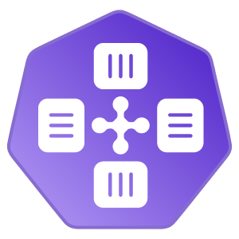

# Cornus

<p align="center">
  
</p>

**Your Docker workflow, all the way to Kubernetes.**

Cornus is one Go binary that combines an OCI registry, a BuildKit-based image
builder, and an imperative deploy engine. It takes the artifacts developers
already use — `compose.yaml`, the `docker` CLI, and `devcontainer.json` — and runs
their workloads on Docker, containerd, a daemonless OCI runtime, Incus, or
Kubernetes.

> [!IMPORTANT]
> Cornus is under active development and does not yet promise a stable CLI or
> API. Pin release artifacts and review release notes before upgrading.

[Get started](#try-it-on-a-docker-host) ·
[Read the documentation](https://cornus.dev/) ·
[Explore the architecture](./ARCHITECTURE.md) ·
[Compare similar tools](https://cornus.dev/introduction/comparison)

## Why Cornus?

- **One service, not a platform assembly.** The registry, builder, and deploy
  engine ship together instead of requiring a separate registry, `buildkitd`,
  and deployment controller.
- **Keep the Docker-shaped workflow.** Use Cornus Compose directly, point the
  stock Docker CLI at its Engine API proxy, or load Dev Container definitions
  natively.
- **Run there while editing here.** Builds and client-local bind mounts serve
  the caller's files over 9P-on-WebSocket. Files stay on the caller and can be
  read on demand instead of being synchronized into a second tree.
- **Bring remote workloads back to the developer.** Published ports,
  `port-forward`, SOCKS5 service discovery, hosted tunnels, and controlled egress
  bridge the workload and caller networks.
- **Use the same control plane from a browser or an agent.** `cornus web`
  provides the local UI and exposes the same operation core through HTTP or
  stdio MCP.
- **Diagnose both the platform and the workload.** OpenTelemetry integration,
  an optional built-in workload telemetry store, and an activity flight recorder
  cover live and post-failure investigation.

## The three subsystems

| Subsystem | What it provides |
| --- | --- |
| Registry | An OCI Distribution v1.1 `/v2/*` endpoint with filesystem, memory, S3-compatible, and optional cloud-object storage backends. On Docker and containerd hosts it can also expose the runtime's native image store. |
| Build engine | An in-process BuildKit solver with Dockerfile builds, cache/secret/SSH mounts, named contexts, and remote caches. Remote builds stream the caller's context over 9P; an unprivileged server can delegate to a managed privileged builder. |
| Deploy engine | One imperative API over five backends: `dockerhost`, native `containerd`, daemonless `bare`, `incus`, and `kubernetes`. Compose, Docker-compatible clients, and Dev Containers all translate into this API. |

The boundaries stay loose: the builder publishes an OCI image reference, and the
selected runtime pulls it. See [ARCHITECTURE.md](./ARCHITECTURE.md) for the
subsystem contracts, wire protocols, privilege model, and security design.

## Try it on a Docker host

This local evaluation path needs the Cornus CLI and a reachable Docker daemon.
Install the CLI from [GitHub Releases](https://github.com/moriyoshi/cornus/releases)
or follow the [installation guide](https://cornus.dev/introduction/installation).

Start a loopback-only server in one terminal:

```sh
cornus serve --addr 127.0.0.1:5000 --storage ./.cornus-data
```

In another terminal, select it and deploy a small Compose project:

```sh
cornus config set-context local --server http://127.0.0.1:5000
cornus config use-context local

mkdir cornus-demo
cd cornus-demo
tee compose.yaml >/dev/null <<'EOF'
name: cornus-demo
services:
  web:
    image: nginx:alpine
    ports:
      - "8080:80"
EOF

cornus compose up -d
curl http://127.0.0.1:8080
cornus compose down
```

This example deploys a pre-built image. A Docker-accessible server that cannot
perform BuildKit's mounts can automatically start a privileged builder helper
when a later `build:` service needs one.

> [!WARNING]
> Authentication is off unless you configure it. Keep an evaluation server on
> loopback. Before making Cornus reachable from another machine, configure
> bearer authentication or mTLS, authorization policy, and workload privilege
> policy; see the [security guide](https://cornus.dev/guides/security).

For the Docker-free k3s walkthrough — including building an image inside the
cluster — use the [full quick start](https://cornus.dev/introduction/quick-start).
The [installation guide](https://cornus.dev/introduction/installation) also
covers Helm, the raw Kubernetes manifest, container images, and source builds.

## Pick the interface that fits

| Interface | Use it for |
| --- | --- |
| [`cornus compose`](https://cornus.dev/cli/compose) | Build and deploy Compose projects, including Compose `provider:` resources and native Dev Container lifecycle hooks. |
| [`cornus daemon docker`](https://cornus.dev/cli/daemon) | Point `DOCKER_HOST` at a local proxy so the stock `docker` CLI, Docker Compose, and `@devcontainers/cli` drive a remote Cornus server. |
| [`cornus build`](https://cornus.dev/cli/build) and [`cornus deploy`](https://cornus.dev/cli/deploy) | Drive the image and workload primitives directly. |
| [`cornus web`](https://cornus.dev/cli/web) | Use the local browser UI, Streamable HTTP MCP, or stdio MCP for agent clients. |
| [`cornus activity`](https://cornus.dev/cli/activity) and [`cornus observe`](https://cornus.dev/cli/observe) | Read platform flight records and query recorded workload logs, traces, and metrics. |

## Documentation

- [What is Cornus?](https://cornus.dev/introduction/what-is-cornus)
- [Installation](https://cornus.dev/introduction/installation)
- [Quick start](https://cornus.dev/introduction/quick-start)
- [Guides](https://cornus.dev/guides/)
- [CLI reference](https://cornus.dev/cli/)
- [Deploy and configuration reference](https://cornus.dev/reference/deploy-spec)
- [Architecture](https://cornus.dev/architecture/)
- [Security and authentication](https://cornus.dev/guides/security)
- [Comparison with similar tools](https://cornus.dev/introduction/comparison)

The VitePress source lives under [`docs/`](./docs). See
[`docs/README.md`](./docs/README.md) for local preview and build instructions.

## Development

Cornus requires Go 1.26. The default test suite needs no external daemon:

```sh
go test ./...
```

The opt-in Starlark E2E harness covers Docker, containerd, Kubernetes, and local
build targets. See the [testing guide](./.agents/docs/TESTING.md) for its
preflight checks, scenarios, and `make` targets.

## License

Cornus is licensed under the [Apache License, Version 2.0](./LICENSE).
Copyright 2026 Moriyoshi Koizumi. See [NOTICE](./NOTICE) for details.

Release images include third-party license attribution under
`/usr/share/doc/cornus/third-party-licenses/`.
