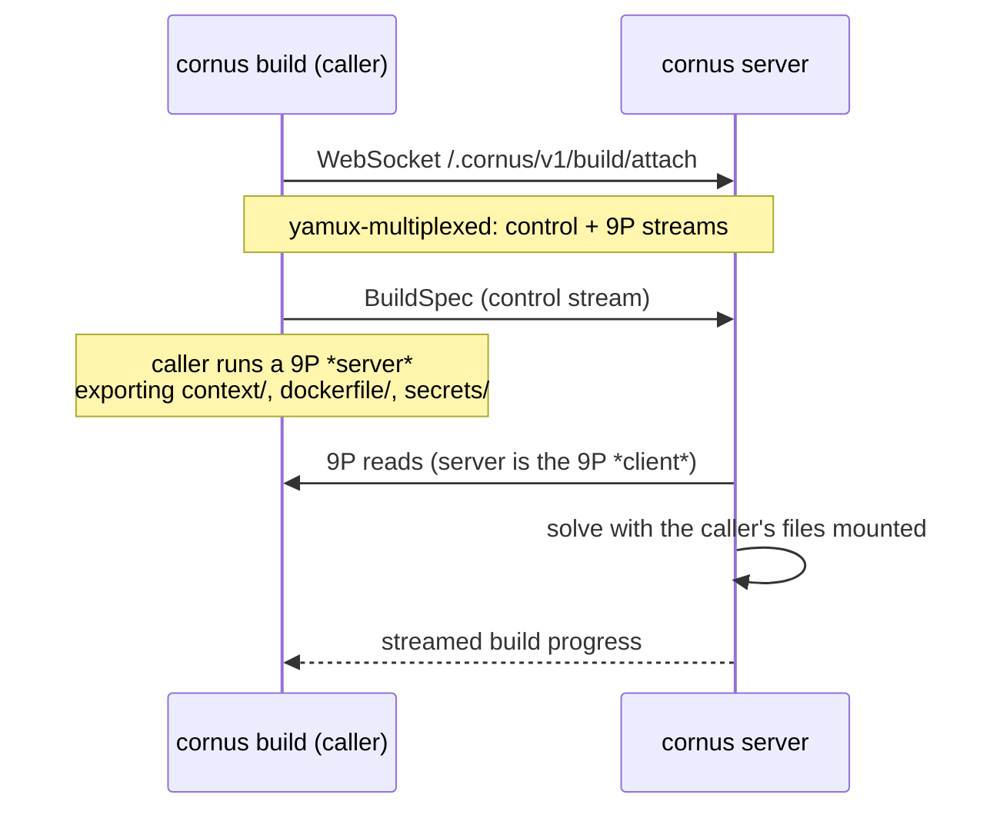

# The build engine and remote builds

Cornus builds images with **BuildKit's solver embedded in-process** — no
separate `buildkitd` daemon, no Docker. Because the engine drives that solver
with BuildKit's own client machinery, the full `buildx` feature set works
unchanged: cache mounts, secret mounts, SSH mounts, named contexts, and remote
caches need zero reimplementation. The engine is Linux-only; on other platforms
the server still runs, and builds are simply refused (or sent to a remote
builder).

Both local and remote builds funnel through a single seam that assembles the
build from pluggable filesystem mounts plus an optional secret store. Those are
cross-platform interfaces, so the remote *client* path links no BuildKit and
works from any OS.

## Worker selection

The default worker is BuildKit's **runc worker**, self-contained under the
server's data dir. `CORNUS_BUILD_WORKER=containerd` swaps in BuildKit's
**containerd worker**, which delegates snapshots and content to a host
containerd at `CORNUS_CONTAINERD_ADDRESS` in namespace
`CORNUS_CONTAINERD_NAMESPACE` (default `cornus` — deliberately the same
namespace the containerd deploy backend manages). Because the worker uses
containerd's image store, a tagged build lands in the host containerd's store
*in addition to* the registry push — so a subsequent containerd-backend deploy
of that image needs no registry round trip. Lazy build contexts are not
supported on the containerd worker and are rejected with a clear error rather
than silently degraded.

Independently of the worker, under
[host-native re-export](/reference/server-env-vars#reusing-a-local-image-store)
(the default on a host backend) a build lands in the backend's own local store
rather than a separate registry. On `containerd`, `/v2/*` is backed by the
containerd content store read-write, so an ordinary build **push** imports straight
into it — no build-worker configuration required. On `dockerhost`, whose `/v2/*` is
read-only, a server-routed build instead exports a **docker-archive** loaded into
the local Docker daemon (`POST /images/load`), so the built image lands directly in
the daemon's store.

The engine is a **process singleton per data dir**: it takes a non-blocking
lock on `engine.lock` and fails fast, because two engines sharing one data dir
would silently deadlock in BuildKit's database. Run two servers on two data
dirs instead.

## Remote builds over 9P

A build can run on a remote Cornus server using the **caller's** directories
and secrets — the way `docker buildx` drives a remote `buildkitd`, except the
whole file transport is tunneled over one WebSocket.

`cornus build --builder ws://host/.cornus/v1/build/attach` opens the WebSocket,
multiplexes it with **yamux** into a control stream and a **9P** stream, and
serves the caller's files as a 9P server. The server side is the 9P *client*:
it wraps each exported subtree as a filesystem fed to the in-process solver,
plus a secret store for `RUN --mount=type=secret`. The caller never has to be
reachable from the server, the build stays BuildKit-native, and **caches stay
on the server** — the second remote build from any laptop hits the same warm
cache.

**SSH agent forwarding** (`RUN --mount=type=ssh`) rides the same session: the
server stands up a temporary socket per declared id and tunnels each connection
back over a new stream to the caller's local `$SSH_AUTH_SOCK`.

## The trust boundary

The remote-build export is a trust boundary, and it is treated as one. The
server sends arbitrary 9P walk/open/create operations, and a naive local
filesystem export would follow `..`, follow symlinks out of the tree, and allow
writes. So every exported subtree is wrapped in a confined attacher that:

1. rejects `..`, path separators, and non-single-element walk components;
2. confines symlinks — a final-component symlink is transmitted *as* a symlink
   (docker parity; it resolves harmlessly container-side), but reading or
   walking *through* a symlink that escapes the export root is denied; and
3. refuses all mutating operations — the export is strictly read-only.

The context and each named context additionally honor **`.dockerignore`**, so
ignored files (`.git`, secrets, `node_modules`) never leave the caller's
machine. Net posture: `cornus build --builder` grants the remote builder
read-only access to exactly the context, dockerfile, and named-context
directories, with no traversal outside them.

## Build caches

The `inline`, `registry`, and `local` remote-cache backends are exposed via
`--cache-to` / `--cache-from` (buildx syntax) on both local and remote builds.

`type=local` caches get special treatment. BuildKit resolves a local cache's
`dest=`/`src=` to a real directory on whichever process runs the solve — the
*server*, for a remote build. Rather than force the caller to know a
server-side path, the engine treats that value as an opaque **key** and maps it
to a confined per-key directory under the server's data dir, auto-deriving the
key from the target image's repository when it is omitted.

## Lazy build contexts

A large `--build-context` directory can be served to the build **on demand**
rather than eagerly synced: a 20 MB context whose build reads 11 bytes
transfers 11 bytes over the wire. Opt in with `cornus build --lazy`.

BuildKit's laziness is snapshotter-level, not source-level, so three
cooperating mechanisms are all required (no BuildKit fork — every seam used is
public):

1. **An image-shaped source.** The named context is presented to BuildKit as an
   OCI layout whose layer digest is a deterministic metadata manifest of the
   tree — the layer blob never materializes.
2. **A remote snapshotter.** Lazy layers register a committed snapshot so
   extraction is skipped; the backing is a host bind locally, or a kernel-9p
   mount proxied to the caller remotely. Ordinary layers fall back cleanly.
3. **A cache pre-seed.** The RUN cache key for a read-only mount is normally
   computed by walking every file. Instead the caller computes per-file digests
   locally and seeds BuildKit's cache context before the solve, so the scan is
   skipped and only the files a `RUN` actually touches cross the wire.

All three apply the identical `.dockerignore` predicate, so the seed always
matches the mount.

## Related pages

- [Building images](/guides/building-images) — the build workflow in practice,
  including remote builders and lazy contexts from the user side.
- [cornus build](/cli/build) — the full flag set.
