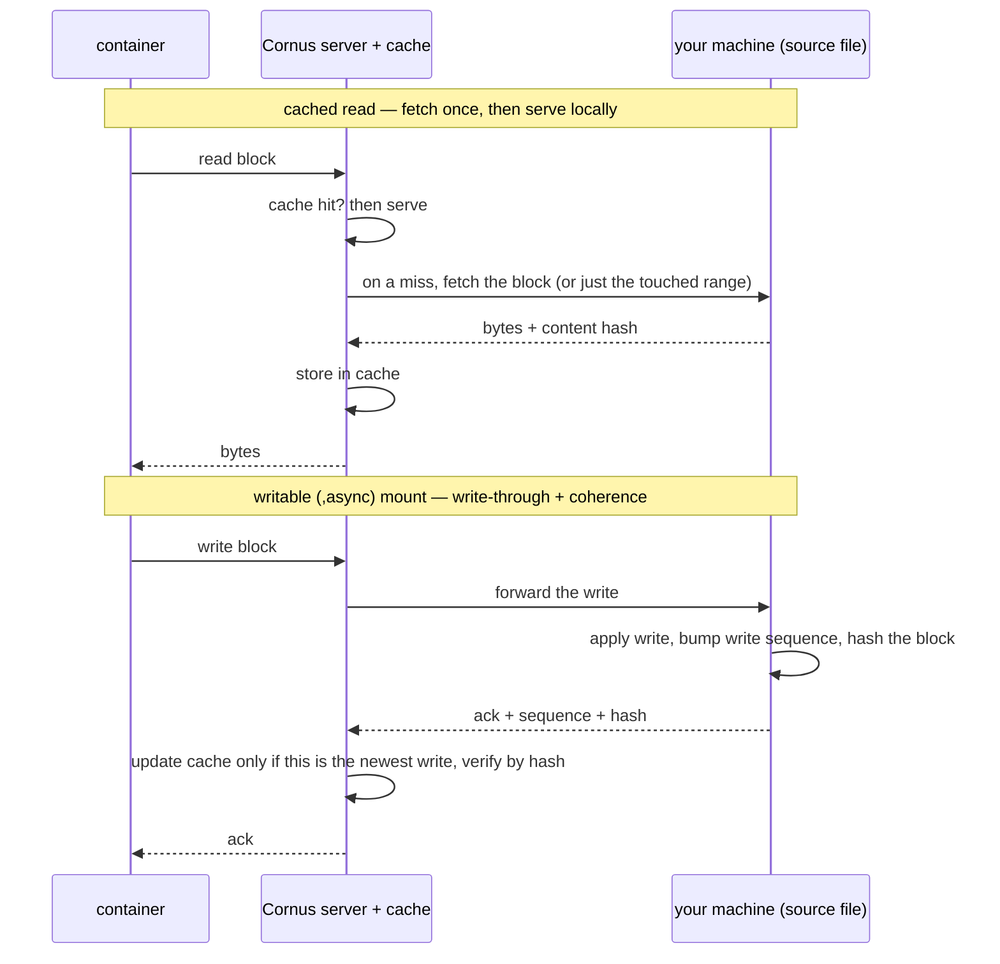

# The deploy engine and backends

The deploy engine is **imperative and pluggable**. Every backend implements the
same small interface — `Apply` / `Status` / `List` / `Delete` — where `Apply`
has create-or-recreate semantics keyed by a `cornus.app` label. Cornus is
deliberately **not an operator**: there is no CRD and no reconcile loop.
Because Cornus creates the objects itself, it mutates them directly at apply
time.

## The four backends

| Backend | Talks to | Notes |
|---|---|---|
| `dockerhost` (default) | Docker Engine REST API over the unix socket | A hand-rolled minimal client, kept free of the heavyweight Docker SDK dependency tree. |
| `containerd` | containerd client API over the containerd socket | Runs workloads natively on a bare containerd host — no dockerd. Linux-only. |
| `bare` | An OCI runtime CLI (runc/crun/youki) directly — no daemon | Daemonless: cornus owns image pull, process supervision, and cgroups itself. Linux-only; needs root + an OCI-runtime binary + CNI plugins. |
| `kubernetes` | client-go | Maps a `DeploySpec` to a Deployment plus a ClusterIP Service, and optionally an Ingress. Stop/Start scale to 0 and back; Restart stamps a pod-template annotation to trigger a rollout. Loads in-cluster or from a local kubeconfig, so a dev machine can target a kind cluster. |

Backend selection is `CORNUS_DEPLOY_BACKEND` (default `dockerhost`) on the
server; the local `cornus deploy` CLI honors the same variable for its
host-level backends, and deploying into a cluster goes through a server via
`cornus deploy --server ...` as a foreground deploy-attach session.
`cornus deploy --detach`/`-d` is the stateless variant: it POSTs the spec and
exits, leaving the workload running with no client session — client-local mount
sources are rejected up front (they need a live session) and ports are not
auto-forwarded. The shipped Kubernetes manifests and Helm chart set the backend
to `kubernetes` explicitly; an in-cluster server left on the default would fail
every deploy, because there is no Docker socket in the pod.

A shared **host-privilege policy** governs the host backends: `Privileged`
workloads and host bind sources are denied by default and opted in via
`CORNUS_ALLOW_PRIVILEGED` / `CORNUS_ALLOW_BIND_SOURCES`.

## The cross-backend contract

The interface carries a documented contract, so behavior cannot silently drift
between backends:

- Stop/Start/Restart on a missing name return a shared not-found error (mapped
  to HTTP 404); `Delete` stays delete-if-exists.
- `spec.Command` is always arguments to the image ENTRYPOINT and
  `spec.Entrypoint` overrides it — **docker semantics everywhere**. The
  kubernetes backend maps Command to `Args` for exactly this reason; the k8s
  `command` field would silently replace the entrypoint.
- Non-TTY logs, exec, and attach output is stdcopy-framed on every backend, and
  log `--since` parses docker's grammar everywhere — clients demux and parse
  unconditionally.
- Host-port publishing with `replicas > 1` binds replica 0 only (one DNAT
  target per host port) on both host backends; `Delete` reaps anonymous volumes
  (`docker rm -v` parity). Status *state* strings stay backend-specific by
  documented design — only `running` is portable.

## The containerd backend

The containerd backend implements the full surface directly against a
containerd daemon, managing containers in a dedicated namespace
(`CORNUS_CONTAINERD_NAMESPACE`, default `cornus`) at
`CORNUS_CONTAINERD_ADDRESS`. Where dockerd provides machinery, the backend
brings its own:

- **Image pulls** construct their own resolver: localhost registries are
  plain-HTTP automatically (the cornus registry next door),
  `CORNUS_CONTAINERD_INSECURE_REGISTRIES` extends that to an explicit list, and
  everything else resolves normally, including the anonymous token flow public
  registries require. Docker-style short names are normalized
  (`nginx` becomes `docker.io/library/nginx:latest`). When the registry is
  unreachable but the ref already sits in the namespace's image store — e.g.
  just built by the containerd build worker — the local image is used, so
  same-host build-then-deploy needs no registry round trip. Set
  `CORNUS_CONTAINERD_SNAPSHOTTER=native` when the containerd root itself sits
  on an overlay filesystem (docker-in-docker), where the kernel rejects
  overlay-upon-overlay mounts.
- **Networking is CNI bridge + portmap** (nerdctl-style). Every network —
  compose `networks:` or the implicit default — is a generated CNI config with
  host-local IPAM on an allocated `10.4.<n>.0/24` (base via
  `CORNUS_CNI_SUBNET_BASE`). Plugin binaries are found via
  `CORNUS_CNI_BIN_DIR`, `CNI_PATH`, or `/opt/cni/bin`; missing plugins fail
  apply with an actionable error. **Inter-container name resolution is
  hosts-file sync** — the bridge CNI has no embedded resolver — with each
  service's name and aliases pointing at replica 0's IP.
- **Logs survive cornus restarts** via a small log shim that appends JSON-line
  records under the data dir; monitor-restarted tasks keep logging with no
  cornus involvement. The file rotates at `CORNUS_CONTAINERD_LOG_MAX_BYTES`
  (default 16 MiB), keeping one old generation; because the running shim holds
  the file open, rotation happens on cornus-driven (re)starts.
- **Restart policy is containerd's own restart monitor**: labels carry the
  policy, Stop sets an explicitly-stopped label so an `unless-stopped`/`always`
  task is not resurrected, and Start clears it.
- **A one-shot reconcile pass repairs stale network namespaces at startup.**
  `/run` is tmpfs, so a host reboot loses every pinned netns while the specs
  keep pointing at the dead paths. On construction, the backend rebuilds netns,
  CNI attachment, and pin for every record whose desired state is running —
  then containerd's monitor resurrects the task itself, so the two never race.
- **Exec, stats, copy, and port-forward** all work; attach is output-only (the
  log shim owns the stdio pipes), copy needs a running instance, and
  healthchecks are ignored with a warning (containerd has no probe engine).

## The bare backend

The `bare` backend (`CORNUS_DEPLOY_BACKEND=bare`) goes one step further than
`containerd`: it removes the *daemon itself*. Cornus drives a low-level OCI
runtime CLI (runc/crun/youki, via `CORNUS_BARE_RUNTIME`) directly and owns
everything a daemon otherwise provides — image pull into an in-process content
store, layer unpack + rootfs snapshot, `config.json` generation, process
supervision, cgroups, and logging. It is **cornus as its own Podman**. State
lives under `<DataDir>/bare/`.

- **Daemon-agnostic machinery is shared with containerd.** Networking (CNI
  bridge + portmap), hosts-file DNS sync, DataDir volumes + image seeding, the
  OCI spec-opts, and the Docker-stats encoder are factored into an internal
  package both backends import (`pkg/deploy/internal/hostrun`). So `bare`
  networking, name resolution, and volumes behave identically to `containerd`;
  each backend supplies only what differs (containerd reads container labels
  where bare reads its own JSON records). The whole tree stays free of BuildKit
  — and, because `bare` reads cgroup files directly rather than loading a cgroup
  *manager*, free of the cgroup-manager library's `cilium/ebpf` / `dbus` too.
- **Cornus is the supervisor.** `runc create`/`start` returns immediately and
  runc's `/run` state is tmpfs, so cornus waits on each container's PID1 (via a
  pidfd), applies the restart policy (`no` / `on-failure[:N]` / `always` /
  `unless-stopped` — `on-failure:N` is something the containerd restart monitor
  cannot express) with capped backoff, and relaunches. A default in-process
  supervisor and an opt-in **detached shim** (`CORNUS_BARE_SHIM`, a conmon
  analogue that survives a cornus restart) share that engine. A startup
  reconcile pass reattaches to survivors on a server restart and fully rebuilds
  workloads after a host reboot (a lost tmpfs netns pin *is* the reboot signal).
- **The record store replaces the metadata DB.** `<DataDir>/bare/records/<id>/
  record.json` (atomic writes) holds image/snapshot/IPs/ports/policy plus the
  desired-vs-observed supervision state; `runc state` remains the source of
  truth for liveness. The full optional-interface surface (client-local mounts,
  egress companion, remote companion via `CORNUS_BARE_REMOTE`, volume removal)
  is implemented for parity with `containerd`. Root, an OCI-runtime binary, and
  CNI plugins are required; rootless is out of scope and errors clearly.

## Volumes and cleanup

Volumes map onto each backend's native semantics. On Kubernetes an anonymous
volume becomes a dynamically-provisioned PVC bound to the deployment's lifetime
(`docker rm -v` parity); a named volume becomes one shared PVC that survives
delete and is shared across deployments (Docker named-volume semantics). An
init container seeds a fresh PVC from the image's baked content,
copy-only-when-empty, so user writes persist. The containerd backend backs both
kinds with data-dir directories seeded the same way; on dockerhost the same
semantics come free from Docker.

**Cleanup is ownership-based, not call-sequence-based.** On Kubernetes, `Apply`
creates the Deployment first, then stamps the Service and each anonymous PVC
with an owner reference back to it. `Delete` is a single foreground-propagation
Deployment delete, and Kubernetes GC reclaims the dependents — an interrupted
delete can no longer orphan them.

## Client-local bind mounts

`cornus deploy --server` and Compose against a remote server can bind-mount
directories that live on **your** machine, not the deploy host. This is what
turns a remote deploy into an inner-loop tool: edit a file locally and the
workload sees it. It reuses the [build engine's transport](/architecture/build-engine#remote-builds-over-9p)
— one WebSocket, yamux, and 9P — with the same inversion of roles: **the caller
is the 9P server**, exporting its own local directories, and the Cornus server
is the 9P client.

The server kernel-mounts each exported directory over 9P and **rewrites the
mount source** in the spec to that mountpoint before handing the spec to the
backend, so the backend binds it like any host path and stays unaware 9P is
involved. Because the mount is served from the caller, the deployment lives
exactly as long as the command stays connected: drop the session (or send
`down`) and the containers are removed, then the mounts unmounted. This
deliberately scopes client-local mounts to dev / inner-loop use, not durable
production workloads. Client-local sources are served from the server's own
`<DataDir>/mounts` area and are always permitted, so they need no host-privilege
relaxation.

A pod behind NAT cannot be dialed by the caller directly, so the **Cornus server
is the rendezvous**: on Kubernetes (and remote-mode host backends) the pod's
[caretaker](/architecture/caretaker) sidecar dials one connection back to the
server, which bridges each mount stream to a fresh backing on the caller. The
mount is realized *inside the pod* — never on a node host — so the pod still
schedules anywhere, and a startup probe holds the app container until the mount
is live.

### Read caching and writable mounts

Blindly tunneling 9P is chatty — every read crosses the wire. For the two cases
where that hurts, Cornus terminates 9P on the server and fronts it with a
server-side, per-file **block cache** (1 MiB chunks, on disk, surviving
restarts), chosen per mount by a suffix on `--local-mount SRC:DST`:

| Mount suffix | Served as | Use it for |
|---|---|---|
| (none) | Blind 9P pipe | Small or rarely-read mounts, and read-write source directories. |
| `,cache` (implies `:ro`) | Read-through cache — a chunk fetched once is never re-fetched | Large **immutable** read-only inputs (datasets, model weights). |
| `,async` (writable) | A cache-coherent **block protocol** | Write-intensive **single-writer** workloads such as a development database. |

Both cached modes need the server-side file cache enabled
(`--file-cache` / `CORNUS_FILE_CACHE`, with `CORNUS_FILE_CACHE_DIR`); without it
every mount falls back to the blind pipe. `,cache` is content-versioned — any
change to a source file yields a new identity, so stale bytes are never served,
which is why it is valid only for inputs you promise not to mutate during the
session.

`,async` keeps a *writable* cache coherent with your local file over a
block-indexed protocol that carries a content hash and a write sequence with
every read and write, so the server never serves a block the caller has
superseded. It requires a single replica and cannot combine with `:ro` or
`,cache`. For database-shaped random I/O, turn on sub-block coherence and
demand-fill — `CORNUS_BLOCK_COHERENCE=subhash,subfill` plus a
`CORNUS_BLOCK_READAHEAD` cap — in **both** the server and the deploy-caller
environments; the two negotiate a shared feature set, so a flag set on only one
side is silently dropped. This cuts a cold random scan from fetching a whole
1 MiB block per point query down to the touched few kilobytes. See
[server environment variables](/reference/server-env-vars#remote-9p-file-cache-and-writable-mounts).

All three modes share one server-side data path. A cached read is served locally
after the first fetch; a writable mount writes through to your machine and keeps
the server cache coherent with a content hash and a write sequence, so the server
never serves a block your file has already moved past:

**What lives in the cache directory.** With `--file-cache` on, each cached file
becomes a **sparse file plus a small index sidecar** under `CORNUS_FILE_CACHE_DIR`,
sharded into subdirectories to bound fan-out. Only the chunks actually read are
stored — the data file is sparse — the cache **survives server restarts**, and
`CORNUS_FILE_CACHE_MAX_BYTES` caps its total size via background garbage
collection. Point `CORNUS_FILE_CACHE_DIR` at a dedicated volume rather than the
server data directory.

## Compose user networks

Compose `networks:` are supported on all four backends. On **dockerhost** they
are native Docker networks (create-if-absent, member-less managed networks
reaped on delete). On **containerd** and **bare** they are the generated CNI
bridges above, with names resolving via hosts-file sync. On **kubernetes** the compose
`driver` selects a provider pipeline:

| Compose `driver` | Mechanism | Isolation strength |
|---|---|---|
| (none) / `services` | one headless Service per alias (bare-name DNS) | none — DNS baseline, any cluster |
| `bridge` / `ipvlan` / `macvlan` | Multus NetworkAttachmentDefinition + pod annotation | topological; needs the NAD CRD |
| `policy` | shared ingress-only NetworkPolicy keyed on membership labels | kernel, if the CNI enforces |
| `cilium` | shared CiliumNetworkPolicy | kernel (Cilium); needs the CNP CRD |
| `driver_opts: {proxy: "true"}` | caretaker enforcing egress proxy | userspace, CNI-independent, hard |
| ... `+ mode: cooperative` | loopback listeners spliced to the peer's real Service | userspace, zero-privilege, soft |

The Multus fabrics get plan-time deterministic static IPs, and the caretaker's
DNS role serves those pinned secondary IPs — cluster DNS only ever publishes a
pod's primary IP, so without the overlay a peer's name would resolve onto the
cluster network instead of the user network. Missing cluster capabilities fall
back to `services` with a once-per-network warning (`CORNUS_K8S_NET_STRICT`
makes it a hard error). The enforcing proxy's allow-list is computed at
compose-plan time, when the whole topology is visible, so there are no dynamic
queries and no staleness within a project.

::: info Rollback is deliberately out of scope
Compose and plain Docker have no rollback concept, and on Kubernetes the
backend updates Deployments in place, keeping native ReplicaSet history — so
`kubectl rollout undo deployment/<name>` already works. A bespoke cross-backend
revision store would add stateful history to a deliberately imperative,
stateless deploy model.
:::

## Workload lineage

Every deployment records where it came from. The CLI stamps the spec's
[`origin`](/reference/deploy-spec#origin) block with the project, the client
host / OS user / launch directory, and — when the directory is a git work tree —
the repo remote, branch, and commit. The server overwrites `origin.subject` with
the authenticated request identity and **discards any client-supplied subject**,
so a client can attest where it deployed from but cannot forge who it is.

The lineage lives with the workload, not in a server-side database: each backend
persists it the same way it persists the `cornus.app` key — as `cornus.origin.*`
container labels on **dockerhost** and **containerd**, as structured fields in the
per-instance `record.json` on **bare**, and as Deployment **annotations** on
**kubernetes** (the values — paths, URLs, subjects — do not satisfy Kubernetes
label syntax, the same reason compose labels ride as annotations there). A single
`OriginToLabels` / `OriginFromLabels` pair in `pkg/deploy` keeps the translation
consistent across backends, and `List` / `Status` read it back onto
`DeployStatus.Origin`.

## Related pages

- [Deploying workloads](/guides/deploying-workloads) — the deploy workflow,
  including remote deploys and client-local mounts from the user side.
- [Deploy backends](/reference/deploy-backends) — per-backend configuration.
- [Deploy spec](/reference/deploy-spec) — every spec field.
- [Networking guide](/guides/networking) — networks in practice.
- [cornus deploy](/cli/deploy) — the full flag set.
