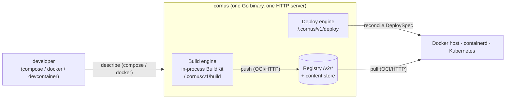

# Architecture overview

Cornus is a **single Go binary** that carries a Docker workflow — `docker
compose`, the `docker` CLI, devcontainers — all the way to a running workload on
a Docker host, a containerd host, or Kubernetes, without the team first standing
up a registry, a `buildkitd`, and a GitOps controller of their own. One HTTP
server fronts three subsystems; they are constructed lazily on first use, so the
server starts cleanly even where no Docker host is reachable or the build engine
cannot initialize.

This section explains how Cornus works from the inside: the data flows, the wire
protocols, and the security properties, written for people evaluating or
operating it. The contributor-oriented design document — package layout, closed
design decisions, testing — lives in the repository:
[ARCHITECTURE.md on GitHub](https://github.com/moriyoshi/cornus/blob/main/ARCHITECTURE.md).

## The mental model

The end-to-end flow has four steps, and each is realized by a specific component:

1. **Describe.** A Docker-compatible client (`cornus compose`, the `docker`
   frontend, devcontainers) is translated by a single client-side agent into
   Cornus's `DeploySpec` / build requests.
2. **Build.** Source becomes an OCI image via an **in-process BuildKit solver** —
   the full `buildx` feature set with no separate `buildkitd`. A build can
   instead run on a remote server while the caller's directories, secrets, and
   SSH agents stream over 9P-on-WebSocket, optionally lazily.
3. **Publish.** The built image lands in a **tiny OCI Distribution v1.1
   registry** backed by a persistent content-addressable store.
4. **Deploy and run.** One `DeploySpec` is imperatively reconciled onto whichever
   runtime you have by a pluggable **deploy engine**. The target's *own* runtime
   — dockerd, containerd, or the kubelet — pulls the image from the registry over
   OCI and starts it.

Two things this makes explicit: the deploy engine never handles image bytes — it
hands the target a **reference** and the target's runtime pulls it; and the three
subsystems meet over the **OCI HTTP protocol** (`/v2/*`), not through Go APIs,
which is what lets them evolve independently or be pointed at an external
registry.

## Properties that recur everywhere

A few design properties show up in every subsystem, and knowing them up front
makes the rest of this section easier to read:

- **One process, lazily assembled.** A single HTTP mux fronts all three
  subsystems. The build engine and the deploy backend are constructed on first
  use, so a registry-only or deploy-only server runs without the other
  subsystems' prerequisites being present.
- **Loose coupling over OCI, not Go.** The build and deploy engines never import
  the registry or its content store; they interact with it as ordinary OCI
  clients (push / pull over `/v2/*`). Any of the three can evolve, or be pointed
  at an external registry, independently.
- **BuildKit is contained.** The build engine embeds BuildKit's solver
  in-process, but its heavy dependency tree is deliberately walled off: the
  deploy and wire transports link zero BuildKit packages.
- **Remote work streams over 9P-on-WebSocket.** Both remote builds and
  client-local bind mounts let a caller run work on a remote server while its
  files stay on the caller's machine, served on demand over a 9P filesystem
  tunneled through a single WebSocket.

## Privilege posture

Only the build engine needs elevation. It runs `runc` + `overlayfs` + user
namespaces in-process, so an instance that **performs builds** either runs
`privileged` (the default in the shipped Compose file, Kubernetes manifests, and
Helm chart) or runs rootless with `uidmap`, `rootlesskit`, and `slirp4netns`
present and `--rootless` set. The registry and deploy subsystems need no special
privileges; the `dockerhost` backend just needs the Docker socket, and the
`containerd` backend needs the containerd socket plus root for its own network
namespaces and CNI plugins.

The one sharp edge is client-local bind mounts: kernel-9p `mount(2)` needs
**CAP_SYS_ADMIN / root** and the `9p` kernel module, and when the server runs in
a container the mount directory must be bind-mounted from the host with
`rshared` propagation so mounts propagate out to the Docker daemon's mount
namespace. See [installation](/introduction/installation) for the concrete
setups and [deploy backends](/reference/deploy-backends) for per-backend
requirements.

## Observability model

One OpenTelemetry seam serves all three Cornus processes — the server, the
per-pod caretaker sidecar, and the client CLI — driven entirely by the standard
`OTEL_*` environment. It is **opt-in and zero-cost when off**: telemetry
installs only when `CORNUS_OTEL` or an `OTEL_*` variable is set; otherwise the
instrumentation call sites hit the OpenTelemetry no-op default and no exporter
goroutines start.

When on, trace context propagates end to end. The client opens one root span per
invocation and injects the W3C `traceparent` into every REST call and WebSocket
attach dial; the server's HTTP layer extracts it; and the caretaker injects its
own span context into its relay dials — so **client → server → caretaker**
becomes one correlated trace across the rendezvous. High-cardinality span names
(digests, deployment names) are collapsed to route templates so metric series do
not explode. An opt-in Prometheus pull endpoint (`CORNUS_METRICS_PROMETHEUS`)
registers an auth-exempt `/metrics` route. See the
[observability guide](/guides/observability) for configuration.

## The rest of this section

- [The server, registry, and content store](/architecture/server-and-registry) —
  the one HTTP process, its operational guardrails, the OCI registry, pluggable
  persistence, and GC.
- [The build engine and remote builds](/architecture/build-engine) — the
  in-process BuildKit solver, the 9P remote-build transport and its trust
  boundary, caches, and lazy contexts.
- [The deploy engine and backends](/architecture/deploy-engine) — the backend
  interface and its cross-backend contract, the containerd backend, volumes, and
  compose user networks.
- [Networking](/architecture/networking) — port forwarding, public tunnels,
  automatic ingress, session conduits, and the workload-to-workload hub.
- [The caretaker and client-side features](/architecture/caretaker) —
  client-local bind mounts, the sidecar's roles, the in-pod Docker endpoint, and
  client-side egress.
- [Docker-compatible clients](/architecture/clients) — the Docker API proxy,
  compose and devcontainers, the unified client agent, and connection profiles.
- [Security model](/architecture/security) — authentication, TLS and mTLS
  identity, authorization, and trust boundaries.
