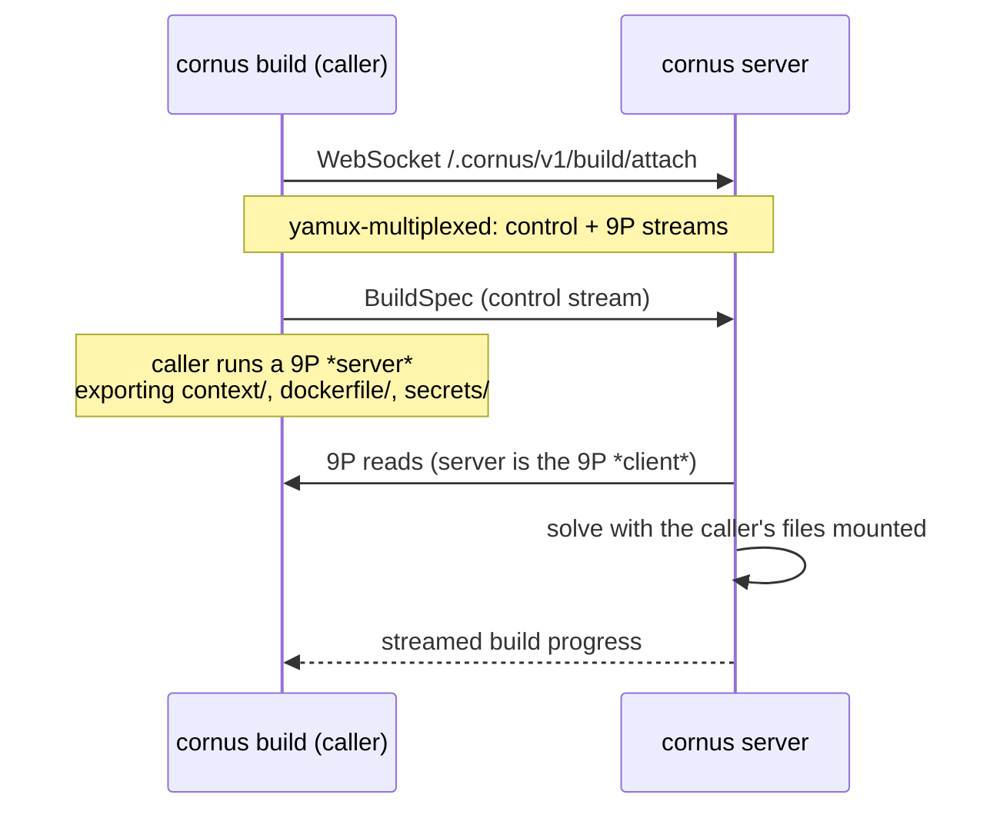

# ビルドエンジンとリモートビルド

Cornus は**プロセス内に組み込んだ BuildKit ソルバー**でイメージをビルドします。別個の `buildkitd` デーモンも Docker も不要です。エンジンは BuildKit 自身のクライアント機構でソルバーを駆動するため、完全な `buildx` 機能一式が変更なく動作します。キャッシュマウント、シークレットマウント、SSH マウント、名前付きコンテキスト、リモートキャッシュを再実装する必要はありません。エンジンは Linux 専用です。ほかのプラットフォームでもサーバーは動作しますが、ビルドは拒否されるかリモートビルダーへ送られます。

ローカルビルドとリモートビルドはともに、差し替え可能なファイルシステムマウントと任意のシークレットストアからビルドを組み立てる一つの仕組みを通ります。これはクロスプラットフォームのインターフェースなので、リモート *クライアント* パスは BuildKit にリンクせず、どの OS からも動作します。

## ワーカーの選択

既定ワーカーはサーバーのデータディレクトリ下に自己完結する BuildKit の **runc ワーカー** です。`CORNUS_BUILD_WORKER=containerd` は BuildKit の **containerd ワーカー** に切り替えます。snapshot と content を `CORNUS_CONTAINERD_ADDRESS` のホスト containerd、名前空間 `CORNUS_CONTAINERD_NAMESPACE` (既定 `cornus`。containerd デプロイバックエンドが管理する名前空間と意図的に同じ) に委譲します。ワーカーは containerd のイメージストアを使うため、タグ付きビルドはレジストリプッシュ *に加えて* ホスト containerd ストアに入ります。そのイメージを後で containerd バックエンドでデプロイするとレジストリ往復は不要です。遅延ビルドコンテキストは containerd ワーカーで未対応であり、黙って劣化させず明確なエラーとして拒否されます。

ワーカーとは独立に、[host-native 再エクスポート](/ja/reference/server-env-vars#reusing-a-local-image-store) (ホストバックエンドでは既定) では、ビルドは別個のレジストリではなくバックエンド自身のローカルストアに入ります。`containerd` では `/v2/*` が containerd コンテンツストアで読み書き可能に支えられるため、通常のビルドの **push** はそこへ直接インポートされます — ビルドワーカーの設定は不要です。`/v2/*` が読み取り専用である `dockerhost` では、サーバー経由でルートされたビルドは代わりに、ローカル Docker デーモンへロードされる **docker-archive** としてエクスポートされ (`POST /images/load`) 、ビルドされたイメージはデーモンのストアへ直接入ります。

エンジンは **データディレクトリごとに 1 つのプロセスだけが動作します**。 `engine.lock` をノンブロッキングでロックし、競合時は直ちに失敗します。同じデータディレクトリを共有する二つのエンジンは BuildKit のデータベースで黙ってデッドロックするためです。代わりに、別々のデータディレクトリで二つのサーバーを実行してください。

## 9P 経由のリモートビルド

ビルドは、**呼び出し元**のディレクトリとシークレットを使ってリモート Cornus サーバー上で実行できます。`docker buildx` がリモート `buildkitd` を駆動する方法と同様ですが、ファイル転送経路全体は一つの WebSocket にトンネルされます。

`cornus build --builder ws://host/.cornus/v1/build/attach` は WebSocket を開き、**yamux** で制御ストリームと **9P** ストリームを多重化し、呼び出し元のファイルを 9P サーバーとして提供します。サーバー側は 9P *クライアント* です。エクスポートされた各サブツリーを、プロセス内ソルバーへ渡すファイルシステムとしてラップし、`RUN --mount=type=secret` 用のシークレットストアも渡します。呼び出し元がサーバーから到達可能である必要はなく、ビルドは BuildKit ネイティブのままです。**キャッシュはサーバー上に残る**ため、どのノート PC からの二回目のリモートビルドでも同じウォームキャッシュを利用できます。

**SSH エージェント転送** (`RUN --mount=type=ssh`) も同じセッションに乗ります。サーバーは宣言された ID ごとに一時ソケットを用意し、各接続を新しいストリームで呼び出し元のローカル `$SSH_AUTH_SOCK` へトンネルします。

## 信頼境界

リモートビルドのエクスポートは信頼境界であり、そのように扱われます。サーバーは任意の 9P の walk/open/create 操作を送れるため、素朴なローカルファイルシステムのエクスポートは `..` をたどったり、ツリー外へのシンボリックリンクをたどったり、書き込みを許したりする可能性があります。そのため、エクスポートされる各サブツリーは次の制限付きアタッチャーでラップされます。

1. `..`、パス区切り文字を含む要素、または単一要素でない walk コンポーネントを拒否します。
2. シンボリックリンクをエクスポート範囲内に閉じ込めます。最終コンポーネントのシンボリックリンクはシンボリックリンク*として*送信されます (Docker と同じ挙動であり、コンテナ側で安全に解決されます) が、エクスポートのルート外へ出るシンボリックリンクを*経由して*読み取りや walk を行うことは拒否されます。
3. 変更を伴うすべての操作を拒否します。エクスポートは厳密に読み取り専用です。

コンテキストと各名前付きコンテキストはさらに **`.dockerignore`** を尊重するため、除外されたファイル (`.git`、シークレット、`node_modules`) が呼び出し元のマシンを離れることはありません。ネットワーク上では、`cornus build --builder` はリモートビルダーにコンテキスト、Dockerfile、名前付きコンテキストのディレクトリだけへの読み取り専用アクセスを与え、それらの外部への走査は許可しません。

## ビルドキャッシュ

`inline`、`registry`、`local` remote-cache バックエンドはローカルビルドとリモートビルドの両方で `--cache-to` / `--cache-from` (buildx 構文) を通じて公開されます。

`type=local` キャッシュには特別な扱いがあります。BuildKit はローカルキャッシュの `dest=`/`src=` を、ソルバーを実行するプロセスの実ディレクトリに解決します。リモートビルドなら*サーバー*です。呼び出し元にサーバー側のパスを知ることを強いる代わりに、エンジンはこの値を不透明な **キー** として扱い、サーバーデータディレクトリ下の制限されたキーごとのディレクトリに対応付けます。キーが省略された場合は対象イメージのリポジトリから自動導出します。

## 遅延ビルドコンテキスト

大きな `--build-context` ディレクトリを先行に同期する代わりに、ビルドへ**必要に応じて**で提供できます。ビルドが 11 byte だけ読む 20 MB コンテキストなら wire を通るのも 11 byte です。`cornus build --lazy` で opt-in します。

BuildKit の laziness は source-level ではなく snapshotter-level なので、三つの協調機構がすべて必要です。BuildKit fork は不要で、使う seam はすべてパブリックです。

1. **イメージ形式のソース。** 名前付きコンテキストは OCI layout として BuildKit に提示されます。レイヤー digest は tree の deterministic metadata マニフェストであり、レイヤーブロブは実体化されません。
2. **リモート snapshotter。** 遅延レイヤーは committed snapshot を登録するため extraction はスキップされます。backing はローカルではホストバインド、リモートでは呼び出し元にプロキシする kernel-9p マウントです。通常レイヤーは正常にフォールバックします。
3. **キャッシュ pre-seed。** 読み取り専用マウントの RUN キャッシュキーは通常すべてのファイルを walk して計算されます。代わりに呼び出し元が per-file digest をローカルに計算し、solve 前に BuildKit キャッシュコンテキストを初期設定します。scan はスキップされ、`RUN` が実際に触るファイルだけが wire を通ります。

三つすべてが同一の `.dockerignore` predicate を適用するため、初期設定は常にマウントと一致します。

## 関連ページ

- [イメージをビルドする](/ja/guides/building-images) — 実際のビルドワークフロー。ユーザー側のリモート builder と遅延コンテキストも含みます。
- [cornus build](/ja/cli/build) — 完全なフラグ set。
