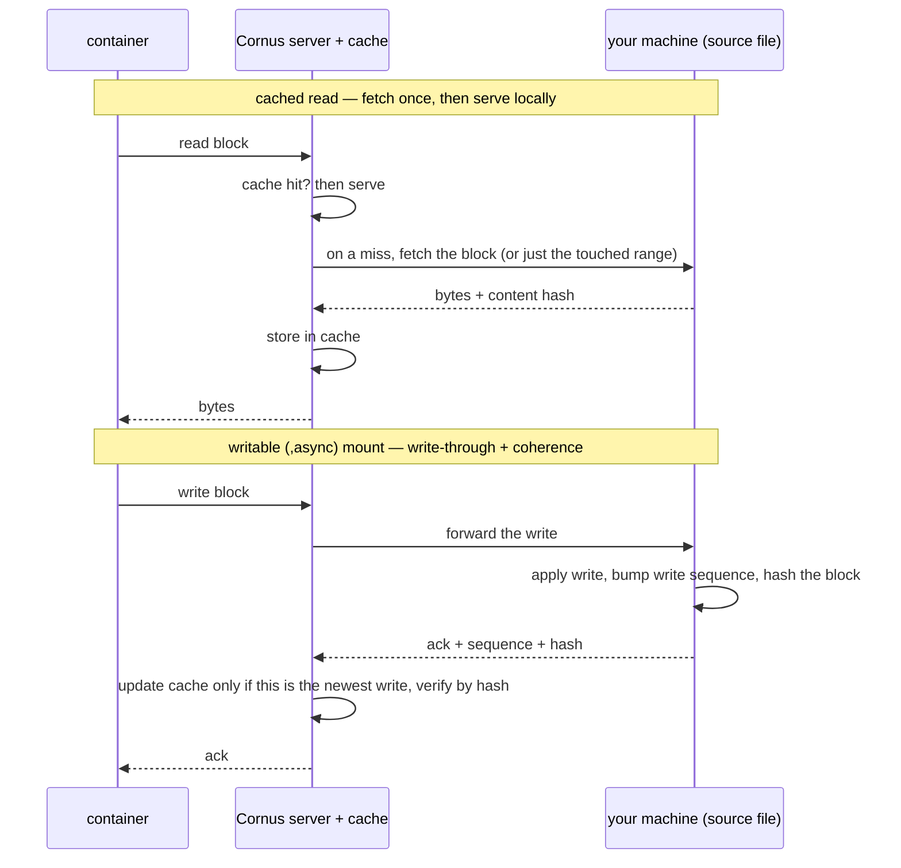

# デプロイエンジンとバックエンド

デプロイエンジンは **命令的かつ差し替え可能** です。すべてのバックエンドは、同じ小さなインターフェース、つまり `Apply` / `Status` / `List` / `Delete` を実装します。`Apply` は `cornus.app` ラベルをキーとし、既存のワークロードを再作成する意味論を持ちます。Cornus は意図的に **運用者ではありません**。CRD も収束ループもありません。Cornus はオブジェクトを自分で作成するため、適用時に直接変更します。

## 4 つのバックエンド

| バックエンド | 通信先 | 備考 |
|---|---|---|
| `dockerhost` (既定) | unix ソケット越しの Docker エンジン REST API | hand-rolled な minimal クライアント。heavyweight な Docker SDK 依存関係 tree を避けています。 |
| `containerd` | containerd ソケット越しの containerd クライアント API | 素の containerd ホスト上でワークロードをネイティブに実行します。dockerd は不要です。Linux-only。 |
| `bare` | OCI ランタイム CLI (runc/crun/youki) を直接、デーモンなし | デーモンレス。cornus 自身がイメージプル・プロセス監督・cgroup を所有します。Linux 専用。root + OCI ランタイムバイナリ + CNI プラグインが必要です。 |
| `kubernetes` | client-go | `DeploySpec` をデプロイメントと ClusterIP サービス、必要に応じてイングレスに map します。Stop/Start は 0 へスケールして戻します。再起動は pod-template annotation を付与して rollout を trigger します。クラスター内またはローカル kubeconfig から読み込めるため、開発 machine から kind クラスターを対象にできます。 |

バックエンド selection はサーバーの `CORNUS_DEPLOY_BACKEND` (既定は `dockerhost`) です。ローカル `cornus deploy` CLI は host-level バックエンドに対して同じ変数を尊重します。クラスターへデプロイする場合は、`cornus deploy --server ...` によるフォアグラウンド deploy-attach セッションとしてサーバー経由で行います。`cornus deploy --detach` / `-d` は stateless variant です。仕様を POST して終了し、クライアントセッションなしでワークロードを実行し続けます。クライアントローカルマウントソースは稼働中セッションを必要とするため前段で拒否され、ポートは自動転送されません。同梱の Kubernetes マニフェストと Helm chart はバックエンドを明示的に `kubernetes` に設定します。クラスター内サーバーを既定のままにすると、pod 内に Docker ソケットがないため、すべてのデプロイが失敗します。

共有の **ホスト権限ポリシー** がホストバックエンドを管理します。`Privileged` ワークロードとホストバインドソースは既定で拒否され、`CORNUS_ALLOW_PRIVILEGED` / `CORNUS_ALLOW_BIND_SOURCES` で明示的に有効化できます。

## バックエンド共通の契約

インターフェースには文書化された契約があるため、バックエンド間で挙動が気付かないうちにずれることはありません。

- 存在しない name に対する Stop/Start/Restart は共有 not-found エラーを返します (HTTP 404 に map されます)。`Delete` は delete-if-exists のままです。
- `spec.Command` は常にイメージ ENTRYPOINT への argument で、`spec.Entrypoint` がそれを上書きします。つまり **どこでも docker semantics** です。kubernetes バックエンドがコマンドを `Args` に map するのは、まさにこのためです。k8s の `command` フィールドは entrypoint を黙って置き換えてしまいます。
- Non-TTY ログ、exec、attach 出力はすべてのバックエンドで stdcopy-framed です。またログ `--since` はどこでも docker grammar を解析します。クライアントは無条件に demux と解析を行います。
- `replicas > 1` での host-port publishing は、両方のホストバックエンドでレプリカ 0 のみをバインドします (ホストポートにつき DNAT 対象は 1 つ)。`Delete` は匿名ボリュームを reap します (`docker rm -v` parity)。状態の *状態* 文字列は、documented design として backend-specific のままです。portable なのは `running` だけです。

## containerd バックエンド

containerd バックエンドは containerd デーモンに対して直接完全な対象範囲を実装し、`CORNUS_CONTAINERD_ADDRESS` にある専用名前空間 (`CORNUS_CONTAINERD_NAMESPACE`、既定 `cornus`) でコンテナを管理します。dockerd が機構を提供する部分について、このバックエンドは自前で持ちます。

- **イメージプル** は独自の resolver を構築します。localhost レジストリは自動的に plain-HTTP になります (隣にある cornus レジストリ)。`CORNUS_CONTAINERD_INSECURE_REGISTRIES` はそれを明示的な list に拡張し、それ以外は通常どおり解決します。パブリックレジストリが要求する匿名トークン flow も含みます。Docker-style short name は正規化されます (`nginx` は `docker.io/library/nginx:latest` になります)。レジストリに到達できないが ref がすでに名前空間のイメージストアに存在する場合、たとえば containerd ビルドワーカーによって直前にビルドされた場合は、ローカルイメージが使われます。そのため same-host build-then-deploy にレジストリ round trip は不要です。containerd root 自体がオーバーレイファイルシステム上にある場合 (docker-in-docker) は、kernel が overlay-upon-overlay マウントを拒否するため、`CORNUS_CONTAINERD_SNAPSHOTTER=native` を設定してください。
- **Networking は CNI bridge + portmap** です (nerdctl-style)。すべてのネットワーク、compose `networks:` または暗黙的既定は、割り当てられた `10.4.<n>.0/24` (`CORNUS_CNI_SUBNET_BASE` で base 指定) 上に host-local IPAM を持つ generated CNI 設定です。プラグイン binary は `CORNUS_CNI_BIN_DIR`、`CNI_PATH`、または `/opt/cni/bin` から見つけます。プラグインがない場合、適用は実行可能なエラーで失敗します。**Inter-container name resolution は hosts-file 同期** です。bridge CNI には組み込み resolver がないため、各サービスの name と alias はレプリカ 0 の IP を指します。
- **ログは cornus restart をまたいで残ります**。小さなログ shim がデータディレクトリの下に JSON-line record を append します。monitor によって再起動された task は cornus の関与なしにログ記録を継続します。ファイルは `CORNUS_CONTAINERD_LOG_MAX_BYTES` (既定 16 MiB) で rotate し、古い generation を 1 つ保持します。running shim がファイルを開き続けるため、rotation は cornus-driven な (re)start 時に起きます。
- **再起動ポリシーは containerd 自身の再起動 monitor** です。label がポリシーを保持し、Stop は explicitly-stopped label を設定するため、`unless-stopped` / `always` task が蘇りません。Start はそれを clear します。
- **startup 時の one-shot 収束 pass が stale ネットワーク名前空間を修復します。** `/run` は tmpfs なので、ホスト reboot によって pinned netns がすべて失われる一方で、仕様は dead パスを指したままです。バックエンドは construction 時に、desired 状態が running のすべての record について netns、CNI attachment、pin を再構築します。その後 containerd の monitor が task 自体を復活させるため、両者は race しません。
- **Exec、stats、コピー、ポート転送** はすべて動作します。attach は output-only です (ログ shim が stdio pipe を所有するため)。コピーには running インスタンスが必要で、ヘルスチェックは警告とともに無視されます (containerd には probe エンジンがありません)。

## bare バックエンド

`bare` バックエンド (`CORNUS_DEPLOY_BACKEND=bare`) は `containerd` からさらに一歩進み、*デーモンそのもの* を取り除きます。cornus は低レベル OCI ランタイム CLI (runc/crun/youki、`CORNUS_BARE_RUNTIME` 経由) を直接駆動し、デーモンが本来提供するすべてを自身で所有します。プロセス内 content store へのイメージプル、layer 展開 + rootfs snapshot、`config.json` 生成、プロセス監督、cgroup、ロギングです。**cornus 自身が Podman になる** 構成です。状態は `<DataDir>/bare/` 下に保存されます。

- **daemon 非依存の機構は containerd と共有します。** ネットワーク (CNI bridge + portmap)、hosts-file DNS 同期、DataDir ボリューム + イメージ seeding、OCI spec-opts、Docker-stats encoder は、両バックエンドが import する internal パッケージ (`pkg/deploy/internal/hostrun`) に切り出されています。そのため `bare` のネットワーク、名前解決、ボリュームは `containerd` と同じ挙動になり、各バックエンドは差分のみ (containerd は container ラベルを読み、bare は自身の JSON record を読む) を供給します。ツリー全体が BuildKit から独立したままで、さらに `bare` は cgroup *manager* をロードせず cgroup ファイルを直接読むため、cgroup-manager ライブラリの `cilium/ebpf` / `dbus` からも独立です。
- **cornus が supervisor そのものです。** `runc create`/`start` は即座に戻り、runc の `/run` state は tmpfs なので、cornus 自身が pidfd で各 container の PID1 を待ち、restart policy (`no` / `on-failure[:N]` / `always` / `unless-stopped` — `on-failure:N` は containerd restart monitor では表現できません) を上限付きバックオフで適用して再起動します。既定のプロセス内 supervisor と、オプトインの **デタッチ shim** (`CORNUS_BARE_SHIM`、cornus 再起動後も存続する conmon 相当) がこのエンジンを共有します。起動時の reconcile パスがサーバー再起動後は生存者へ再アタッチし、ホスト再起動後はワークロードを完全に再構築します (失われた tmpfs netns pin が *まさに* 再起動のシグナルです)。
- **record store がメタデータ DB を置き換えます。** `<DataDir>/bare/records/<id>/record.json` (アトミック書き込み) がイメージ/snapshot/IP/ポート/policy と期待・観測の監督状態を保持し、`runc state` が liveness の真実の情報源であり続けます。`containerd` と同等にするため、オプションインターフェース一式 (クライアントローカルマウント、egress companion、`CORNUS_BARE_REMOTE` 経由の remote companion、ボリューム削除) を実装しています。root、OCI ランタイムバイナリ、CNI プラグインが必要で、rootless は対象外で明確にエラーになります。

## ボリュームと後片付け

ボリュームは各バックエンドのネイティブ semantics に map されます。Kubernetes では匿名ボリュームはデプロイメントの lifetime に bound された dynamically-provisioned PVC になります (`docker rm -v` parity)。名前付きボリュームは delete 後も生き残る共有 PVC になり、デプロイメント間で共有されます (Docker named-volume semantics)。init コンテナは fresh PVC にイメージに baked された content を初期設定します。copy-only-when-empty なので、user の書き込みは保持されます。containerd バックエンドはどちらの kind も data-dir ディレクトリで backing し、同じ方法で初期設定します。dockerhost では同じ semantics が Docker からそのまま得られます。

**Cleanup は ownership-based であり、call-sequence-based ではありません。** Kubernetes では、`Apply` はまずデプロイメントを作成し、それからサービスと各匿名 PVC にデプロイメントへの owner 参照を付与します。`Delete` は foreground-propagation のデプロイメント delete 1 回だけで、Kubernetes GC が dependent を回収します。中断された delete がそれらを orphan することはなくなります。

## クライアントローカルバインドマウント

`cornus deploy --server` や Compose はリモートサーバーに対して、デプロイホストではなく **自分の** マシン上にあるディレクトリを bind-mount できます。これがリモートデプロイを inner-loop ツールに変えます。ローカルでファイルを編集すればワークロードがそれを見ます。これは [ビルドエンジンの transport](/ja/architecture/build-engine#9p-経由のリモートビルド) — 1 本の WebSocket、yamux、9P — を再利用し、役割の反転も同じです。**呼び出し元が 9P サーバー** で、自分のローカルディレクトリを export し、Cornus サーバーが 9P クライアントです。

サーバーは export された各ディレクトリを 9P で kernel-mount し、spec をバックエンドに渡す前に **マウント source を** その mountpoint に **書き換えます**。そのためバックエンドはそれを通常のホストパスと同様に bind し、9P が関与していることを意識しません。マウントは呼び出し元から提供されるため、デプロイメントはコマンドが接続している間だけ生きます。セッションを切る (または `down` を送る) と、まずコンテナが削除され、次に 9P マウントが unmount されます。これは意図的に、クライアントローカルマウントを永続的な本番ワークロードではなく開発 / inner-loop 用途に scope します。クライアントローカル source はサーバー自身の `<DataDir>/mounts` area から提供され、常に許可されるため、host-privilege ポリシーを緩める必要はありません。

NAT の背後にある pod は呼び出し元から直接 dial できないため、**Cornus サーバーが接続の仲介 (rendezvous)** になります。Kubernetes (および remote モードのホストバックエンド) では、pod の [caretaker](/ja/architecture/caretaker) サイドカーがサーバーへ 1 本の接続を dial し、サーバーが各マウントストリームを呼び出し元上の新しい backing に bridge します。マウントは *pod 内部で* 実現され — ノードホスト上では決して行われないため — pod はどこにでもスケジュールでき、startup probe がマウントが live になるまでアプリコンテナを保留します。

### 読み取りキャッシュと書き込み可能マウント

9P を素朴に tunnel するのは chatty で、すべての読み取りが wire を越えます。それが問題になる 2 つのケースのために、Cornus はサーバー側で 9P を終端し、サーバー側の per-file **block cache** (1 MiB chunk、on-disk、restart をまたいで存続) を前段に置きます。どれを使うかは `--local-mount SRC:DST` の suffix でマウントごとに選びます。

| マウント suffix | 提供方法 | 用途 |
|---|---|---|
| (なし) | 素通しの 9P pipe | 小さい / まれにしか読まれないマウント、および read-write な source ディレクトリ。 |
| `,cache` (`:ro` を含意) | read-through cache — 一度 fetch した chunk は二度と re-fetch されない | 大きな **immutable** な読み取り専用入力 (データセット、モデルの重み)。 |
| `,async` (書き込み可能) | cache-coherent な **block protocol** | 開発用データベースのような書き込み集約的な **single-writer** ワークロード。 |

どちらの cached モードもサーバー側のファイルキャッシュを有効にする必要があります (`--file-cache` / `CORNUS_FILE_CACHE`、`CORNUS_FILE_CACHE_DIR` とともに)。無効な場合はすべてのマウントが素通し pipe にフォールバックします。`,cache` は content-versioned で、source ファイルへの変更は新しい identity を生むため、stale なバイトが提供されることはありません。だからこそ、セッション中に mutate しないと約束できる入力にのみ有効です。

`,async` は、読み取りと書き込みのたびに content hash と write sequence を運ぶ block-indexed protocol を通じて、*書き込み可能な* キャッシュをローカルファイルと coherent に保ちます。そのためサーバーは呼び出し元が supersede した block を決して提供しません。single replica が必要で、`:ro` や `,cache` とは組み合わせられません。データベース型のランダム I/O では、sub-block coherence と demand-fill を有効にします — `CORNUS_BLOCK_COHERENCE=subhash,subfill` と `CORNUS_BLOCK_READAHEAD` の cap を、サーバーと deploy caller の **両方の** 環境に設定します。両者は共有 feature set を negotiate するため、片側だけに設定したフラグは silently に drop されます。これにより cold なランダムスキャンが、point query ごとに 1 MiB block 全体を fetch する代わりに、触れた数キロバイトだけの fetch に減ります。[サーバー環境変数](/ja/reference/server-env-vars#リモート-9p-ファイルキャッシュと書き込み可能マウント)を参照してください。

3 つのモードはサーバー側の 1 本のデータパスを共有します。cached read は最初の fetch 以降ローカルで提供され、書き込み可能マウントは自分のマシンへ write-through しつつ、content hash と write sequence でサーバーキャッシュを coherent に保ちます。そのためサーバーは、ファイルがすでに追い越した block を決して提供しません。

**キャッシュディレクトリの中身。** `--file-cache` を有効にすると、cached ファイルはそれぞれ `CORNUS_FILE_CACHE_DIR` 配下の **sparse ファイルと小さな index sidecar** になり、fan-out を抑えるためサブディレクトリに sharded されます。実際に読まれた chunk だけが格納され (data ファイルは sparse)、キャッシュは **サーバーの restart をまたいで存続** します。`CORNUS_FILE_CACHE_MAX_BYTES` はバックグラウンドのガベージコレクションで合計サイズを cap します。`CORNUS_FILE_CACHE_DIR` はサーバーのデータディレクトリではなく専用ボリュームを指すようにしてください。

## Compose のユーザー定義ネットワーク

Compose `networks:` は 4 つすべてのバックエンドで対応されます。**dockerhost** ではネイティブ Docker ネットワークです (create-if-absent、member のない管理対象ネットワークは delete 時に reap)。**containerd** と **bare** では上記の generated CNI bridge で、hosts-file 同期により name が解決されます。**kubernetes** では compose `driver` が provider pipeline を選択します。

| Compose `driver` | 仕組み | isolation strength |
|---|---|---|
| (none) / `services` | alias ごとに 1 つの headless サービス (bare-name DNS) | なし - DNS baseline、任意のクラスター |
| `bridge` / `ipvlan` / `macvlan` | Multus NetworkAttachmentDefinition + pod annotation | topological。NAD CRD が必要 |
| `policy` | membership label に基づく共有 ingress-only NetworkPolicy | kernel。CNI が強制する場合 |
| `cilium` | 共有 CiliumNetworkPolicy | kernel (Cilium)。CNP CRD が必要 |
| `driver_opts: {proxy: "true"}` | caretaker enforcing エグレスプロキシ | userspace、CNI-independent、hard |
| ... `+ mode: cooperative` | loopback リスナーを peer の real サービスへ splice | userspace、zero-privilege、soft |

Multus fabric は plan-time deterministic 静的 IP を取得し、caretaker の DNS 役割はそれらの pinned 副 IP を提供します。クラスター DNS が publish するのは常に pod の主 IP だけなので、オーバーレイがなければ peer の name は user ネットワークではなくクラスターネットワーク上に解決されてしまいます。クラスター capability がない場合は `services` にフォールバックし、ネットワークごとに 1 回警告を出します (`CORNUS_K8S_NET_STRICT` では hard エラーになります)。enforcing プロキシの allow-list は compose-plan time に計算されます。その時点で topology 全体が見えているため、動的 query はなく、プロジェクト内での staleness もありません。

::: info Rollback は意図的に範囲外です
Compose とプレーン Docker には rollback の概念がなく、Kubernetes ではバックエンドがデプロイメントを in-place update し、ネイティブ ReplicaSet history を保持します。そのため `kubectl rollout undo deployment/<name>` がすでに機能します。独自の cross-backend revision ストアは、意図的に命令的で stateless なデプロイ model に stateful history を追加してしまいます。
:::

## 関連ページ

- [Deploying workloads](/ja/guides/deploying-workloads) - デプロイワークフロー。
- [Remote workflows](/ja/topics/remote-workflows) - ユーザー視点でのリモートデプロイとクライアントローカルマウント。
- [デプロイ backends](/ja/reference/deploy-backends) - バックエンドごとの設定。
- [デプロイスペック](/ja/reference/deploy-spec) - すべての仕様フィールド。
- [Networking ガイド](/ja/guides/networking) - ネットワークの実践。
- [cornus deploy](/ja/cli/deploy) - 完全なフラグ set。
