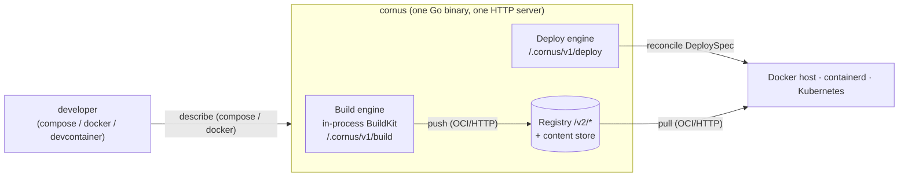

# アーキテクチャ概要

Cornus は **単一の Go バイナリ** です。`docker compose`、`docker` CLI、devcontainers といった Docker ワークフローを、チームが自前でレジストリ、`buildkitd`、GitOps コントローラーをあらかじめ用意しなくても、Docker ホスト、containerd ホスト、または Kubernetes 上の実行中ワークロードまで運びます。1 つの HTTP サーバーが 3 つのサブシステムの前面に立ちます。これらは初回利用時に遅延構築されるため、Docker ホストに到達できない環境やビルドエンジンを初期化できない環境でも、サーバーは正常に起動できます。

この節では、Cornus が内部でどう動くかを説明します。データフロー、通信プロトコル、セキュリティ特性を、評価や運用を行う人向けにまとめています。コントリビューター向けの設計文書、つまりパッケージレイアウト、確定済みの設計判断、テストについてはリポジトリにあります。
[GitHub のアーキテクチャ.md](https://github.com/moriyoshi/cornus/blob/main/ARCHITECTURE.md) を参照してください。

## 基本モデル

エンドツーエンドの流れは 4 つの段階で構成され、それぞれを具体的なコンポーネントが実現します。

1. **記述。** Docker 互換クライアント (`cornus compose`、`docker` フロントエンド、devcontainers) は、単一のクライアント側エージェントによって Cornus の `DeploySpec` / ビルド要求へ変換されます。
2. **ビルド。** ソースは **プロセス内 BuildKit solver** により OCI イメージになります。別個の `buildkitd` なしで、完全な `buildx` 機能一式を使えます。ビルドはリモートサーバー上で実行することもでき、その場合、呼び出し元のディレクトリ、シークレット、SSH エージェントは 9P-on-WebSocket で、必要に応じて遅延にストリームされます。
3. **公開。** ビルドされたイメージは、永続的なコンテンツアドレス指定ストアを基盤とする **小規模な OCI Distribution v1.1 レジストリ** に置かれます。
4. **デプロイと実行。** 1 つの `DeploySpec` は、差し替え可能な **デプロイエンジン** により、利用中のランタイムへ命令的に収束されます。対象 *自身*のランタイム、つまり dockerd、containerd、または kubelet がレジストリから OCI 経由でイメージをプルして起動します。

ここで 2 つの点が明確になります。デプロイエンジンはイメージ byte を扱いません。対象に **参照** を渡し、対象のランタイムがそれをプルします。また 3 つのサブシステムは Go API ではなく **OCI HTTP protocol** (`/v2/*`) で接続されます。これにより、それぞれを独立して進化させたり、外部レジストリへ向けたりできます。

## 全体に繰り返し現れる性質

いくつかの design property はすべてのサブシステムに現れます。最初に把握しておくと、この section の残りを読みやすくなります。

- **1 プロセス、遅延 assembly。** 単一の HTTP mux が 3 つすべてのサブシステムの前面に立ちます。ビルドエンジンとデプロイバックエンドは初回利用時に構築されるため、registry-only または deploy-only サーバーは、他サブシステムの prerequisite がなくても動きます。
- **Go ではなく OCI による loose coupling。** ビルドエンジンとデプロイエンジンはレジストリやコンテンツストアをインポートしません。通常の OCI クライアントとしてやり取りします (`/v2/*` 越しのプッシュ / プル)。3 つのうちどれでも独立して進化させたり、外部レジストリに向けたりできます。
- **BuildKit は封じ込められている。** ビルドエンジンは BuildKit の solver をプロセス内に embed しますが、その重い依存関係 tree は意図的に隔離されています。デプロイと wire 転送経路は BuildKit package を一切 link しません。
- **リモート work は 9P-on-WebSocket でストリームされる。** リモートビルドとクライアントローカルバインドマウントのどちらも、呼び出し元のファイルを呼び出し元の machine に置いたまま、リモートサーバー上で work を実行できます。ファイルは単一の WebSocket トンネル上の 9P ファイルシステムとして demand-driven に提供されます。

## 権限の考え方

elevation が必要なのはビルドエンジンだけです。ビルドエンジンは `runc` + `overlayfs` + user 名前空間をプロセス内で実行するため、**ビルドを実行する** インスタンスは `privileged` で動くか (同梱の Compose ファイル、Kubernetes マニフェスト、Helm chart では既定)、または `uidmap`、`rootlesskit`、`slirp4netns` を用意し、`--rootless` を設定してルートレスで動く必要があります。レジストリとデプロイサブシステムには特別な privilege は不要です。`dockerhost` バックエンドは Docker ソケットだけを必要とし、`containerd` バックエンドは containerd ソケットに加えて、自身のネットワーク名前空間と CNI プラグインのために root を必要とします。

鋭い edge はクライアントローカルバインドマウントです。kernel-9p `mount(2)` には **CAP_SYS_ADMIN / root** と `9p` kernel module が必要です。またサーバーがコンテナ内で動く場合、マウントディレクトリは `rshared` propagation 付きでホストから bind-mounted されている必要があります。そうしないとマウントが Docker デーモンのマウント名前空間へ伝搬しません。具体的な設定は [インストール](/ja/introduction/installation) を、バックエンドごとの要件は [デプロイ backends](/ja/reference/deploy-backends) を参照してください。

## オブザーバビリティモデル

1 つの OpenTelemetry の仕組みが Cornus の 3 プロセス、つまりサーバー、pod ごとの caretaker sidecar、クライアント CLI にまたがります。これは標準の `OTEL_*` 環境変数だけで駆動されます。オプトインであり、無効なら余計な負荷はかかりません。テレメトリーは `CORNUS_OTEL` または `OTEL_*` 変数が設定されている場合にのみ有効になります。それ以外では計装箇所は OpenTelemetry の no-op 既定に落ち、エクスポーターの goroutine は起動しません。

有効な場合、トレースコンテキストはエンドツーエンドで伝搬します。クライアントは呼び出しごとにルート span を一つ開き、すべての REST 呼び出しと WebSocket attach 接続に W3C `traceparent` を注入します。サーバーの HTTP レイヤーはこれを抽出し、caretaker は中継接続に自身の span コンテキストを注入します。その結果、**クライアント → サーバー → caretaker** は、接続確立をまたぐ一つの関連付けられたトレースになります。digest やデプロイメント名のようなカーディナリティの高い span 名は経路テンプレートにまとめられるため、メトリクス系列が爆発しません。オプトインの Prometheus プルエンドポイント (`CORNUS_METRICS_PROMETHEUS`) は、認証を必要としない `/metrics` 経路を登録します。設定は[オブザーバビリティガイド](/ja/guides/observability)を参照してください。

## この節の残り

- [サーバー、レジストリ、コンテンツストア](/ja/architecture/server-and-registry) - 1 つの HTTP プロセス、運用上の保護策、OCI レジストリ、差し替え可能な永続化、GC。
- [The ビルドエンジン and リモート builds](/ja/architecture/build-engine) - プロセス内 BuildKit solver、9P remote-build 転送経路とその trust boundary、キャッシュ、遅延コンテキスト。
- [The デプロイエンジン and backends](/ja/architecture/deploy-engine) - バックエンドインターフェースと cross-backend contract、containerd バックエンド、ボリューム、compose user ネットワーク。
- [Networking](/ja/architecture/networking) - ポート転送、パブリックトンネル、自動イングレス、セッション conduit、ワークロード間 hub。
- [The caretaker and クライアント側 features](/ja/architecture/caretaker) - クライアントローカルバインドマウント、sidecar の役割、in-pod Docker エンドポイント、クライアント側エグレス。
- [Docker-compatible clients](/ja/architecture/clients) - Docker API プロキシ、compose と devcontainers、unified クライアントエージェント、接続プロファイル。
- [セキュリティ model](/ja/architecture/security) - 認証、TLS と mTLS ID、認可、trust boundary。
