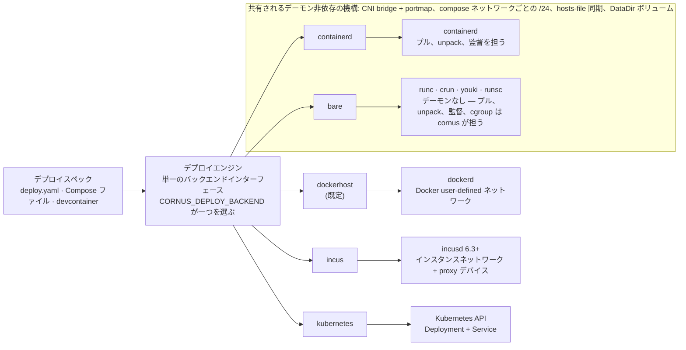
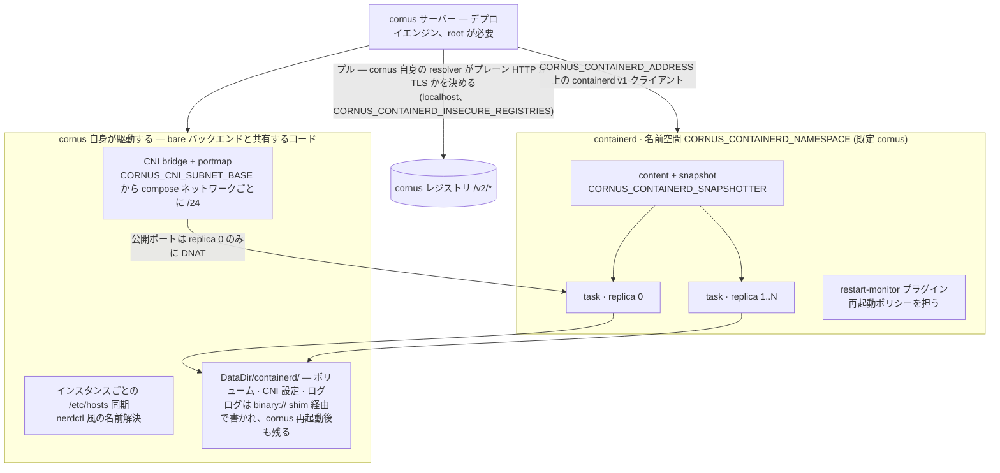
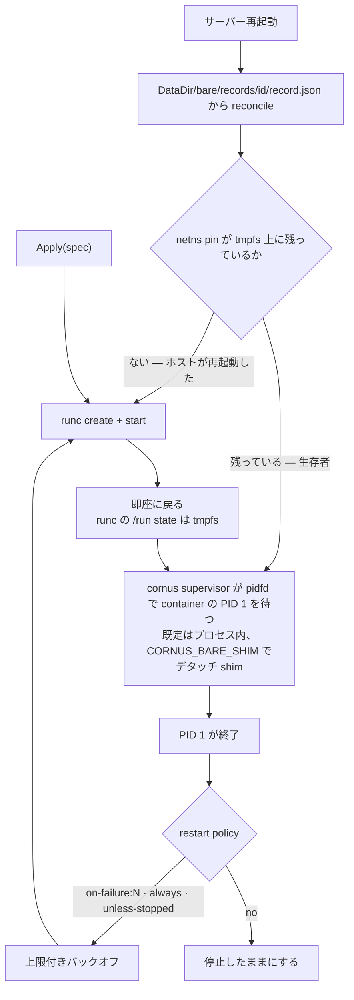
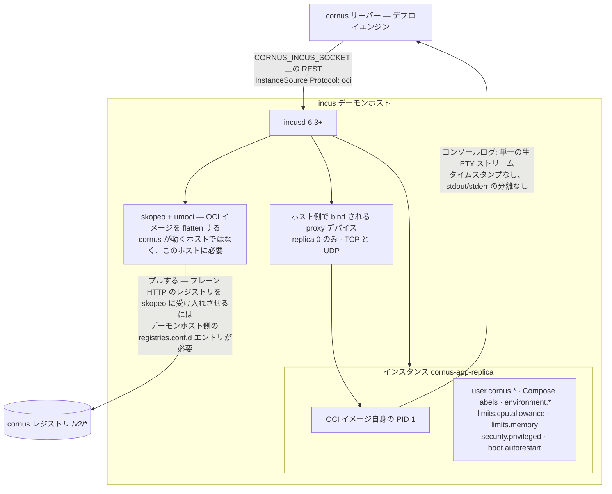
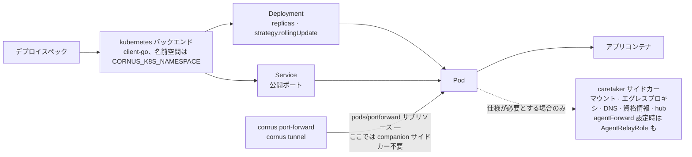

# デプロイバックエンド

cornus deployエンジンは [デプロイスペック](/ja/reference/deploy-spec) (ネイティブ `deploy.yaml`、または Compose ファイル / devcontainer から変換されたもの) を、**交換可能な五つのバックエンド** のいずれかへ適用します。すべて同じインターフェースの背後にあり、`CORNUS_DEPLOY_BACKEND` 環境変数で選びます (環境変数のみ。CLI フラグはありません)。

| `CORNUS_DEPLOY_BACKEND` | 対象 | Networking | 備考 |
| --- | --- | --- | --- |
| `dockerhost` (既定) | ローカル Docker デーモン | Docker ネットワーク | Docker ソケット (`/var/run/docker.sock`) が必要。 |
| `containerd` | dockerd のない素の containerd ホスト | CNI bridge + portmap | Linux 専用。root + CNI プラグインが必要。 |
| `bare` | OCI ランタイム CLI (runc/crun/youki) を直接 — **デーモンなし** | CNI bridge + portmap | Linux 専用。root + OCI ランタイムバイナリ + CNI プラグインが必要。イメージプル・監督・cgroup を cornus 自身が所有。 |
| `incus` | [Incus](https://linuxcontainers.org/incus/) デーモン (6.3+) | Incus インスタンスネットワーク + `proxy` デバイス | Linux 専用。OCI イメージを Incus の **アプリケーションコンテナ**として実行します。デーモンホスト側に `skopeo` + `umoci` が必要。仕様フィールドの対応範囲は最も狭く、下記を参照してください。 |
| `kubernetes` / `k8s` | Kubernetes クラスター (client-go) | デプロイメント + サービス | サーバー / クラスター内のみ。RBAC 範囲。 |

選択はサーバー (`cornus serve`) と、`--server` なしで実行するローカル [`cornus deploy`](/ja/cli/deploy) の両方に適用されます。例外は `kubernetes` です。これは server/cluster 内専用で、`CORNUS_DEPLOY_BACKEND=kubernetes` のローカル `cornus deploy` は警告とともに `dockerhost` へフォールバックします。

四つの host バックエンドは同じ核となる仕様フィールド (`name` / `image` / `replicas` / `restart` / `env` / `ports`) を尊重し、さらに `dockerhost` / `containerd` / `bare` はクライアントローカル 9P バインドマウント、Compose user ネットワーク、公開ポート転送も共有します。そのためこの三つの間では同じワークフローを変更せず移動できます。例外は `incus` です。核となるフィールドは map しますが、マウント、ボリューム、user ネットワーク、ヘルスチェック、command/entrypoint の上書きには対応せず、黙って捨てるのではなくフィールドごとに警告します。特定バックエンドにしか対応しない仕様フィールドは[デプロイスペックリファレンス](/ja/reference/deploy-spec)にフィールドごとに記載されています。



privilege の扱いは**default-deny**です。明示的に許可 (`CORNUS_ALLOW_PRIVILEGED`、`CORNUS_ALLOW_BIND_SOURCES`) しない限り、特権コンテナとホストバインドマウントは拒否されます。[セキュリティと認証](/ja/guides/security)を参照してください。

host バックエンド (`dockerhost`、`containerd`、`bare`) では、ワークロードの*傍らで*動く必要があるもの — クライアントローカルマウント、クライアント側エグレス、そして remote モードでは以下で説明するポート転送の再ルートと ssh-agent 中継 — はすべて、そのレプリカのネットワーク名前空間を共有する**レプリカごとに 1 つの companion `cornus caretaker` コンテナ**で実現されます。したがって 1 回のデプロイでクライアントローカルマウントとクライアント側エグレスを組み合わせられます。host バックエンドがまだ実現していない唯一のアタッチメントはクライアント由来の資格情報で、これは引き続き `kubernetes` 専用です。

## `dockerhost` (既定)

ローカル Docker デーモン上でワークロードをコンテナとして実行します。Docker ソケット (`/var/run/docker.sock`、`CORNUS_DOCKER_SOCK` で上書き可) が必要です。最も機能が豊富なバックエンドで、仕様フィールドの最大範囲を Docker の create-time / host-config オプションに直接 map します。Compose user ネットワークは実際の Docker user-defined ネットワークとなり、libnetwork が DNS とネットワークごとの isolation をネイティブに提供します。

[host-native 再エクスポート](/ja/reference/server-env-vars#reusing-a-local-image-store) (このバックエンドでは既定) では、デーモンが既に持っているイメージ (bare またはループバックホストの参照) について、このバックエンドは**レジストリプルをスキップ**します。そのイメージをプルすると cornus のレジストリ経由で同じデーモンへ往復してしまうためです。外部の参照 (例: `docker.io/...`) は従来どおりプルされます。

**クライアントローカルバインドマウント** は通常、呼び出し元のエクスポートを cornus **サーバー**自身のホストへ直接 kernel-9p マウントして実現されます — サーバーが駆動する Docker デーモンと同じホストにあることを前提とした、単一ホストの高速パスです。`CORNUS_DOCKER_REMOTE=1` を設定すると、代わりに caretaker-sidecar 経路 (`kubernetes` バックエンドが常に使っているのと同じ仕組み) にオプトインします。companion の `cornus caretaker` コンテナが kernel 9P マウント自体を行い、`rshared`/`rslave` propagation を持つ Docker 管理ボリュームがそれをアプリコンテナへ中継します。そのため、サーバーがデーモンとファイルシステムを共有していない場合 (例: `DOCKER_HOST=tcp://...`) でもマウントが機能します。これには、このバックエンドの既存のエグレス companion 経路とまったく同じく、`CORNUS_AGENT_IMAGE` に cornus を組み込んだイメージを設定する必要があります。`CORNUS_DOCKER_REMOTE` と `CORNUS_AGENT_IMAGE` については[サーバー環境変数](/ja/reference/server-env-vars)を参照してください。

remote モードでは、この companion はデプロイが `--mount` を使うかどうかにかかわらず、アプリコンテナのネットワーク名前空間を共有して**インスタンスごとに必ず作成されます** — 単なるマウント中継ではなく「remote companion」です。`CORNUS_DOCKER_REMOTE=1` のもとで [`cornus port-forward`](/ja/cli/port-forward) と [`cornus tunnel`](/ja/cli/tunnel) がそもそも機能するのもこのためです。companion がなければ、サーバーにはインスタンス自身のネットワークへ橋渡しする経路がないため、どちらもインスタンスへ直接接続する代わりに companion の共有 netns 経由で再ルートされます。同じ companion により、remote モードの任意のインスタンスで [`cornus exec --forward-agent`](/ja/cli/exec) がローカルの ssh-agent を exec セッションへ転送できるようになります。

二つのマウント経路を並べると次のようになります。呼び出し元のエクスポートがサーバーへ届くまでは同じで、最後の一区間だけが異なります。

```mermaid
flowchart TB
    subgraph fast["既定 — 単一ホストの高速パス"]
        direction LR
        c1["あなたのマシン<br/>エクスポートしたディレクトリ"]
        s1["cornus サーバー<br/>DataDir/mounts/ 下に kernel 9P マウント"]
        a1["アプリコンテナ"]
        c1 -- "deploy-attach WebSocket 上の 9P" --> s1
        s1 -- "バインドマウント — サーバーと dockerd が<br/>ファイルシステムを共有している前提" --> a1
    end

    subgraph rem["CORNUS_DOCKER_REMOTE=1 — remote companion"]
        direction LR
        c2["あなたのマシン<br/>エクスポートしたディレクトリ"]
        s2["cornus サーバー<br/>例: DOCKER_HOST=tcp://..."]
        k2["cornus caretaker companion<br/>インスタンスごとに一つ、アプリの netns を共有<br/>kernel 9P マウントを自身で行う"]
        a2["アプリコンテナ"]
        c2 -- "deploy-attach WebSocket 上の 9P" --> s2
        s2 -- "CORNUS_ADVERTISE_URL 経由で接続してきた<br/>companion へ 9P を中継" --> k2
        k2 -- "rshared / rslave propagation を持つ Docker ボリューム" --> a2
        s2 -. "port-forward · tunnel · exec --forward-agent は<br/>companion の共有 netns 経由で再ルート" .-> k2
    end
```



## `containerd`

`CORNUS_DEPLOY_BACKEND=containerd` は **dockerd のない素の containerd ホスト上でネイティブに** ワークロードを実行し、containerd v1 クライアントに直接デプロイインターフェース全体を実装します。**Linux 専用**で、ほかの環境では unsupported エラーを返します。`dockerhost` と同様、サーバーに対してもサーバーなしのローカル `cornus deploy` に対しても動作します。

必要なもの:

- containerd ソケット (`CORNUS_CONTAINERD_ADDRESS`、既定 `/run/containerd/containerd.sock`; 標準 `CONTAINERD_ADDRESS` はフォールバックとして尊重)、
- **root** (ネットワーク名前空間を作成し CNI プラグインを実行するため)、
- 標準 CNI プラグイン (`bridge`、`portmap`、`host-local`、`loopback`)。`CORNUS_CNI_BIN_DIR`、`CNI_PATH`、`/opt/cni/bin` から検出します。

ワークロードは `cornus` containerd 名前空間 (`CORNUS_CONTAINERD_NAMESPACE`) に置かれ、バックエンド状態 (ボリューム、ログ、CNI 設定) は `<DataDir>/containerd/` 下に保存されます。

- **Networking** は host-port publishing を portmap で行う単純な CNI bridge です。Compose ネットワークごとに `CORNUS_CNI_SUBNET_BASE` (既定 `10.4`) から独自の `/24` を割り当てます。公開ポートはレプリカ 0 だけに DNAT されます。コンテナ間の名前解決は hosts-file 同期 (nerdctl 風) で機能します。UDP ポート mapping はサポートされます (kubernetes バックエンドと異なります)。
- **イメージプル** はプレーン HTTP と TLS を自身で選びます。`localhost` レジストリは自動的にプレーン HTTP、`CORNUS_CONTAINERD_INSECURE_REGISTRIES` (comma-separated `host[:port]`) は明示ホストに拡張します。`CORNUS_CONTAINERD_SNAPSHOTTER` は rootfs snapshotter を上書きします (docker-in-docker のような overlay-backed ホストでは `native` を設定)。
- **ログ** はデータディレクトリ下に保存され、`CORNUS_CONTAINERD_LOG_MAX_BYTES` (既定 16 MiB、旧世代一つを保持) で rotate され、cornus restart 後も残ります。**再起動ポリシー** は containerd restart-monitor プラグインに委譲されます。



containerd **ビルドワーカー** (`CORNUS_BUILD_WORKER=containerd`) と組み合わせると、ビルドの実行、snapshot、content が同じホスト containerd に委譲されます。タグ付きビルドはホストイメージストアに直接入り、ビルド直後のイメージをレジストリ往復なしでデプロイできます。遅延 build-context (`--lazy` / `CORNUS_LAZY_BUILD`) は containerd ワーカーでは**未対応**です。

**クライアントローカルバインドマウント** は `dockerhost` と同様、既定では単一ホストの kernel-9p 高速パスを取ります。`CORNUS_CONTAINERD_REMOTE=1` は同じ caretaker-sidecar の仕組み (companion の `cornus caretaker` コンテナ/タスクが kernel 9P マウントを行い、`rshared`/`rslave` OCI マウントオプションを持つ共有ホストディレクトリ経由でアプリコンテナへ伝播させる) にオプトインし、`CORNUS_AGENT_IMAGE` を必要とします。`dockerhost` と違い、これは真のリモートデーモン対応を**追加しません**。containerd のクライアント dialer はローカルの unix ソケットとしか話さないため、このバックエンドはフラグの有無にかかわらず無条件に cornus サーバーと同じホストにあります。sidecar の仕組み自体は持つ価値がありますが (サーバー自身が kernel マウント権限を持つ必要がなくなり、今後の機能が再利用できる土台にもなります)、同じホストにない containerd への道ではありません。

`dockerhost` と同じく、`CORNUS_CONTAINERD_REMOTE=1` は `--mount` の有無にかかわらず、この companion をインスタンスごとに必ず作成します (アプリの pin されたネットワーク名前空間に参加します)。理由も同じで、[`cornus port-forward`](/ja/cli/port-forward)/[`cornus tunnel`](/ja/cli/tunnel) を再ルートし、`ForwardPort` の通常の直接 IP 接続が関わる場面で [`cornus exec --forward-agent`](/ja/cli/exec) を有効にするのがこの companion だからです。ここではサーバーが CNI bridge ネットワークへ直接接続する経路や権限を必要としなくなるだけで、上記の (未解決の) 真のリモートデーモン問題とは別の話です。

**`dockerhost` との既知の差:** attach は output-only、ヘルスチェックは無視され警告が出ます。ルートレス containerd は現在未検証・未対応です。

## `bare`

`CORNUS_DEPLOY_BACKEND=bare` はワークロードを**デーモンレス**に実行します。dockerd も containerd もありません。cornus は低レベル **OCI ランタイム CLI** (`runc`、または `CORNUS_BARE_RUNTIME` 経由で `crun`/`youki`/`runsc`) を直接駆動し、デーモンが本来提供するすべてを自身で所有します。プロセス内 content store へのイメージプル、layer 展開 + rootfs 構築、OCI `config.json` 生成、**プロセス監督 + restart policy**、cgroup ライフサイクル、ロギングです。実質的に **cornus 自身が Podman になる** 構成です。ほかの host バックエンドと同様 **Linux 専用**で、サーバーにもローカル `cornus deploy` にも動作します。状態は `<DataDir>/bare/` 下に保存されます。

必要なもの:

- **root** (snapshotter mount、ネットワーク名前空間、CNI プラグイン、container cgroup のため)、
- `PATH` 上の **OCI ランタイムバイナリ** (既定 `runc`。起動時に検証され、欠落は実行可能なエラーで即座に失敗)、
- 標準 **CNI プラグイン** (`bridge`、`portmap`、`host-local`、`loopback`。`CORNUS_CNI_BIN_DIR`、`CNI_PATH`、`/opt/cni/bin` から検出)。

Networking、hosts-file 名前解決、DataDir ボリュームの挙動は `containerd` バックエンドと**まったく同じ**です。daemon 非依存の機構は共有コードです (CNI bridge + portmap、compose ネットワークごとに `CORNUS_CNI_SUBNET_BASE` から `/24`、公開ポートはレプリカ 0 に DNAT、インスタンスごとの `/etc/hosts` 同期、空のときだけコピーするボリューム seeding)。加えて、netns gateway 上のプロセス内 resolver が guest DNS に応答します (`CORNUS_BARE_DNS=false` で無効化)。イメージプルはプレーン HTTP と TLS を自身で選び (`localhost` は自動、`CORNUS_BARE_INSECURE_REGISTRIES` が拡張)、rootfs snapshotter は overlay + native フォールバックです (overlay-backed / docker-in-docker ホストでは `CORNUS_BARE_SNAPSHOTTER=native`)。

`bare` に固有なのは **cornus が supervisor そのもの** である点です。`runc create`/`start` は即座に戻り、runc の `/run` state は tmpfs なので、cornus 自身が pidfd で各 container の PID1 を待ち、restart policy (`no` / `on-failure[:N]` — containerd restart-monitor では表現できません / `always` / `unless-stopped`) を上限付きバックオフで適用して再起動します。二つの supervisor 形態がこのエンジンを共有します。プロセス内 (既定) と、オプトインの **container ごとのデタッチ shim** (`CORNUS_BARE_SHIM`、cornus の conmon 相当) で、後者は cornus の再起動後も存続します。起動時の **reconcile** パスがサーバー再起動後は生存者へ再アタッチし、ホスト再起動後はワークロードを完全に再構築します (netns pin は tmpfs 上にあるため、pin の消失が再起動のシグナルです)。インスタンスごとの状態 — イメージ、snapshot、IP、ポート、restart policy、および期待状態と観測状態 — は `<DataDir>/bare/records/<id>/record.json` として永続化されます。これが containerd のメタデータ DB を置き換えるストアです。



クライアントローカルバインドマウントは既定でほかの host バックエンドと同じ単一ホストの kernel-9p 高速パスを取り、`CORNUS_BARE_REMOTE=1` で caretaker-sidecar パスにオプトインします (`CORNUS_AGENT_IMAGE` が必要)。`dockerhost`/`containerd` と異なり、この companion は**マウント専用**で、デプロイが実際にクライアントローカルマウントを宣言したときにのみ存在します。[`cornus port-forward`](/ja/cli/port-forward)/[`cornus tunnel`](/ja/cli/tunnel) はインスタンス自身の IP へ直接接続し (デーモンレスなバックエンドは常にサーバーと同じホストにあるため、これが正しい動作です)、[`cornus exec --forward-agent`](/ja/cli/exec) は利用できず、事前に拒否されます。`containerd` と同等にするため、オプションインターフェース一式 (`MountingBackend`、`EgressBackend`、`RemoteCapable`、ボリューム削除) を実装しています。

**gVisor (`runsc`)。** `CORNUS_BARE_RUNTIME=runsc` を設定すると、各ワークロードが gVisor サンドボックス内で動作します。サンドボックスが guest の cgroup 計測とファイルシステムを所有するため、cornus は 2 つの操作を自動で切り替えます (ランタイム名で検出。`CORNUS_BARE_STATS_SOURCE` で上書き可)。`cornus stats` は host の cgroup ファイルではなくランタイム自身のメトリクス (`runsc events --stats`) を読み、`cornus cp` は host の `/proc/<pid>/root` 経由ではなくコンテナ**内**で `tar` を実行します。ここから 2 点の注意が生じます。`cornus cp` はイメージ内に `tar` バイナリが必要で (scratch/distroless イメージはコピー不可)、コンテナごとのネットワークカウンタは報告されません (`cornus stats` のネットワーク I/O は 0 表示)。それ以外の監督・restart policy・ネットワーク・volume はすべて変わりません。

**`dockerhost` との既知の差:** `containerd` と同様、attach は output-only、ヘルスチェックは無視され警告が出ます。ルートレスは現在対象外で、明確にエラーになります。

## `incus`

`CORNUS_DEPLOY_BACKEND=incus` はワークロードを **[Incus](https://linuxcontainers.org/incus/) のアプリケーションコンテナ**としてデプロイし、公式 Go クライアントで Incus デーモンの REST API (ローカル unix ソケット) と通信します。Incus 6.3+ は OCI イメージをそのままアプリケーションコンテナとして実行でき、cornus が対象とするのはこの機能です。ほかのバックエンドで実行するのと同じ OCI イメージを、dockerd や containerd や cornus 自身ではなく incusd が監督します。**Linux 専用**で (ほかの環境では unsupported エラーを返します)、ほかの host バックエンドと同様、サーバーに対してもサーバーなしのローカル `cornus deploy` に対しても動作します。

必要なもの:

- incus デーモンソケット (`CORNUS_INCUS_SOCKET`、既定は `/var/lib/incus/unix.socket`) とそれへのアクセス権
- **Incus 6.3 以降**。それより前のリリースには OCI サポートがなく、デプロイは `Unsupported protocol: oci` で失敗します
- **デーモンホスト上の `skopeo` と `umoci`**。OCI イメージを平坦化するために incusd 自身がこれらを呼び出します。必要なのは cornus が動くホストではなく *incusd* が動くホストです

インスタンスは `CORNUS_INCUS_PROJECT` (既定は `default`) で選んだプロジェクトに作成され、`cornus-<app>-<replica>` という名前になります。

プル矢印の起点に注目してください。イメージを自分で取得しない唯一のバックエンドです。



- **イメージプルを行うのは cornus ではなく incusd です。** cornus は自身のレジストリを指す OCI remote (`InstanceSource{Protocol: "oci"}`) をデーモンに渡し、incusd が skopeo 経由でプルします。skopeo は既定で HTTPS を使うため、平文 HTTP のレジストリは insecure と宣言する必要があります。`CORNUS_INCUS_INSECURE_REGISTRIES` (カンマ / 空白区切りの `host[:port]`) を設定すると cornus 側がそのホストを `http://` で扱い、加えて**デーモンホスト側**にも対応する `/etc/containers/registries.conf.d/` エントリが必要です (skopeo にも同意させるため)。ループバックのレジストリは cornus 側では自動的に平文 HTTP として扱われます。
- **識別情報とメタデータ**は Incus の `user.*` 設定名前空間に載ります。任意のキーが許されるのはここだけです。`user.cornus.managed`、`user.cornus.app`、由来を示す `user.cornus.origin.*` 一式、そして Compose の `labels:` が格納されます。環境変数は `environment.*`、CPU / メモリの上限は `limits.cpu.allowance` / `limits.memory`、`privileged: true` (ほかと同じくポリシーで制御されます) は `security.privileged` になります。
- **Apply は作り直します。** Incus は実行中インスタンスの削除を拒否するため、仕様の適用時にはそのアプリの既存インスタンスを停止して削除し、`Start: true` で新しく作成します。
- **公開ポート**はホスト側で bind する Incus の `proxy` デバイスになり、バックエンド共通の契約に従って **replica 0 のみ**に付与されます。TCP と UDP のどちらのマッピングにも対応します。
- **restart policy** は真偽値の `boot.autorestart` に map されます。`no` 以外はすべて有効になります。試行回数の上限は Incus にないため、`restart: on-failure:N` の `N` は表現できません (`containerd` と同じ制限です)。
- **ログ**はインスタンスの**コンソール**ログです。OCI の PID 1 の stdout/stderr が単一の生 PTY ストリームとして混ざったもので、cornus はこれを通常の stdout ストリームに framing し直します。この情報源には行ごとのタイムスタンプも stdout/stderr の分離も存在しないため、`--since` / `--until` / `--follow` / `--tail` / `--timestamps` は尊重できません。黙って無視するのではなく、それぞれ個別に警告します (不正な `--since` は従来どおりエラーです)。
- **`cornus stats`** はメモリ、pids、ネットワークを正確に報告しますが、Incus はホスト全体の CPU 合計を公開しないため、そこから導く **CPU 使用率は低く出るかゼロになります**。
- **`cornus cp`** は Incus のインスタンスファイル API を利用します。この API はファイルサイズもシンボリックリンクの参照先も持たないため、cornus は本文を読み切ってサイズを測り、リンクは内容として読みます。正しく動作しますが、安価な stat ではありません。
- **[`cornus port-forward`](/ja/cli/port-forward) と [`cornus tunnel`](/ja/cli/tunnel)** は、インスタンス状態から得たインスタンス自身のルーティング可能な IPv4 へ直接接続します。TCP と UDP の両方に対応し、companion サイドカーは関与しません。
- **[`cornus exec`](/ja/cli/exec)** は TTY のサイズ設定を含めて対応しています。**attach は意図的に非対応**です。Incus が公開するのは docker-attach のストリーム意味論ではなく PID 1 に接続されたコンソールであるため、`cornus attach` は明確なエラーを返し、exec を案内します。

**`dockerhost` との既知の差。** 上記のログと stats の注意点に加えて、incus バックエンドは現在次を map しません。`command` / `entrypoint` の上書き (イメージ自身の entrypoint が実行されます)、`user`、`workingDir`、`mounts` (クライアントローカル 9P バインドマウントを含む)、管理対象 `volumes`、`healthcheck`、Compose の user `networks`、`knative`。いずれも設定されているとフィールド名を挙げた警告を出すため、黙って捨てられることはありません。`CORNUS_INCUS_REMOTE` はほかの host バックエンドのリモート companion フラグとの対称性のために受け付けられますが、caretaker companion の経路はこのバックエンドでは**まだ実装されていません**。そのため、ほかのバックエンドがそこから得ているマウントやポート転送の再ルートは一切実現されません。設定しても目に見える影響は一切ありません。[`cornus exec --forward-agent`](/ja/cli/exec) は引き続き前段で拒否されます。このバックエンドはフラグからサーバーに機能の有無を推測させるのではなく、機能が使えないことを自ら宣言するためです。設定しないでください。

## `kubernetes` / `k8s`

`CORNUS_DEPLOY_BACKEND=kubernetes` (または `k8s`) は **client-go** で Kubernetes クラスターにデプロイし、各ワークロードを **デプロイメント** と公開ポート用の **サービス** として描画します。**サーバー / クラスター内専用**で、このバックエンドを指定したローカル `cornus deploy` は警告とともに `dockerhost` へフォールバックします。提供される Kubernetes マニフェストと Helm chart が使用するバックエンドです。

RBAC 範囲かつ名前空間付き (`CORNUS_K8S_NAMESPACE`) です。高度な仕様 block を実現する唯一のバックエンドでもあります。ネットワーク driver pipeline (`CORNUS_K8S_NET_DRIVER`: `services`、Multus 経由の `bridge`/`ipvlan`/`macvlan`、`cilium`) による user ネットワーク、enforcing エグレスプロキシ、Pod ごとの caretaker DNS resolver、資格情報ブローキング、クライアント側エグレス中継、ワークロード間 [hub](/ja/guides/hub) オーバーレイを提供します。ローリング更新はデプロイメントの `strategy.rollingUpdate` に map されます。

CLI を実行する machine ではなく Kubernetes API を通じてデプロイするため、kubernetes バックエンドが[リモートクラスターで作業する](/ja/guides/remote-clusters)を支えます。developer はクラスター内 cornus サーバーを操作し、ポートごとの転送または SOCKS5 conduit がワークロードポートを laptop へ戻します。

`ForwardPort` (つまり [`cornus port-forward`](/ja/cli/port-forward)/[`cornus tunnel`](/ja/cli/tunnel)) は、ここでは companion サイドカーをまったく必要としません。Kubernetes API 自身の `pods/portforward` サブリソースに直接乗ります。[`cornus exec --forward-agent`](/ja/cli/exec) にも対応しますが、host バックエンドのバックエンド全体に効く remote モードと違い、**デプロイメントごとのオプトイン**です。[DeploySpec](/ja/reference/deploy-spec) に `agentForward` を設定すると、Pod の caretaker に `AgentRelayRole` が組み込まれます (ほかに caretaker 役割を持たない Pod では最小構成のものが作られます)。これを設定せずに適用したデプロイメントは、`--forward-agent` を明確なエラーで拒否します。



## 権限の考え方

**ワークロードを実行するバックエンド** とプロセス内 **ビルドエンジン** は必要な権限が異なります。Cornus サーバーの実行方法はこれで決まります。

- **ビルドを行う** Cornus には昇格が必要です。ビルドエンジンは runc + overlayfs + user 名前空間を実行します。レジストリとデプロイサブシステム単独には不要です。
- `dockerhost` は Docker ソケット、`containerd` はソケット、**root**、CNI プラグイン、`bare` は **root**、OCI ランタイムバイナリ、CNI プラグイン (デーモンソケットは一切不要)、`incus` は incus デーモンソケットへのアクセス権 (加えてデーモンホスト上の `skopeo`/`umoci`) が必要で、ワークロード自身の権限は incusd に委ねます。`kubernetes` は RBAC 下のクラスター内実行が必要です。

```sh
# Simplest: run the container privileged (the shipped default).
#   compose: privileged: true   |   k8s: securityContext.privileged: true

# Rootless: run unprivileged with the prerequisites present, then:
cornus serve --rootless          # or CORNUS_ROOTLESS=1
```

ルートレスには `uidmap` (`newuidmap` / `newgidmap`)、`rootlesskit`、`slirp4netns` と適切な `securityContext` が必要です。イメージには `uidmap` が同梱されます。ホストによっては (例: `kernel.apparmor_restrict_unprivileged_userns=1` の最近の Ubuntu) AppArmor プロファイルまたは緩和した sysctl が必要です。

これは **ワークロード** privilege とは別です。サーバーの実行方法にかかわらず default-deny であり、明示的に許可 (`CORNUS_ALLOW_PRIVILEGED`、`CORNUS_ALLOW_BIND_SOURCES`; [セキュリティと認証](/ja/guides/security)を参照) しない特権コンテナとホストバインドマウントは拒否されます。

## 関連項目

- [`cornus deploy`](/ja/cli/deploy) — 仕様を適用するコマンド。
- [デプロイスペックリファレンス](/ja/reference/deploy-spec) — 全フィールドと各バックエンドの対応。
- [サーバー環境変数](/ja/reference/server-env-vars) — `CORNUS_DEPLOY_BACKEND` とバックエンドごとの設定。
- [リモートクラスターで作業する](/ja/guides/remote-clusters) — laptop から kubernetes バックエンドを操作する方法。
