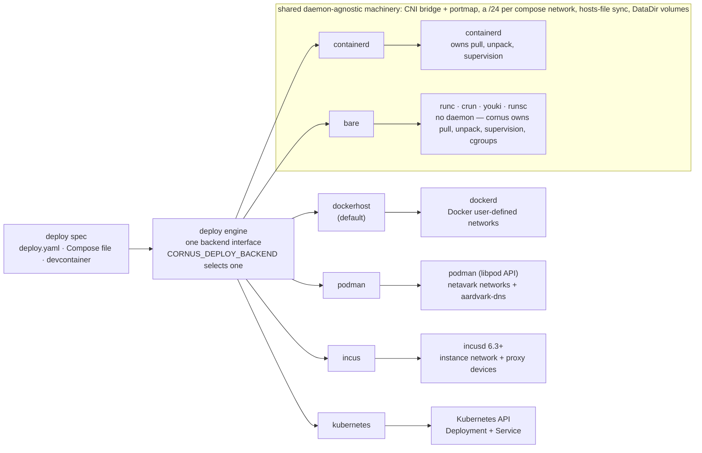
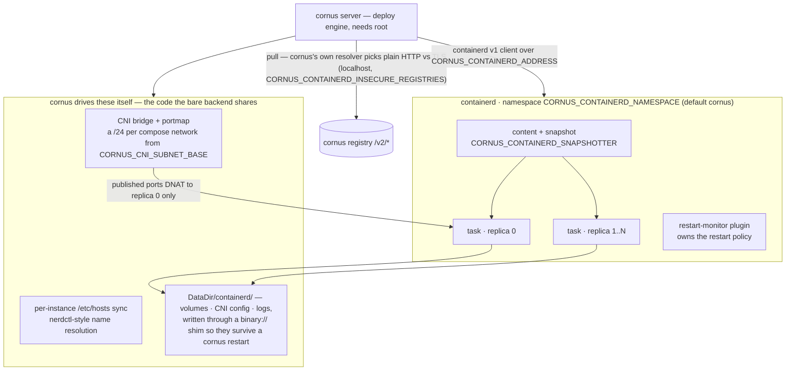
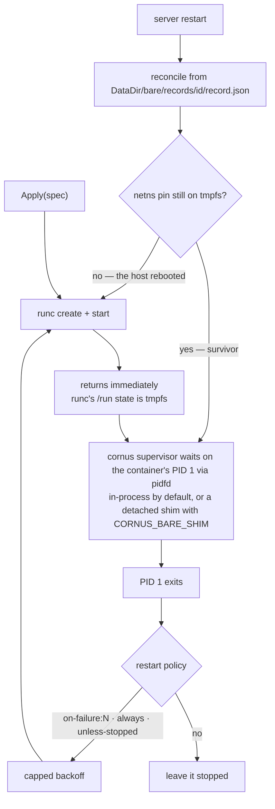
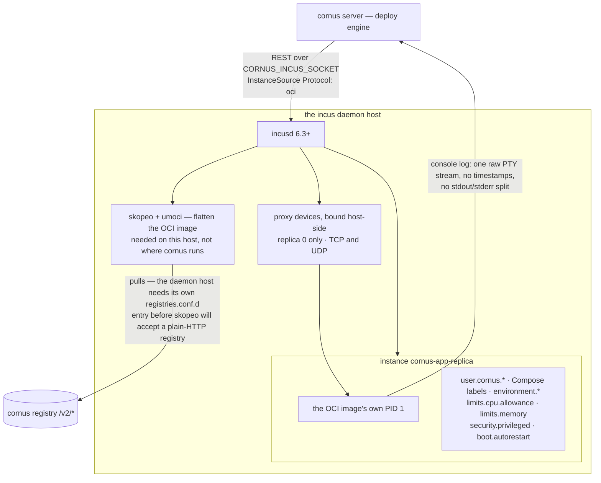
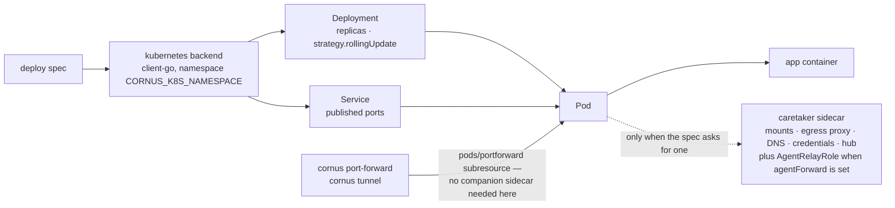

# Deploy backends

The cornus deploy engine applies a [deploy spec](/reference/deploy-spec) — a native `deploy.yaml`, or a Compose file / devcontainer translated into one — to one of **six interchangeable backends**. They all sit behind the same interface and are selected with the `CORNUS_DEPLOY_BACKEND` environment variable (env-only; there is no CLI flag).

| `CORNUS_DEPLOY_BACKEND` | Target | Networking | Notes |
| --- | --- | --- | --- |
| `dockerhost` (default) | Local Docker daemon | Docker networks | Needs the Docker socket (`/var/run/docker.sock`). |
| `podman` | A Podman daemon, via its **native libpod API** | Podman networks (netavark) | Rootful or rootless. No default socket: set `CORNUS_PODMAN_SOCKET`, or `CORNUS_PODMAN_SERVICE=1` to have cornus run `podman system service` itself. |
| `containerd` | Bare containerd host, no dockerd | CNI bridge + portmap | Linux-only; needs root + CNI plugins. |
| `bare` | An OCI runtime CLI (runc/crun/youki) directly — **no daemon** | CNI bridge + portmap | Linux-only; needs root + an OCI-runtime binary + CNI plugins. Cornus owns image pull, supervision, and cgroups itself. |
| `incus` | An [Incus](https://linuxcontainers.org/incus/) daemon (6.3+) | Incus instance network + `proxy` devices | Linux-only; runs OCI images as Incus **application containers**. Needs `skopeo` + `umoci` on the daemon host. The narrowest spec coverage — see below. |
| `kubernetes` / `k8s` | A Kubernetes cluster (client-go) | Deployments + Services | Server / in-cluster only; RBAC-scoped. |

The selection applies to both the server (`cornus serve`) and a local [`cornus deploy`](/cli/deploy) run **without** a `--server`. The one exception is `kubernetes`, which is server/in-cluster only — a local `cornus deploy` with `CORNUS_DEPLOY_BACKEND=kubernetes` falls back to `dockerhost` with a warning.

The five host backends honor the same core spec fields (`name` / `image` / `replicas` / `restart` / `env` / `ports`), and `dockerhost` / `podman` / `containerd` / `bare` additionally share the client-local 9P bind mounts, Compose user networks, and published-port forwarding, so the same workflow moves across those four unchanged. `incus` is still the outlier, though a much narrower one than it was: it maps the core fields, an `entrypoint` override, server-host bind mounts, managed volumes, `sysctls`, `ulimits`, `tmpfs` and `shmSize`, and healthchecks, but not client-local 9P bind mounts, user networks, or a command-only override — and it now warns for every field it cannot map, dropping nothing silently. Where an individual spec field maps onto only some backends, the [deploy spec reference](/reference/deploy-spec) says so per field.



The web UI's file explorer reaches a workload's files through whichever route the backend offers. `dockerhost` / `podman`, `containerd` and `bare` serve **structured filesystem operations** (`deploy.FSOperator`) by reading the container's rootfs through its init process, so a rename or a copy WITHIN one workload happens in place instead of streaming every byte out to the caller and back; `incus` serves them too, by a different route: it has no local path to read, so it uses the daemon's own SFTP channel into the instance — which also needs nothing from the image, where reading a rootfs needs root. `kubernetes` does the same through its caretaker. The `/proc/<pid>/root` route needs root — reading a root-owned container's `/proc/<pid>/root` is privileged — and is declined on a non-local or rootless daemon, where the pid names nothing this server can reach. Every refusal falls back to relaying, so the explorer works either way and only loses the fast path.

Privilege handling is **default-deny**: privileged containers and host bind mounts are refused unless explicitly allowed (`CORNUS_ALLOW_PRIVILEGED`, `CORNUS_ALLOW_BIND_SOURCES`). See [Security and authentication](/guides/security).

On the host backends (`dockerhost`, `containerd`, `bare`), everything a workload needs running *beside* it — client-local mounts, client-side egress, and, in remote mode, the port-forward rerouting and ssh-agent relaying described below — is realized by **one companion `cornus caretaker` container per replica**, sharing that replica's network namespace. So a single deploy can combine client-local mounts with client-side egress.

Client-sourced credentials need **no companion at all** on the host backends — and therefore neither `CORNUS_ADVERTISE_URL` nor `CORNUS_AGENT_IMAGE` — because a co-located server can do each delivery itself. An [`env` delivery](/guides/credentials) is resolved at deploy time and set in the container's environment at create; a `file` is rendered under the server's own data dir and bound read-only; an `endpoint` is a listener the server binds *inside the workload's network namespace*, which keeps the kubernetes security model (the namespace boundary is the authorization) without the sidecar that used to provide it. Where a runtime remaps ids into a user namespace, cornus owns the credential file as the ids the workload will actually read it with, so a non-root workload reads its own credential; the data directory becomes traversable (`0711` — walkable, not listable) on those runtimes, while the secrets in it stay `0600`. The two remapping runtimes reach that by different routes. Rootless `podman` reports its mapping before the container exists, so the server resolves the ownership and writes the file already correct. `incus` records the map ON THE INSTANCE, so there is nothing to ask at the moment the file is written: it creates the instance stopped, takes ownership of the directory once the map exists, and starts it afterwards. One case is refused there rather than delivered wrong — replicas given DIFFERENT id ranges (`security.idmap.isolated=true`) cannot share one host directory, since it carries a single ownership, so a credential readable by replica 0 would be unreadable to the rest. `incus` reaches all of this WITHOUT being an AttachingBackend at all: its companion is a sibling instance that cannot carry mounts or egress, but nothing about that stops the server realizing a credential itself. All of them are declined in remote mode, where the runtime's paths and process ids are not this server's to resolve.

## `dockerhost` (default)

Runs workloads as containers on a local Docker daemon. It needs the Docker socket (`/var/run/docker.sock`, overridable with `CORNUS_DOCKER_SOCK`). This is the richest backend: it maps the widest set of spec fields directly onto Docker's create-time and host-config options, and Compose user networks become real Docker user-defined networks (libnetwork gives DNS and per-network isolation natively).

Under [host-native re-export](/reference/server-env-vars#reusing-a-local-image-store) (the default on this backend) it **skips the registry pull** for an image the daemon already has (bare or loopback-host refs), since pulling it would round-trip through cornus's registry back to the same daemon; external refs (e.g. `docker.io/...`) are still pulled normally.

**Client-local bind mounts** normally realize by kernel-9p-mounting the caller's export directly on the cornus **server's** own host — the single-host fast path, which assumes the server is co-located with the Docker daemon it drives. Setting `CORNUS_DOCKER_REMOTE=1` opts into a caretaker-sidecar path instead (the same mechanism the `kubernetes` backend always uses): a companion `cornus caretaker` container performs the kernel 9P mount itself, and a Docker-managed volume with `rshared`/`rslave` propagation relays it into the app container — so the mount works even when the server does not share a filesystem with the daemon (e.g. `DOCKER_HOST=tcp://...`). This needs `CORNUS_AGENT_IMAGE` set to a cornus-embedding image, exactly like the existing egress-companion path on this backend. See [server env vars](/reference/server-env-vars) for `CORNUS_DOCKER_REMOTE` and `CORNUS_AGENT_IMAGE`.

**Where the runtime runs containers in a different mount namespace** — rootless `podman` today — the fast path additionally needs **shared propagation** on the directory cornus mounts into (`<data-dir>/mounts`). The server makes the kernel 9P mount in its own mount namespace, and a runtime whose containers live in another one sees that mount only if it propagates there. Without it the deploy would come up with an **empty** mount and no error anywhere, so cornus refuses it up front and names the fix. Give the directory shared propagation **before the runtime starts** — `mount --make-rshared /` on the host, or bind the data dir with `:rshared` when cornus is itself containerized. The ordering is not negotiable: a mount namespace joins a peer group when it is created, so one that already exists cannot be made a peer afterwards.

In remote mode this companion is **always created per instance**, sharing the app container's network namespace, whether or not the deploy uses `--mount` — it is a "remote companion," not just a mount relay. That is also what makes [`cornus port-forward`](/cli/port-forward) and [`cornus tunnel`](/cli/tunnel) work at all under `CORNUS_DOCKER_REMOTE=1`: without the companion, the server has no route to the instance's own network to bridge either one, so both reroute through the companion's shared netns instead of dialing the instance directly. The same companion also lets [`cornus exec --forward-agent`](/cli/exec) forward a local ssh-agent into an exec session on any remote-mode instance.

The two mount paths, side by side — the caller's export reaches the server the same way in both, and only the last hop differs:

```mermaid
flowchart TB
    subgraph fast["default — single-host fast path"]
        direction LR
        c1["your machine<br/>exported directory"]
        s1["cornus server<br/>kernel 9P mount under DataDir/mounts/"]
        a1["app container"]
        c1 -- "9P over the deploy-attach WebSocket" --> s1
        s1 -- "bind mount — assumes the server and dockerd<br/>share a filesystem" --> a1
    end

    subgraph rem["CORNUS_DOCKER_REMOTE=1 — remote companion"]
        direction LR
        c2["your machine<br/>exported directory"]
        s2["cornus server<br/>e.g. DOCKER_HOST=tcp://..."]
        k2["cornus caretaker companion<br/>one per instance, shares the app netns<br/>does the kernel 9P mount itself"]
        a2["app container"]
        c2 -- "9P over the deploy-attach WebSocket" --> s2
        s2 -- "relays 9P to the companion,<br/>which dialed back via CORNUS_ADVERTISE_URL" --> k2
        k2 -- "Docker volume with rshared / rslave propagation" --> a2
        s2 -. "port-forward · tunnel · exec --forward-agent<br/>reroute through the companion's shared netns" .-> k2
    end
```



## `podman`

Runs workloads on a Podman daemon through its **native libpod API**
(`/v5.0.0/libpod/...`), not Podman's Docker-compatibility endpoints.

That choice is deliberate. Podman's compat layer advertised Docker API v1.41 for
close to four years, and several of its open defects land precisely on the paths
this backend depends on: compat container stats inflates CPU for containers in a
pod, compat attach echoes the request body into the stream, and compat archive
`PUT` diverges from Docker. Cornus passes stats through verbatim, bridges attach
raw, and implements `cornus cp` on that archive endpoint, so building on compat
would have inherited all three. The libpod routes have none of them, and they
give cornus one thing compat cannot: `tlsVerify` as a request parameter, which is
what lets a workload pull from cornus's own plain-HTTP loopback registry without
editing `registries.conf` on the daemon host.

### Telling cornus how to reach Podman

Unlike every other backend, podman has **no default endpoint**, and cornus does
not probe for one — not `CONTAINER_HOST`, not `DOCKER_HOST`, not the stock socket
paths. With neither variable below set, the server refuses to start. The reason
is diagnostic: a server that finds a daemon on its own is one whose bug reports
cannot answer *which* daemon it drove.

| Variable | Meaning |
| --- | --- |
| `CORNUS_PODMAN_SOCKET` | Use exactly this endpoint. A path, a `unix://` or `tcp://` URL, or an `ssh://` destination. |
| `CORNUS_PODMAN_SERVICE=1` | Cornus runs `podman system service` itself on a private socket and supervises it. Needs only the `podman` binary on `PATH` — no socket unit to enable. |

Setting both is an error rather than a precedence: which one loses is exactly the
detail nobody remembers during an incident.

```sh
# Rootless
systemctl --user enable --now podman.socket
export CORNUS_PODMAN_SOCKET="$XDG_RUNTIME_DIR/podman/podman.sock"

# Rootful
sudo systemctl enable --now podman.socket
export CORNUS_PODMAN_SOCKET=/run/podman/podman.sock

# Remote, using the destination `podman system connection` stores
export CORNUS_PODMAN_SOCKET="ssh://core@host/run/user/1000/podman/podman.sock"
```

Enabling `podman.socket` does not make Podman a daemon: the unit is
socket-activated, so the service starts on demand and exits when idle. The
`CORNUS_PODMAN_SERVICE=1` child behaves the same way — the difference is only who
owns its lifecycle.

An endpoint that is **named but unreachable** is not a startup error. A stopped
podman is a runtime condition that may resolve, and the server still starts and
serves its registry; only a missing *selector*, which can never resolve on its
own, is fatal at boot.

### Rootless

Rootless podman works for deploy, logs, exec, and `cornus cp`. What it cannot do
is let this host dial a workload directly: a rootless container's network
namespace lives behind `pasta`/`slirp4netns` and is not routable from outside it.

So [`cornus port-forward`](/cli/port-forward) and [`cornus tunnel`](/cli/tunnel)
**refuse immediately** on a rootless daemon rather than timing out — a timeout
reads as "the workload is down" and sends you to the wrong place. Set
`CORNUS_PODMAN_REMOTE=1` to reach workloads through a per-instance companion that
shares their namespace; like the other backends' remote modes it also needs
`CORNUS_AGENT_IMAGE` and `CORNUS_ADVERTISE_URL`. A **rootful** podman has none of
these restrictions.

Cornus asks the daemon whether it is rootless (`host.security.rootless`) rather
than guessing from the socket path, since a rootful socket can be bind-mounted
anywhere.

### Host-native re-export

Under [host-native re-export](/reference/server-env-vars#reusing-a-local-image-store),
the default on this backend, the `/v2/*` registry serves **podman's** image store
— chosen by the deploy backend, not by `DOCKER_HOST`. A podman server whose
registry re-exported the Docker daemon would serve images from a runtime it never
deploys to, which is wrong rather than broken, so nothing would report it.

## `containerd`

`CORNUS_DEPLOY_BACKEND=containerd` runs workloads **natively on a bare containerd host — no dockerd** — implementing the full deploy interface directly against the containerd v1 client. It is **Linux-only** (elsewhere the backend returns an unsupported error) and, like `dockerhost`, works both for the server and for a local `cornus deploy` without a server.

It needs:

- the containerd socket (`CORNUS_CONTAINERD_ADDRESS`, default `/run/containerd/containerd.sock`; the standard `CONTAINERD_ADDRESS` is honored as a fallback),
- **root** (it creates network namespaces and runs CNI plugins), and
- the standard CNI plugins installed (`bridge`, `portmap`, `host-local`, `loopback`; discovered via `CORNUS_CNI_BIN_DIR`, `CNI_PATH`, or `/opt/cni/bin`).

Workloads live in the `cornus` containerd namespace (`CORNUS_CONTAINERD_NAMESPACE`); backend state (volumes, logs, CNI config) lives under `<DataDir>/containerd/`.

- **Networking** is a plain CNI bridge with host-port publishing via portmap. Each compose network gets its own `/24` carved from `CORNUS_CNI_SUBNET_BASE` (default `10.4`); published ports DNAT to replica 0 only. Inter-container name resolution works via hosts-file sync (nerdctl-style). UDP port mappings are supported (unlike the kubernetes backend).
- **Image pulls** decide plain-HTTP-vs-TLS themselves: `localhost` registries are plain-HTTP automatically, and `CORNUS_CONTAINERD_INSECURE_REGISTRIES` (comma-separated `host[:port]`) extends that to explicit hosts. `CORNUS_CONTAINERD_SNAPSHOTTER` overrides the rootfs snapshotter (set `native` on overlay-backed hosts such as docker-in-docker).
- **Logs** are kept under the data dir and rotated at `CORNUS_CONTAINERD_LOG_MAX_BYTES` (default 16 MiB, one old generation kept), and survive cornus restarts. **Restart policy** is delegated to containerd's restart-monitor plugin.



Pair it with the containerd **build worker** (`CORNUS_BUILD_WORKER=containerd`) so builds delegate execution, snapshots, and content to the same host containerd — a tagged build then lands in the host's image store directly, so a just-built image deploys without a registry round trip. Note the lazy build-context path (`--lazy` / `CORNUS_LAZY_BUILD`) is **not** supported on the containerd worker.

**Client-local bind mounts require `CORNUS_CONTAINERD_REMOTE=1`.** Unlike `dockerhost` and `bare`, this backend has no single-host kernel-9p fast path — that server-side path exists for those two backends only — so with the flag unset a deploy carrying `--mount` is refused up front, and the error names this variable. With the flag set, mounts are realized by the same caretaker-sidecar mechanism `dockerhost`'s remote mode uses (a companion `cornus caretaker` container/task performs the kernel 9P mount, propagated into the app container via a shared host directory with `rshared`/`rslave` OCI mount options), which also needs `CORNUS_AGENT_IMAGE`. Unlike `dockerhost`, the flag does **not** add true remote-daemon support: containerd's client dialer only ever speaks to a local unix socket, so this backend is unconditionally co-located with the cornus server regardless of the flag — the sidecar mechanism is worth having anyway (it avoids the server itself needing kernel-mount privilege, and is the substrate future features can reuse), but it is not a path to a non-co-located containerd host.

As with `dockerhost`, `CORNUS_CONTAINERD_REMOTE=1` always creates this companion per instance (joining the app's pinned network namespace), with or without `--mount`, and for the same reason: it is what reroutes [`cornus port-forward`](/cli/port-forward)/[`cornus tunnel`](/cli/tunnel) and enables [`cornus exec --forward-agent`](/cli/exec) once `ForwardPort`'s normal direct-IP dial is in play — here that just avoids the server needing route/permission to dial into the CNI bridge network directly, distinct from the (unresolved) true-remote-daemon question above.

Healthchecks work here even though containerd runs no probes of its own — cornus runs them and reports the result (see [healthchecks](#healthchecks)).

**Known gaps vs `dockerhost`:** attach is output-only. Rootless containerd is untested and unsupported for now.

## `bare`

`CORNUS_DEPLOY_BACKEND=bare` runs workloads **daemonlessly** — no dockerd *and* no containerd. Cornus drives a low-level **OCI runtime CLI** (`runc`, or `crun`/`youki`/`runsc` via `CORNUS_BARE_RUNTIME`) directly and owns everything a daemon otherwise provides: the image pull into an in-process content store, layer unpack + rootfs assembly, OCI `config.json` generation, **process supervision + restart policy**, cgroup lifecycle, and logging. It is effectively **cornus as its own Podman**. Like the other host backends it is **Linux-only** and works both for the server and a local `cornus deploy`. State lives under `<DataDir>/bare/`.

It needs:

- **root** (for the snapshotter mounts, network namespaces, CNI plugins, and the container cgroup),
- an **OCI-runtime binary** on `PATH` (`runc` default; validated at startup — a missing runtime fails fast with an actionable error), and
- the standard **CNI plugins** installed (`bridge`, `portmap`, `host-local`, `loopback`; discovered via `CORNUS_CNI_BIN_DIR`, `CNI_PATH`, or `/opt/cni/bin`).

Networking, hosts-file name resolution, and DataDir volumes behave **exactly as the `containerd` backend's** — the daemon-agnostic machinery is shared code (CNI bridge + portmap with a `/24` per compose network from `CORNUS_CNI_SUBNET_BASE`, published ports DNATed to replica 0, per-instance `/etc/hosts` sync, copy-when-empty volume seeding). In addition, an in-process resolver on the netns gateway answers guest DNS (disable with `CORNUS_BARE_DNS=false`). Image pulls decide plain-HTTP-vs-TLS themselves (`localhost` automatic, `CORNUS_BARE_INSECURE_REGISTRIES` extends it), and the rootfs snapshotter is overlay with a native fallback (`CORNUS_BARE_SNAPSHOTTER=native` on overlay-backed / docker-in-docker hosts).

What is unique to `bare` is that **cornus is the supervisor**. `runc create`/`start` returns immediately and runc's `/run` state is tmpfs, so cornus itself waits on each container's PID1 (via a pidfd), applies the restart policy (`no` / `on-failure[:N]` — which the containerd restart-monitor cannot express — / `always` / `unless-stopped`) with capped backoff, and relaunches. Two supervisor forms share that engine: an in-process one (default) and an opt-in **detached per-container shim** (`CORNUS_BARE_SHIM`, cornus's conmon analogue) that survives a cornus restart. A startup **reconcile** pass reattaches to survivors on a server restart and fully rebuilds workloads after a host reboot (the netns pins live on tmpfs, so a lost pin *is* the reboot signal). Per-instance state — image, snapshot, IPs, ports, restart policy, and desired-vs-observed status — is persisted as `<DataDir>/bare/records/<id>/record.json`, the store that replaces containerd's metadata DB.



Client-local bind mounts default to the same single-host kernel-9p fast path as the other host backends, with `CORNUS_BARE_REMOTE=1` opting into the caretaker-sidecar path (needs `CORNUS_AGENT_IMAGE`). Unlike `dockerhost`/`containerd`, that companion is **mount-only** and exists only when a deploy actually declares client-local mounts: [`cornus port-forward`](/cli/port-forward)/[`cornus tunnel`](/cli/tunnel) dial the instance's own IP directly (correct here — a daemonless backend is always co-located with the server), and [`cornus exec --forward-agent`](/cli/exec) is not available and is refused up front. The full optional-interface surface (`MountingBackend`, `EgressBackend`, `RemoteCapable`, volume removal) is implemented for parity with `containerd`.

**gVisor (`runsc`).** Setting `CORNUS_BARE_RUNTIME=runsc` runs each workload inside a gVisor sandbox. Because the sandbox owns the guest's cgroup accounting and filesystem, cornus adapts two operations automatically (detected from the runtime name; override with `CORNUS_BARE_STATS_SOURCE`): `cornus stats` reads the runtime's own metrics (`runsc events --stats`) instead of the host cgroup files, and `cornus cp` runs `tar` **inside** the container rather than through the host `/proc/<pid>/root`. Two caveats follow: `cornus cp` needs a `tar` binary in the image (scratch/distroless images cannot be copied), and per-container network counters are not reported (`cornus stats` shows zero network I/O). Everything else — supervision, restart policy, networking, volumes — is unchanged.

Healthchecks work here too, and there was never anything else that could run them: cornus *is* the runtime on this backend, so its probe engine sits beside the restart supervisor described above (see [healthchecks](#healthchecks)).

**Known gaps vs `dockerhost`:** attach is output-only, as on `containerd`. Rootless is out of scope for now and errors clearly.

## `incus`

`CORNUS_DEPLOY_BACKEND=incus` deploys workloads as **[Incus](https://linuxcontainers.org/incus/) application containers**, talking to the Incus daemon over its REST API (the local unix socket) with the official Go client. Incus 6.3+ can run an OCI image directly as an application container, and that is what cornus targets — the same OCI image you would run on any other backend, supervised by incusd instead of by dockerd, containerd, or cornus itself. It is **Linux-only** (elsewhere the backend returns an unsupported error) and, like the other host backends, works both for the server and for a local `cornus deploy` without a server.

It needs:

- the incus daemon socket (`CORNUS_INCUS_SOCKET`, default `/var/lib/incus/unix.socket`) and access to it,
- **Incus 6.3 or newer** — earlier releases have no OCI support and fail the deploy with `Unsupported protocol: oci`, and
- **`skopeo` and `umoci` on the daemon host**: incusd itself shells out to them to flatten the OCI image. They are needed where *incusd* runs, not where cornus runs.

Instances are created in the project selected by `CORNUS_INCUS_PROJECT` (default `default`) and named `cornus-<app>-<replica>`.

Note where the pull arrow starts — this is the one backend that does not fetch the image itself:



- **Image pull is done by incusd, not by cornus.** Cornus hands the daemon an OCI remote pointing at its own registry (`InstanceSource{Protocol: "oci"}`), and incusd pulls through skopeo. Because skopeo defaults to HTTPS, a plain-HTTP registry needs to be declared insecure: `CORNUS_INCUS_INSECURE_REGISTRIES` (comma/space-separated `host[:port]`) makes cornus address those hosts over `http://`, and the **daemon host** additionally needs a matching `/etc/containers/registries.conf.d/` entry so skopeo agrees. Loopback registries are treated as plain-HTTP automatically on the cornus side.
- **Identity and metadata** ride Incus's `user.*` config namespace, which is the only place arbitrary keys are allowed: `user.cornus.managed`, `user.cornus.app`, the `user.cornus.origin.*` provenance set, and any Compose `labels:`. Environment becomes `environment.*`, CPU/memory caps become `limits.cpu.allowance` / `limits.memory`, and `privileged: true` (policy-gated as everywhere else) becomes `security.privileged`.
- **Apply recreates.** Incus refuses to delete a running instance, so applying a spec stops and deletes the app's existing instances and creates fresh ones with `Start: true`.
- **Published ports** become Incus `proxy` devices bound on the host side and, per the cross-backend contract, are attached to **replica 0 only**. Both TCP and UDP mappings are supported.
- **Restart policy** maps onto `boot.autorestart`, a plain on/off. Anything other than `no` turns it on; there is no attempt cap, so `restart: on-failure:N` cannot express its `N` (the same limitation as `containerd`).
- **Logs** are the instance **console** log — the OCI PID 1's combined stdout/stderr as a single raw PTY stream, which cornus re-frames into the usual stdout stream. There are no per-line timestamps and no stdout/stderr split anywhere in this source, so `--since` / `--until` / `--follow` / `--tail` / `--timestamps` cannot be honored; each is warned about individually rather than silently ignored (a malformed `--since` is still an error).
- **`cornus stats`** reports memory, pids, and network exactly, but Incus exposes no host-wide CPU total, so the derived **CPU percentage reads low or zero**.
- **`cornus cp`** rides the Incus instance file API. That API carries neither a file size nor a symlink target, so cornus drains the body to measure and reads links as content — correct, but not a cheap stat.
- **Structured filesystem operations** (`deploy.FSOperator`, what the web file explorer uses) take a different channel: the daemon's SFTP one. The file API cannot express a RENAME at all, which is close to the reason the capability exists — the archive primitives can already stat and copy, and cannot move anything. The channel needs nothing in the image, so it works against a distroless application container, and it serves one root (`/`) over the instance's whole filesystem.
- **[`cornus port-forward`](/cli/port-forward) and [`cornus tunnel`](/cli/tunnel)** dial the instance's own routable IPv4 (from its instance state) directly, for both TCP and UDP — no companion involved. In remote mode (below) that direct dial is exactly what cannot be relied on, so the traffic is rerouted through the replica's companion instead.
- **[`cornus exec`](/cli/exec)** is supported, including TTY sizing. **Attach is deliberately not supported**: Incus exposes a console attached to PID 1 rather than docker-attach stream semantics, so `cornus attach` returns a clear error and points you at exec.

- **`healthcheck`** is honored, and this is the backend where it needed the most from cornus: Incus exposes no instance-level probe, so cornus runs the check itself over the daemon's exec API (see [healthchecks](#healthchecks)). That exec is also the best-shaped of the three — its operation metadata carries the command's actual return code, where the `bare` backend's OCI runtime only reports a non-zero exit as an error.

**Known gaps vs `dockerhost`.** Beyond the log and stats caveats above, the incus backend does not map: a **command-only** override, client-local 9P bind mounts, Compose user `networks`, and `knative`.

**Nothing is dropped in silence.** Every other spec field either maps or produces a warning naming it, and a spec that uses only supported features emits **no warnings at all** — both halves are pinned by tests. This is worth stating because it was aspirational until recently: the backend warned about nine fields while discarding around twenty more (`hostname`, `stopSignal`, `capAdd`/`capDrop`, `devices`, `init`, `tty`, the DNS settings, and others) without a word. A warning you do not see now means the field was honored.

**Three fields map conditionally**, and the condition is the useful part:

- **`entrypoint`** becomes the instance's `oci.entrypoint`, which replaces the image's whole argv, with `command` supplying its arguments — the same semantics `entrypoint` has on the other backends. A **command-only** override cannot be expressed: `command:` with no `entrypoint:` means "keep the image's `ENTRYPOINT`, replace only its arguments", `oci.entrypoint` can only replace the argv as a whole, and the backend never sees the split it would need — incus pulls the image itself, and the argv it exposes (the image config's flattened `Process.Args`) has already lost the `ENTRYPOINT`/`CMD` boundary. That case warns, naming the workaround: set `entrypoint` as well.
- **`workingDir`** maps when it is **absolute**, as `oci.cwd`. A relative one warns: `oci.cwd` is validated as an absolute path, so incusd would reject the create, and the image's own working directory — what a relative path would resolve against — is not visible here either.
- **`user`** maps when it is **numeric**: `1000` or `1000:1000` become `oci.uid` / `oci.gid` (a uid-only value leaves the group to the image). A username or group-name form (`app`, `1000:staff`) warns, because resolving a name needs the image's `/etc/passwd`, which this backend never sees — the same numeric-only limit the kubernetes backend has. `1000:staff` is refused **whole** rather than honoring the uid and dropping the group, which would run the process in a group nobody asked for.

**Mounts and volumes.** Server-host bind paths become incus `disk` devices, gated by the same default-deny `hostpolicy` (`CORNUS_ALLOW_BIND_SOURCES`) as the other host backends — a source outside the allow-list still fails the deploy rather than being mounted. Client-local 9P bind mounts stay unsupported, and the server refuses them before they reach the backend. What an incus disk device cannot express is warned about per mount: an empty or relative source, a root (`/`) target, and an SELinux relabel request. Managed `volumes` are provisioned as custom storage volumes in the configured pool; an anonymous volume is reaped when its deployment goes away, and a named one is removed by `compose down --volumes`.

**Also mapped**, each with per-entry warnings for what Incus will not take: `sysctls` (as `linux.sysctl.*`, minus the two an OCI container's incusd sets itself), `ulimits` (as `limits.kernel.*`, for the rlimit names Incus documents and only when the soft bound does not exceed the hard one), and `tmpfs` plus `shmSize` (tmpfs disk devices, where `size` is the only mount option Incus can express).

**Remote mode.** `CORNUS_INCUS_REMOTE` turns on the caretaker-companion path, as `CORNUS_DOCKER_REMOTE` and friends do for their backends. Every replica gets a companion instance running `cornus caretaker` with the PortForward and AgentRelay roles, which is what lets [`cornus port-forward`](/cli/port-forward) / [`cornus tunnel`](/cli/tunnel) reach a workload the server has no route to, and what makes [`cornus exec --forward-agent`](/cli/exec) available. Without it, the backend declares agent forwarding unavailable and `--forward-agent` is refused up front. Remote mode needs `CORNUS_AGENT_IMAGE` and `CORNUS_ADVERTISE_URL` (the companion image, and the cornus URL the companion dials back on); a deploy fails on either being missing before it tears anything down, rather than half-way through.

Two things about the incus companion differ from every other host backend's, both forced by Incus rather than chosen. It is a **sibling instance** rather than a netns-sharing sidecar, because Incus exposes no way for one instance to join another's network namespace — so the caretaker dials the app instance by address instead of over loopback. And the forwarded-agent socket rides a **shared custom storage volume** (created `security.shifted`, so two unprivileged instances with different id maps can both mount it) rather than a bind from the server's data directory, which would assume the server can see the daemon host's filesystem.

Remote mode does **not** bring the client-local mounts the other backends get from their companion, and that gap is structural rather than merely unbuilt: a 9P mount has to propagate into the app's mount namespace, which a sibling instance cannot do — it would take a caretaker running inside the app instance itself. Client-side egress is unwired for the same reason.

One caveat on all of the above: the companion path has not been run against a live `incusd`. It is built against the Incus v6 API as vendored, so treat it as supported in remote mode rather than proven in the field.

## `kubernetes` / `k8s`

`CORNUS_DEPLOY_BACKEND=kubernetes` (or `k8s`) deploys into a Kubernetes cluster using **client-go**, rendering each workload as a **Deployment** plus a **Service** for its published ports. It is **server / in-cluster only**: a local `cornus deploy` with this backend falls back to `dockerhost` with a warning. It is the backend the shipped Kubernetes manifests and Helm chart preset.

It is RBAC-scoped and namespaced (`CORNUS_K8S_NAMESPACE`), and it is the only backend that realises the advanced spec blocks — user networks via a pipeline of network drivers (`CORNUS_K8S_NET_DRIVER`: `services`, `bridge`/`ipvlan`/`macvlan` via Multus, `cilium`), the enforcing egress proxy, the per-pod caretaker DNS resolver, credential brokering, client-side egress relay, and the workload-to-workload [hub](/guides/hub) overlay. Rolling updates map onto the Deployment's `strategy.rollingUpdate`.

Because it deploys through the Kubernetes API rather than to the machine the CLI runs on, the kubernetes backend is what powers the [working with remote clusters](/guides/remote-clusters): a developer drives an in-cluster cornus server, and per-port forwarding or a SOCKS5 conduit brings the workload's ports back to the laptop.

`ForwardPort` (and so [`cornus port-forward`](/cli/port-forward)/[`cornus tunnel`](/cli/tunnel)) needs no companion sidecar here at all — it rides the Kubernetes API's own `pods/portforward` subresource directly. [`cornus exec --forward-agent`](/cli/exec) is supported too, but unlike the host backends' backend-wide remote mode it is **opt-in per deployment**: set `agentForward` in the [DeploySpec](/reference/deploy-spec) to fold an `AgentRelayRole` into the pod's caretaker (creating a minimal one if the pod has no other caretaker role). A deployment applied without it rejects `--forward-agent` with a clear error.



## Healthchecks

Every backend reports a workload's health, but by three different routes. `dockerhost` / `podman` hand the [`healthcheck`](/reference/deploy-spec#healthcheck) to the daemon, which runs it and answers on inspect. `kubernetes` turns it into an exec liveness and readiness probe, and projects readiness onto the reported health. `containerd`, `bare` and `incus` have no probe engine of their own, so **cornus runs the probes itself**.

That last group is the reason this section exists. A backend that reports no health does not merely omit a column: a Compose file with `depends_on: condition: service_healthy` is **refused up front** there, because the honest answer is better than a dependency that times out minutes later. Until cornus ran its own probes, that refusal made a large class of ordinary Compose files undeployable on those three backends.

**The state machine is Docker's**, deliberately, because `service_healthy` is compared against Docker's vocabulary and a difference here is a difference in whether real Compose files converge:

- A probe exiting `0` passes; anything else — including a probe that cannot be executed at all, or one that exceeds `timeout` — fails.
- **During `start_period`, failures do not count toward `retries`** and the state stays `starting`. The first success flips to `healthy` and ends the start period, so failures after it count normally even if the period has not elapsed.
- After that, `retries` **consecutive** failures flip to `unhealthy`; any success flips back to `healthy` and clears the count.
- Empty fields default to Docker's: `interval` 30s, `timeout` 30s, `retries` 3, `start_period` 0.
- `test` uses Docker's forms — `["CMD", ...]` execs directly, `["CMD-SHELL", s]` runs `s` through `/bin/sh -c`, `["NONE"]` disables an inherited check.

Two things cornus's engine does that the delegating backends do not. It honors **`start_interval`** (probe more often *during* the start period), which the `kubernetes` backend warns it cannot express — a Kubernetes Probe has one period throughout. And it keeps **one probe in flight per instance**: a probe slower than the interval delays the next one instead of stacking up.

**Across a restart.** Stopping a workload disarms its probe (health reads empty, not `unhealthy` — a stopped container is not a failing one) and starting it re-arms. A **cornus server** restart is the case worth stating: the healthcheck itself is persisted where the workload lives — a container label on `containerd`, the instance record on `bare`, the instance config on `incus` — so probing resumes for instances that are still running, or that the restart monitor is about to resurrect. What does **not** survive is the probe *state*: every re-armed instance goes back to `starting` until its first probe returns, where Docker keeps its own state in a daemon that outlives cornus. An instance that was explicitly stopped stays disarmed. On `incus`, which has no startup reconcile pass to hang this off, the re-arm is triggered by the first `cornus deploy status` or `cornus deploy list` — which is enough, since `service_healthy` converges by polling status.

**Health is reporting, not control.** Nothing restarts a container for going unhealthy; Docker does not either without an orchestrator. The [`restart` policy](/reference/deploy-spec) reacts to a container *exiting*, which is a different event.

## Privilege posture

The backend that **runs workloads** and the in-process **build engine** have different privilege needs, and they are what determine how you run a Cornus server:

- A Cornus that **performs builds** needs elevation — the build engine runs runc + overlayfs + user namespaces. The registry and deploy subsystems on their own do not.
- The `dockerhost` backend needs the Docker socket; the `containerd` backend needs its socket, **root**, and CNI plugins; the `bare` backend needs **root**, an OCI-runtime binary, and CNI plugins (no daemon socket at all); the `incus` backend needs access to the incus daemon socket (plus `skopeo`/`umoci` on the daemon host), and leaves privilege for the workload itself to incusd; the `kubernetes` backend runs in-cluster under RBAC.

```sh
# Simplest: run the container privileged (the shipped default).
#   compose: privileged: true   |   k8s: securityContext.privileged: true

# Rootless: run unprivileged with the prerequisites present, then:
cornus serve --rootless          # or CORNUS_ROOTLESS=1
```

Rootless needs `uidmap` (`newuidmap` / `newgidmap`), `rootlesskit`, and `slirp4netns` plus the appropriate `securityContext`. The image bundles `uidmap`. Some hosts (e.g. recent Ubuntu with `kernel.apparmor_restrict_unprivileged_userns=1`) need an AppArmor profile or a relaxed sysctl.

Note this is distinct from **workload** privilege, which is default-deny regardless of how the server runs: privileged containers and host bind mounts are refused unless explicitly allowed (`CORNUS_ALLOW_PRIVILEGED`, `CORNUS_ALLOW_BIND_SOURCES`; see [Security and authentication](/guides/security)).

## See also

- [`cornus deploy`](/cli/deploy) — the command that applies a spec.
- [Deploy spec reference](/reference/deploy-spec) — every field, and which backends honor it.
- [Server environment variables](/reference/server-env-vars) — `CORNUS_DEPLOY_BACKEND` and the per-backend knobs.
- [Working with remote clusters](/guides/remote-clusters) — driving the kubernetes backend from a laptop.
