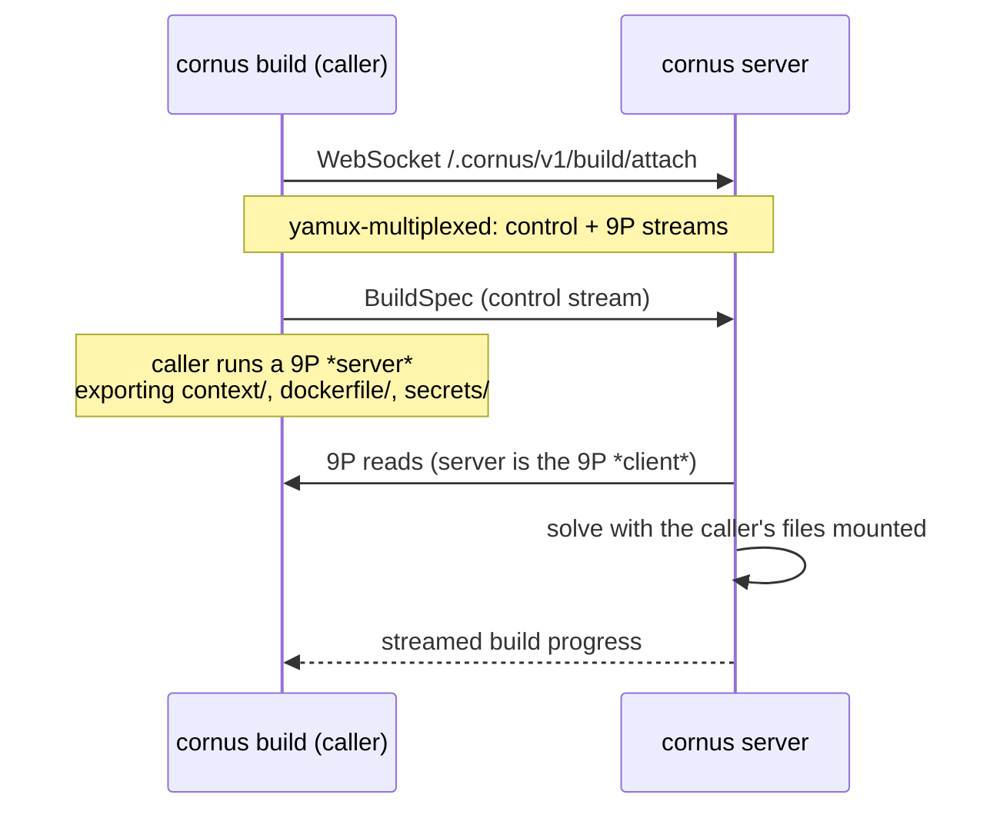

# 构建引擎和远程构建

Cornus 通过**进程内嵌 BuildKit solver**构建镜像——没有独立 `buildkitd` daemon，也不需要 Docker。引擎使用 BuildKit 自身的 client machinery 驱动 solver，因此完整的 `buildx` 功能集无需改造即可工作：cache mount、secret mount、SSH mount、命名 context 和 remote cache 都无需重新实现。引擎仅支持 Linux；其他平台上服务器仍可运行，只是拒绝构建（或将其发送至远程 builder）。

本地和远程构建都经由同一个 seam：它从可插拔 filesystem mount 和可选 secret store 组装 build。这些接口跨平台，因此远程*客户端*路径不链接 BuildKit，可在任意 OS 上运行。

## Worker 选择

默认 worker 是 BuildKit 的 **runc worker**，自包含于服务器数据目录。`CORNUS_BUILD_WORKER=containerd` 切换至 BuildKit **containerd worker**，它在 namespace `CORNUS_CONTAINERD_NAMESPACE`（默认 `cornus`，有意与 containerd deploy backend 管理的 namespace 相同）中，将 snapshot 和 content 委托给 `CORNUS_CONTAINERD_ADDRESS` 所指的 host containerd。由于 worker 使用 containerd image store，带 tag 的 build 除 push 到 registry 外也会进入 host containerd store，因此随后用 containerd backend 部署该镜像无需 registry round trip。containerd worker 不支持 lazy build context，会给出清晰错误而非静默降级。

与 worker 无关，在 [host-native 重新导出](/zh/reference/server-env-vars#reusing-a-local-image-store)（主机后端上的默认值）下，build 落入后端自身的本地 store 而非单独的 registry。在 `containerd` 上，`/v2/*` 由 containerd 内容 store 以读写方式支撑，因此普通 build 的 **push** 会直接导入其中 —— 无需 build worker 配置。在 `/v2/*` 只读的 `dockerhost` 上，经服务器路由的 build 转而导出为 **docker-archive** 并 load 进本地 Docker daemon（`POST /images/load`），因此构建出的镜像直接进入 daemon 的 store。

引擎是**每个数据目录一个进程 singleton**：它对 `engine.lock` 获取 non-blocking lock 并快速失败，因为两个 engine 共享一个数据目录会在 BuildKit database 中静默 deadlock。请在两个数据目录中运行两个服务器。

## 经 9P 的远程构建

构建可在远程 Cornus server 上运行，同时使用**调用方**的目录和 secret——类似 `docker buildx` 驱动远程 `buildkitd`，但完整文件 transport 都封装在一个 WebSocket 中。

`cornus build --builder ws://host/.cornus/v1/build/attach` 打开 WebSocket，通过 **yamux** 将其 multiplex 为 control stream 和 **9P** stream，并将调用方文件作为 9P server 提供。服务器端是 9P *client*：它将每个导出 subtree 包装成供进程内 solver 使用的 filesystem，并提供 `RUN --mount=type=secret` 所用 secret store。调用方无需能被服务器访问，构建保持 BuildKit-native，且**cache 留在服务器上**——来自任意笔记本电脑的第二次 remote build 都会命中同一个 warm cache。

**SSH agent forwarding**（`RUN --mount=type=ssh`）也使用同一 session：服务器为每个声明 id 创建临时 socket，并将每条连接通过新 stream tunnel 回调用方的本地 `$SSH_AUTH_SOCK`。

## 信任边界

远程 build export 是信任边界，并按此处理。服务器可发送任意 9P walk/open/create operation；天真的本地 filesystem export 会跟随 `..`、沿 symlink 走出树，或允许写入。因此，每个 export subtree 都由受限 attacher 包裹，它：

1. 拒绝 `..`、path separator 和非单元素的 walk component；
2. 限制 symlink：最终 component 的 symlink 会*作为* symlink 传输（Docker parity；它在 container 侧安全解析），但读取或 walk *穿过*逃离 export root 的 symlink 会被拒绝；
3. 拒绝所有 mutation operation——export 严格只读。

Context 和每个命名 context 还遵循 **`.dockerignore`**，因此被忽略的文件（`.git`、secret、`node_modules`）绝不离开调用方机器。整体姿态是：`cornus build --builder` 只向 remote builder 授予对 context、dockerfile 和命名-context 目录的只读访问，不能越界遍历。

## Build cache

`inline`、`registry` 和 `local` remote-cache backend 在本地与远程 build 中均通过 `--cache-to` / `--cache-from`（buildx syntax）提供。

`type=local` cache 有特殊处理。BuildKit 会将 local cache 的 `dest=`/`src=` 解析为实际运行 solve 的进程中的真实目录——远程 build 时即*服务器*。引擎不要求调用方了解服务器路径，而是将该值作为不透明 **key**，映射到服务器数据目录中每 key 一个的受限目录；省略时，会从 target image 的 repository 自动派生 key。

## Lazy build context

巨大的 `--build-context` 目录可**按需**提供给 build，而非 eager sync：构建只读取 11 byte 的 20 MB context，只会通过线路传输 11 byte。使用 `cornus build --lazy` opt in。

BuildKit 的 lazy 发生在 snapshotter 层而非 source 层，因此需要三种协作机制（无需 fork BuildKit，使用的全部都是 public seam）：

1. **镜像形态 source。**命名 context 以 OCI layout 呈现，其 layer digest 是 tree 的确定性 metadata manifest——layer blob 永不 materialize。
2. **远程 snapshotter。**lazy layer 注册 committed snapshot，跳过 extraction；其 backing 在本地是 host bind，在远程则是代理到调用方的 kernel-9p mount。普通 layer 会干净地 fallback。
3. **Cache pre-seed。**只读 mount 的 RUN cache key 通常通过遍历所有文件计算。调用方改为在本地计算每文件 digest，并在 solve 前 seed BuildKit cache context，因此跳过扫描，只有 RUN 实际触碰的文件跨线路传输。

三者都使用完全相同的 `.dockerignore` predicate，因此 seed 始终与 mount 匹配。

## 相关页面

- [构建镜像](/zh/guides/building-images)——实际的构建工作流。
- [远程工作流](/zh/topics/remote-workflows)——用户侧的 remote builder 和 lazy context。
- [cornus build](/zh/cli/build)——完整 flag 集。
