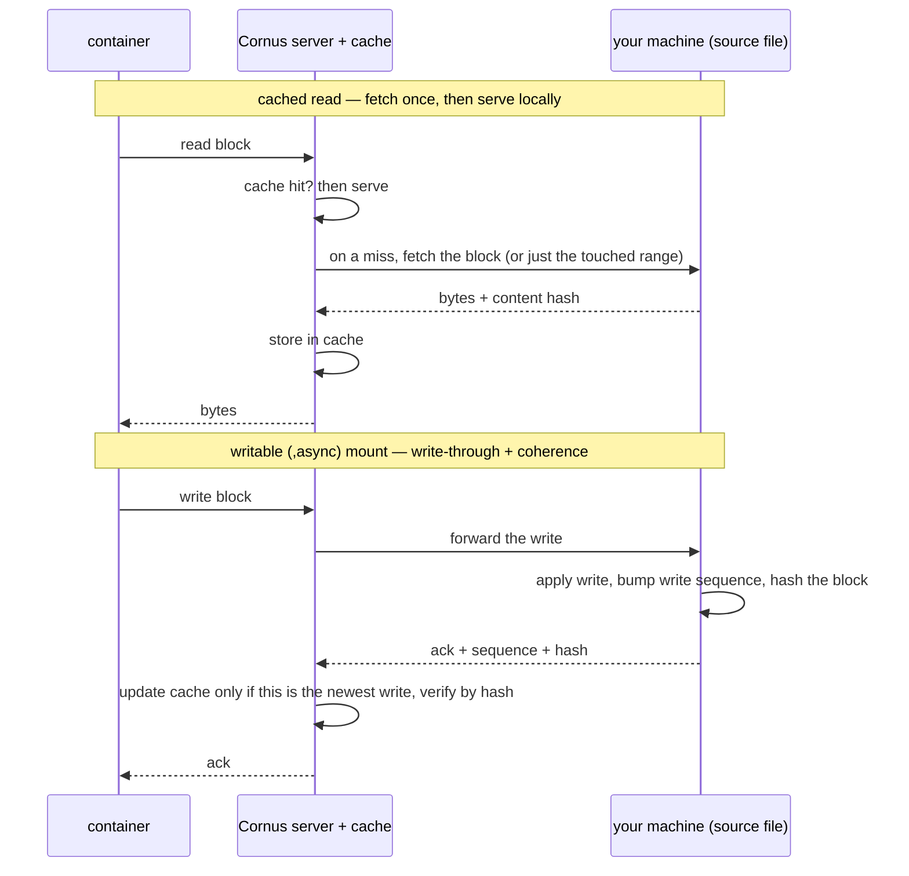

# 部署引擎和后端

部署引擎是**命令式、可插拔**的。每个后端实现相同的小接口——`Apply` / `Status` / `List` / `Delete`——其中 `Apply` 以 `cornus.app` label 为 key，具有 create-or-recreate 语义。Cornus 有意**不是 operator**：没有 CRD，也没有 reconcile loop。Cornus 自行创建 object，因此在 apply 时直接 mutate 它们。

## 四种后端

| 后端 | 通信对象 | 说明 |
|---|---|---|
| `dockerhost`（默认） | 经 unix socket 的 Docker Engine REST API | 手写的最小 client，不引入沉重 Docker SDK dependency tree。 |
| `containerd` | 经 containerd socket 的 containerd client API | 在裸 containerd host 原生运行 workload，无 dockerd。仅 Linux。 |
| `bare` | 直接使用 OCI runtime CLI（runc/crun/youki），无守护进程 | 无守护进程：cornus 自行拥有镜像拉取、进程监督和 cgroup。仅 Linux；需要 root + OCI runtime 二进制 + CNI plugin。 |
| `kubernetes` | client-go | 将 `DeploySpec` 映射为 Deployment + ClusterIP Service，可选 Ingress。Stop/Start 扩缩到 0 再恢复；Restart 通过 pod-template annotation 触发 rollout。可加载 in-cluster 或 local kubeconfig，因此开发机能指向 kind cluster。 |

服务器使用 `CORNUS_DEPLOY_BACKEND`（默认 `dockerhost`）选择后端；本地 `cornus deploy` CLI 对其 host-level backend 遵循同一变量，部署到集群则经 `cornus deploy --server ...` 前台 deploy-attach session。`cornus deploy --detach`/`-d` 是 stateless 形式：POST spec 后退出，workload 无 client session 地运行——客户端本地 mount source 会被预先拒绝（它们需要 live session），端口也不会自动转发。随附 Kubernetes manifest 和 Helm chart 显式设置 `kubernetes`；若集群内 server 保持默认值，每次 deploy 都会失败，因为 pod 内没有 Docker socket。

共享的 **host-privilege policy** 管理 host backend：默认拒绝 `Privileged` workload 和 host bind source，使用 `CORNUS_ALLOW_PRIVILEGED` / `CORNUS_ALLOW_BIND_SOURCES` opt in。

## 跨后端 contract

接口携带文档化 contract，使行为不会在后端之间悄然漂移：

- 对缺失 name 的 Stop/Start/Restart 返回共享 not-found error（映射 HTTP 404）；`Delete` 仍是 delete-if-exists。
- `spec.Command` 始终是 image ENTRYPOINT 的 argument，`spec.Entrypoint` 覆盖它——**各处均为 docker 语义**。Kubernetes backend 因此将 Command 映射到 `Args`；k8s `command` field 会静默替换 entrypoint。
- 每个后端上的 non-TTY log、exec 和 attach output 均为 stdcopy-framed；log `--since` 各处均解析 docker grammar，client 无条件 demux 和 parse。
- `replicas > 1` 的 host-port publishing 在两种 host backend 上都只绑定 replica 0（每 host port 一个 DNAT target）；`Delete` 清理 anonymous volume（`docker rm -v` parity）。Status *state* string 按文档保持 backend-specific——只有 `running` 可移植。

## Containerd backend

Containerd backend 直接面向 containerd daemon 实现完整 surface，在 `CORNUS_CONTAINERD_ADDRESS` 的专用 namespace（`CORNUS_CONTAINERD_NAMESPACE`，默认 `cornus`）管理 container。dockerd 提供的基础能力，该 backend 自己实现：

- **镜像拉取**构建自己的 resolver：localhost registry 自动 plain-HTTP（相邻 Cornus registry），`CORNUS_CONTAINERD_INSECURE_REGISTRIES` 扩展为显式列表，其他地址正常解析并支持 public registry 所需 anonymous token flow。Docker-style short name 被规范化（`nginx` 变为 `docker.io/library/nginx:latest`）。registry 不可达但 ref 已位于 namespace image store（例如刚由 containerd build worker 构建）时，会使用 local image，因此同主机 build-then-deploy 无需 registry 往返。containerd root 位于 overlay filesystem（docker-in-docker）时，kernel 会拒绝 overlay-on-overlay mount，请设置 `CORNUS_CONTAINERD_SNAPSHOTTER=native`。
- **网络使用 CNI bridge + portmap**（nerdctl 风格）。每个 network——Compose `networks:` 或 implicit default——都是生成的 CNI config，使用从 `10.4.<n>.0/24`（base 经 `CORNUS_CNI_SUBNET_BASE`）分配的 host-local IPAM。Plugin binary 通过 `CORNUS_CNI_BIN_DIR`、`CNI_PATH` 或 `/opt/cni/bin` 查找；缺失时 apply 返回可操作错误。**Container 间 name resolution 使用 hosts-file sync**——bridge CNI 没有内嵌 resolver——每个 service name 和 alias 指向 replica 0 IP。
- **Log 跨 cornus restart 保留**：小型 log shim 在数据目录追加 JSON-line record；monitor 重启的 task 无需 cornus 参与仍会继续记录。文件按 `CORNUS_CONTAINERD_LOG_MAX_BYTES`（默认 16 MiB）滚动，保留一个旧 generation；由于运行中的 shim 持有文件，roll 发生在 cornus 驱动的（重）启动时。
- **Restart policy 由 containerd 自身 restart monitor 提供**：label 携带 policy，Stop 设置 explicitly-stopped label，避免 `unless-stopped`/`always` task 被复活；Start 清除它。
- **启动时单次 reconcile pass 修复陈旧 network namespace。**`/run` 是 tmpfs，host reboot 会丢失所有 pinned netns，而 spec 仍指向失效 path。构造时，backend 为 desired state 为 running 的 record 重建 netns、CNI attachment 和 pin；随后 containerd monitor 自身复活 task，二者不会竞争。
- **Exec、stats、copy 和 port-forward**均可工作；attach 仅输出（log shim 持有 stdio pipe），copy 需要运行中实例，healthcheck 被忽略并警告（containerd 没有 probe engine）。

## bare 后端

`bare` 后端（`CORNUS_DEPLOY_BACKEND=bare`）比 `containerd` 更进一步：它移除了*守护进程本身*。Cornus 直接驱动底层 OCI runtime CLI（runc/crun/youki，经 `CORNUS_BARE_RUNTIME`），并自行拥有守护进程原本提供的一切——将镜像拉取至进程内 content store、layer 解包 + rootfs snapshot、`config.json` 生成、进程监督、cgroup 和日志。这是 **cornus 成为自己的 Podman**。状态位于 `<DataDir>/bare/`。

- **daemon 无关的机制与 containerd 共享。**网络（CNI bridge + portmap）、hosts-file DNS sync、DataDir volume + 镜像 seeding、OCI spec-opts 和 Docker-stats encoder 被提取到两个后端都导入的 internal package（`pkg/deploy/internal/hostrun`）。因此 `bare` 的网络、名称解析和 volume 与 `containerd` 表现相同；各后端仅提供不同之处（containerd 读 container label，而 bare 读自己的 JSON record）。整棵树保持不含 BuildKit——并且，由于 `bare` 直接读 cgroup 文件而非加载 cgroup *manager*，也不含 cgroup-manager 库的 `cilium/ebpf` / `dbus`。
- **cornus 就是 supervisor。**`runc create`/`start` 会立即返回，且 runc 的 `/run` state 位于 tmpfs，因此 cornus 自身经 pidfd 等待每个 container 的 PID1，施加 restart policy（`no` / `on-failure[:N]` / `always` / `unless-stopped`——`on-failure:N` 是 containerd restart monitor 无法表达的）并带上限退避后重启。默认的进程内 supervisor 与可选的**独立 shim**（`CORNUS_BARE_SHIM`，可在 cornus 重启后存活的 conmon 类比）共享该引擎。启动 reconcile pass 在 server 重启后重新附着到存活者，并在 host 重启后完整重建工作负载（丢失的 tmpfs netns pin *即是*重启信号）。
- **record store 替代 metadata DB。**`<DataDir>/bare/records/<id>/record.json`（原子写入）保存镜像/snapshot/IP/端口/policy 以及期望与观测的监督状态；`runc state` 仍是 liveness 的真实来源。为与 `containerd` 对等，完整的可选接口面（客户端本地 mount、egress companion、经 `CORNUS_BARE_REMOTE` 的 remote companion、volume 移除）均已实现。需要 root、OCI runtime 二进制和 CNI plugin；rootless 不在范围内，且会明确报错。

## Volume 和清理

Volume 映射到各 backend 的 native semantic。Kubernetes 中 anonymous volume 成为随 deployment 生命周期存在的 dynamically-provisioned PVC（`docker rm -v` parity）；named volume 成为跨 deployment 共享且 delete 后仍存在的 shared PVC（Docker named-volume semantic）。Init container 从镜像的 baked content seed 新 PVC，仅在空时复制，因此 user write 得以保留。Containerd backend 以数据目录目录支持两类 volume，并以相同方式 seed；dockerhost 则免费获得同样的语义。

**清理基于所有权，而非调用顺序。**Kubernetes 上，`Apply` 先创建 Deployment，再为 Service 与每个 anonymous PVC 标记回指 Deployment 的 owner reference。`Delete` 只执行一次 foreground-propagation Deployment delete，Kubernetes GC 回收 dependent——中断的 delete 不再遗留 orphan。

## 客户端本地绑定挂载

`cornus deploy --server` 和面向远程服务器的 Compose 可以 bind-mount 位于**你的**机器（而非部署主机）上的目录。这正是让远程部署成为内循环工具的原因：在本地编辑文件，工作负载即可看到更新。它复用[构建引擎的 transport](/zh/architecture/build-engine#经-9p-的远程构建)——一条 WebSocket、yamux 和 9P——并采用相同的角色反转：**调用方是 9P 服务器**，export 自己的本地目录，而 Cornus 服务器是 9P 客户端。

服务器将每个 export 的目录通过 9P kernel-mount，并在把 spec 交给 backend 之前**改写挂载 source** 为该 mountpoint，因此 backend 像对待任何主机路径一样 bind 它，并不知道涉及 9P。由于挂载由调用方提供，部署仅在命令保持连接期间存在：断开会话（或发送 `down`）后，会先删除容器，再 unmount 这些 9P 挂载。这有意将客户端本地挂载 scope 到开发 / 内循环用途，而非持久的生产工作负载。客户端本地 source 由服务器自身的 `<DataDir>/mounts` 区域提供，且始终允许使用，因此无需放宽 host-privilege 策略。

NAT 背后的 pod 无法被调用方直接 dial，因此 **Cornus 服务器充当汇合点（rendezvous）**：在 Kubernetes（以及 remote 模式的主机 backend）上，pod 的 [caretaker](/zh/architecture/caretaker) sidecar 向服务器 dial 一条连接，服务器再将每条挂载流 bridge 到调用方上的新 backing。挂载在 *pod 内部* 实现——绝不在节点主机上——因此 pod 仍可调度到任意位置，并由 startup probe 阻塞 app 容器，直到挂载 live。

### 读缓存与可写挂载

素朴地 tunnel 9P 很啰嗦——每次读取都要跨越网络。针对这会造成困扰的两种情形，Cornus 在服务器端终结 9P，并在其前面放置服务器端的 per-file **block cache**（1 MiB chunk，落盘，跨 restart 存续），按挂载通过 `--local-mount SRC:DST` 上的后缀来选择：

| 挂载后缀 | 提供方式 | 用途 |
|---|---|---|
| （无） | 直通 9P pipe | 小或很少读取的挂载，以及可读写的 source 目录。 |
| `,cache`（隐含 `:ro`） | read-through 缓存——一旦 fetch 的 chunk 不再 re-fetch | 大型 **immutable** 只读输入（数据集、模型权重）。 |
| `,async`（可写） | cache-coherent 的 **block protocol** | 写密集的 **single-writer** 工作负载，例如开发数据库。 |

两种缓存模式都需要启用服务器端文件缓存（`--file-cache` / `CORNUS_FILE_CACHE`，配合 `CORNUS_FILE_CACHE_DIR`）；否则每个挂载都回退到直通 pipe。`,cache` 是 content-versioned 的：对 source 文件的任何更改都会产生新 identity，因此绝不会提供陈旧字节——这也是它仅对你承诺在会话期间不 mutate 的输入有效的原因。

`,async` 通过一种 block-indexed protocol 让*可写*缓存与你的本地文件保持 coherent，该 protocol 在每次读写时都携带 content hash 和 write sequence，因此服务器绝不会提供调用方已 supersede 的 block。它要求单 replica，且不能与 `:ro` 或 `,cache` 组合。对于数据库形态的随机 I/O，开启 sub-block coherence 和 demand-fill——在服务器和 deploy caller **两端**环境中设置 `CORNUS_BLOCK_COHERENCE=subhash,subfill` 以及 `CORNUS_BLOCK_READAHEAD` cap；两端会 negotiate 共享 feature set，因此只在一侧设置的 flag 会被静默丢弃。这将冷随机扫描从每次 point query fetch 整个 1 MiB block，降到仅 fetch 触及的几千字节。参阅[服务器环境变量](/zh/reference/server-env-vars#远程-9p-文件缓存和可写挂载)。

三种模式共享同一条服务器端数据路径。cached read 在首次 fetch 之后即在本地提供；可写挂载会 write-through 到你的机器，并用 content hash 和 write sequence 保持服务器缓存 coherent，因此服务器绝不会提供你的文件已越过的 block：

**缓存目录中的内容。** 启用 `--file-cache` 后，每个 cached 文件都会成为 `CORNUS_FILE_CACHE_DIR` 下的一个 **sparse 文件加一个小的 index sidecar**，并 shard 到子目录以限制 fan-out。仅存储实际读取的 chunk（data 文件是 sparse 的），缓存**跨服务器 restart 存续**，`CORNUS_FILE_CACHE_MAX_BYTES` 通过后台垃圾回收为其总大小设定上限。请将 `CORNUS_FILE_CACHE_DIR` 指向专用卷，而非服务器数据目录。

## Compose user network

四个 backend 都支持 Compose `networks:`。在 **dockerhost** 上它们是 native Docker network（create-if-absent，在 delete 时清理无 member 的 managed network）。在 **containerd** 和 **bare** 上是上述生成的 CNI bridge，经 hosts-file sync 解析名称。**kubernetes** 上 compose `driver` 选择 provider pipeline：

| Compose `driver` | 机制 | 隔离强度 |
|---|---|---|
| （无）/ `services` | 每 alias 一个 headless Service（裸名称 DNS） | 无——DNS baseline，任意集群 |
| `bridge` / `ipvlan` / `macvlan` | Multus NetworkAttachmentDefinition + pod annotation | 拓扑隔离；需要 NAD CRD |
| `policy` | 由 membership label 标记的 shared ingress-only NetworkPolicy | 内核，前提是 CNI 强制执行 |
| `cilium` | shared CiliumNetworkPolicy | 内核（Cilium）；需要 CNP CRD |
| `driver_opts: {proxy: "true"}` | caretaker enforcing egress proxy | userspace，独立于 CNI，强 |
| ... `+ mode: cooperative` | loopback listener 拼接到 peer 的真实 Service | userspace、零权限、软 |

Multus fabric 在 plan 时获得确定性 static IP，caretaker DNS role 提供这些固定 secondary IP；cluster DNS 只发布 pod primary IP，因此没有 overlay 时 peer name 会解析到 cluster network 而不是 user network。缺失 cluster capability 时回退至 `services` 并每 network 警告一次（`CORNUS_K8S_NET_STRICT` 使其成为 hard error）。Enforcing proxy 的 allow-list 在整个 topology 可见的 compose-plan 时计算，因此项目内没有 dynamic query 或 staleness。

::: info Rollback 有意不在范围内
Compose 和普通 Docker 没有 rollback 概念；Kubernetes 上 backend 就地更新 Deployment，并保留 native ReplicaSet history——因此 `kubectl rollout undo deployment/<name>` 已可使用。专用的跨 backend revision store 会为刻意命令式、stateless 的 deploy model 引入 stateful history。
:::

## 相关页面

- [部署工作负载](/zh/guides/deploying-workloads)——部署工作流。
- [远程工作流](/zh/topics/remote-workflows)——从用户视角看远程部署与客户端本地挂载。
- [部署后端](/zh/reference/deploy-backends)——各后端配置。
- [Deploy spec](/zh/reference/deploy-spec)——所有 spec 字段。
- [网络指南](/zh/guides/networking)——实际中的 network。
- [cornus deploy](/zh/cli/deploy)——完整 flag 集。
