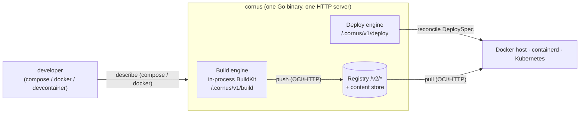

# 架构概览

Cornus 是**单个 Go 二进制文件**，可将 Docker 工作流——`docker compose`、`docker` CLI、devcontainer——一路带到 Docker 主机、containerd 主机或 Kubernetes 上正在运行的工作负载，无需团队先自行部署镜像仓库、`buildkitd` 和 GitOps controller。一个 HTTP 服务器面向三个子系统；它们在首次使用时才延迟构造，因此即使无法访问 Docker 主机或构建引擎无法初始化，服务器仍可正常启动。

本节从内部说明 Cornus 的工作方式：数据流、wire protocol 和安全属性，面向正在评估或运维它的人员。面向贡献者的设计文档——包布局、已定设计决策和测试——位于仓库中：[GitHub 上的 ARCHITECTURE.md](https://github.com/moriyoshi/cornus/blob/main/ARCHITECTURE.md)。

## 心智模型

端到端流程有四个步骤，每一步都由特定组件实现：

1. **描述。**Docker 兼容客户端（`cornus compose`、`docker` frontend、devcontainer）由一个客户端侧 agent 转换为 Cornus 的 `DeploySpec` / build request。
2. **构建。**源代码借助**进程内 BuildKit solver**成为 OCI 镜像——提供完整 `buildx` 功能集，但没有独立 `buildkitd`。构建也可在远程服务器运行，同时调用方目录、secret 和 SSH agent 经 9P-on-WebSocket 流式传输，并可选择按需传输。
3. **发布。**构建出的镜像进入由持久化内容寻址存储支撑的**小型 OCI Distribution v1.1 镜像仓库**。
4. **部署并运行。**一个 `DeploySpec` 由可插拔的**部署引擎**以命令式方式调谐到您拥有的运行时。目标自身的运行时——dockerd、containerd 或 kubelet——通过 OCI 从镜像仓库拉取镜像并启动它。

这明确了两点：部署引擎从不处理镜像字节——它向目标提供的是一个**引用**，由目标运行时拉取；三个子系统经由**OCI HTTP 协议**（`/v2/*`）而非 Go API 相遇，因此它们可独立演进，或被指向外部镜像仓库。

## 反复出现的属性

一些设计属性贯穿所有子系统，预先了解它们会使本节其余内容更容易理解：

- **一个进程，按需组装。**单个 HTTP mux 面向全部三个子系统。构建引擎和部署后端在首次使用时构造，因此纯镜像仓库或纯部署服务器无需具备其他子系统的前提条件。
- **通过 OCI 而非 Go 的松耦合。**构建和部署引擎从不 import 镜像仓库或其内容存储；它们作为普通 OCI client 与之交互（经 `/v2/*` push / pull）。三者中的任一个都可独立演进，或被指向外部镜像仓库。
- **BuildKit 被隔离。**构建引擎在进程内嵌入 BuildKit solver，但有意将沉重依赖树隔离：部署和 wire transport 不链接任何 BuildKit package。
- **远程工作通过 9P-on-WebSocket 流式传输。**远程构建和客户端本地 bind mount 都允许调用方在远程服务器上运行工作，同时文件保留在调用方机器上，通过单个 WebSocket tunnel 中的 9P 文件系统按需提供。

## 权限要求

只有构建引擎需要提权。它在进程内运行 `runc` + `overlayfs` + user namespace，因此**执行构建**的实例要么以 `privileged` 运行（随附 Compose 文件、Kubernetes manifest 和 Helm chart 的默认方式），要么在已安装 `uidmap`、`rootlesskit` 和 `slirp4netns` 且设置 `--rootless` 的情况下以 rootless 方式运行。镜像仓库和部署子系统不需要特殊权限；`dockerhost` 后端只需要 Docker socket，`containerd` 后端则需要 containerd socket，以及用于自身 network namespace 和 CNI plugin 的 root 权限。

客户端本地 bind mount 是唯一需要特别注意的地方：内核 9P 的 `mount(2)` 需要 **CAP_SYS_ADMIN / root** 和 `9p` kernel module；当服务器运行在容器中时，mount 目录必须通过具有 `rshared` propagation 的 bind mount 从主机挂入，才能将挂载传播到 Docker daemon 的 mount namespace。具体配置参见[安装](/zh/introduction/installation)，各后端要求参见[部署后端](/zh/reference/deploy-backends)。

## 可观测性模型

一个 OpenTelemetry seam 服务于全部三个 Cornus 进程——服务器、每 pod 的 caretaker sidecar 和客户端 CLI——完全由标准 `OTEL_*` 环境变量驱动。它是**可选的，关闭时没有成本**：仅在设置 `CORNUS_OTEL` 或 `OTEL_*` 变量时安装 telemetry；否则 instrumentation 调用点会命中 OpenTelemetry 的 no-op 默认实现，且不会启动 exporter goroutine。

启用后，trace context 端到端传播。客户端每次调用打开一个 root span，并将 W3C `traceparent` 注入每个 REST 调用和 WebSocket attach dial；服务器 HTTP 层提取它；caretaker 再将自己的 span context 注入 relay dial——因此 **client → server → caretaker** 会成为跨 rendezvous 的一条关联 trace。高基数 span 名称（digest、部署名称）会折叠为 route template，避免 metric series 膨胀。可选 Prometheus pull endpoint（`CORNUS_METRICS_PROMETHEUS`）注册免认证的 `/metrics` route。配置请参见[可观测性指南](/zh/guides/observability)。

## 本节其余内容

- [服务器、镜像仓库和内容存储](/zh/architecture/server-and-registry)——单个 HTTP 进程、其运行防护、OCI 镜像仓库、可插拔持久化和 GC。
- [构建引擎和远程构建](/zh/architecture/build-engine)——进程内 BuildKit solver、9P 远程构建传输及其信任边界、缓存和 lazy context。
- [部署引擎和后端](/zh/architecture/deploy-engine)——后端接口及其跨后端契约、containerd 后端、卷和 Compose 用户网络。
- [网络](/zh/architecture/networking)——端口转发、公共 tunnel、自动 ingress、session conduit 和工作负载到工作负载 hub。
- [caretaker 和客户端侧功能](/zh/architecture/caretaker)——客户端本地 bind mount、sidecar 职责、pod 内 Docker 端点和客户端侧 egress。
- [兼容 Docker 的客户端](/zh/architecture/clients)——Docker API 代理、compose 和 devcontainer、统一客户端 agent 以及连接配置文件。
- [安全模型](/zh/architecture/security)——认证、TLS 和 mTLS 身份、授权及信任边界。
