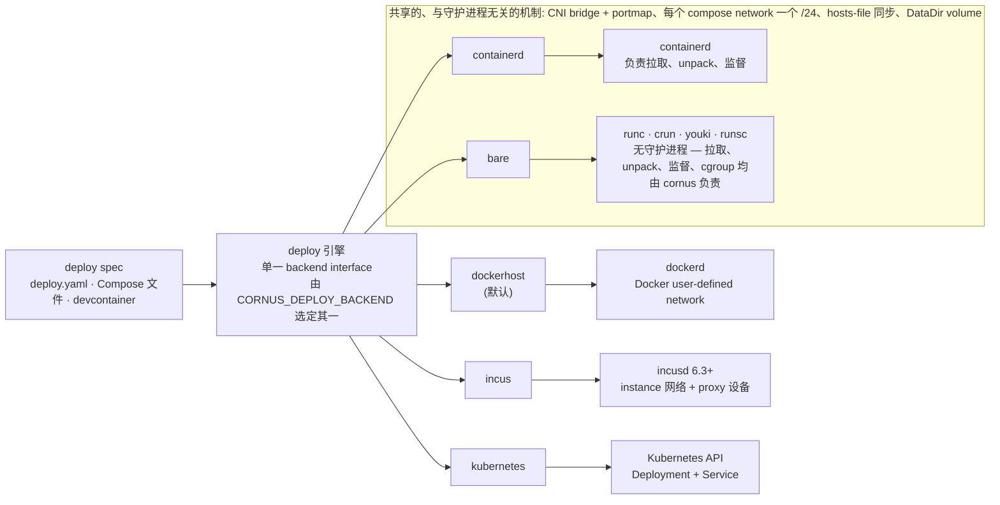
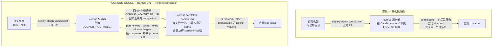
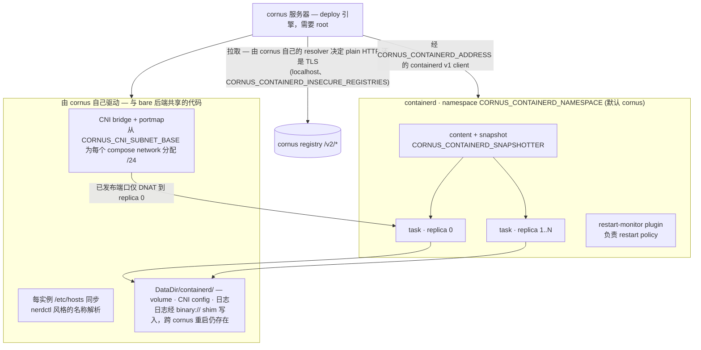
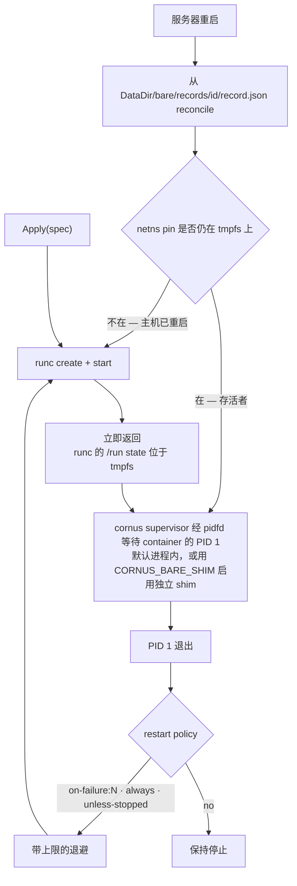
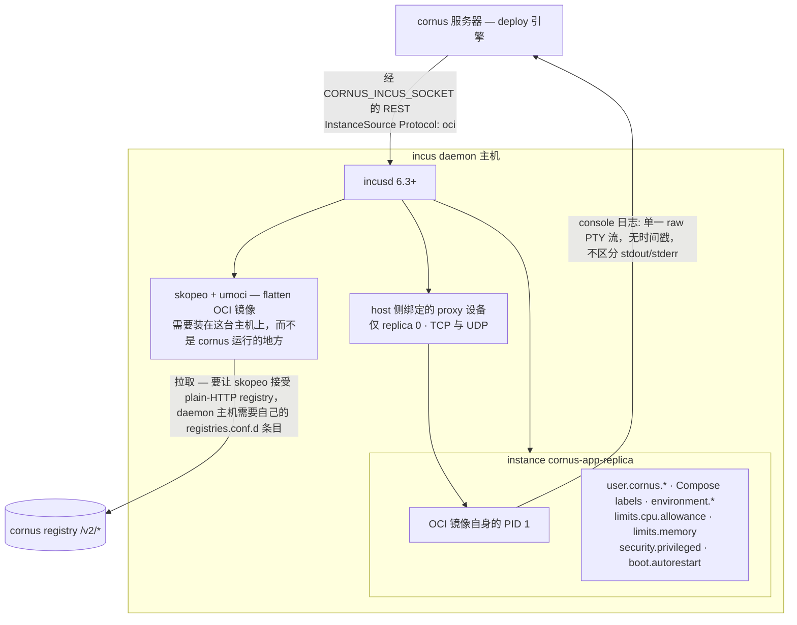
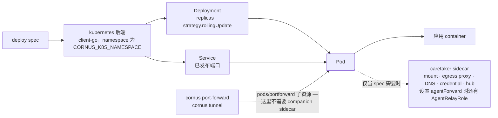

# 部署后端

cornus 部署引擎将 [deploy spec](/zh/reference/deploy-spec)——原生 `deploy.yaml`，或由 Compose 文件 / devcontainer 转换而来——应用到**五种可互换后端**之一。它们位于同一接口之后，通过环境变量 `CORNUS_DEPLOY_BACKEND` 选择 (仅环境变量，没有 CLI flag) 。

| `CORNUS_DEPLOY_BACKEND` | 目标 | 网络 | 说明 |
| --- | --- | --- | --- |
| `dockerhost` (默认) | 本地 Docker daemon | Docker network | 需要 Docker socket (`/var/run/docker.sock`) 。 |
| `containerd` | 裸 containerd host，无 dockerd | CNI bridge + portmap | 仅 Linux；需要 root + CNI plugin。 |
| `bare` | 直接使用 OCI runtime CLI (runc/crun/youki) ——**无守护进程** | CNI bridge + portmap | 仅 Linux；需要 root + OCI runtime 二进制 + CNI plugin。镜像拉取、监督、cgroup 均由 cornus 自行拥有。 |
| `incus` | [Incus](https://linuxcontainers.org/incus/) daemon (6.3+) | Incus instance 网络 + `proxy` device | 仅 Linux；将 OCI 镜像作为 Incus **应用容器**运行。daemon 主机上需要 `skopeo` + `umoci`。spec 覆盖面最窄——参见下文。 |
| `kubernetes` / `k8s` | Kubernetes 集群 (client-go) | Deployment + Service | 仅 server / in-cluster；受 RBAC 限制。 |

该选择既适用于服务器 (`cornus serve`) ，也适用于**未**指定 `--server` 的本地 [`cornus deploy`](/zh/cli/deploy)。唯一例外是仅 server/in-cluster 支持的 `kubernetes`: 本地 `cornus deploy` 设置 `CORNUS_DEPLOY_BACKEND=kubernetes` 时会警告并回退到 `dockerhost`。

四个 host 后端均支持同一核心 spec 字段 (`name` / `image` / `replicas` / `restart` / `env` / `ports`) ，其中 `dockerhost` / `containerd` / `bare` 还共享客户端本地 9P bind mount、Compose user network 和已发布端口转发，因此可不变地在这三者之间移动同一工作流。`incus` 是例外: 它映射核心字段，但不支持 mount、volume、user network、healthcheck 以及 command/entrypoint 覆盖——它会逐字段告警，而不是静默丢弃。个别字段仅映射到部分后端时，[deploy spec 参考](/zh/reference/deploy-spec)会逐字段说明。



权限处理是**默认拒绝**: 除非通过 `CORNUS_ALLOW_PRIVILEGED`、`CORNUS_ALLOW_BIND_SOURCES` 显式允许，否则拒绝 privileged container 和 host bind mount。参见[安全与认证](/zh/guides/security)。

在 host 后端 (`dockerhost`、`containerd`、`bare`) 上，工作负载*旁边*需要运行的一切——客户端本地 mount、客户端侧 egress，以及 remote 模式下下文所述的端口转发改路与 ssh-agent 中继——都由**每个副本一个 companion `cornus caretaker` container** 实现，并共享该副本的 network namespace。因此一次部署即可同时使用客户端本地 mount 和客户端侧 egress。host 后端尚未实现的唯一一种 attachment 是客户端来源的凭据，它仍然仅限 `kubernetes`。

## `dockerhost` (默认)

在本地 Docker daemon 上以 container 运行工作负载。它需要 Docker socket (`/var/run/docker.sock`，可由 `CORNUS_DOCKER_SOCK` 覆盖) 。这是功能最完整的后端: 它将最多的 spec 字段直接映射到 Docker create-time 和 host-config option；Compose user network 会成为真实的 Docker user-defined network (libnetwork 原生提供 DNS 和每网络隔离) 。

在 [host-native 重新导出](/zh/reference/server-env-vars#reusing-a-local-image-store) (本后端上的默认值) 下，对 daemon 已有的镜像 (bare 或 loopback 主机引用) ，该后端会**跳过 registry 拉取**，因为拉取它会经由 cornus 的 registry 往返回到同一个 daemon；外部引用 (例如 `docker.io/...`) 仍会正常拉取。

**客户端本地 bind mount** 通常通过在 cornus **服务器**自己的主机上直接 kernel-9p 挂载调用方的 export 来实现——这条单机快路径假定服务器与它所驱动的 Docker daemon 同机。设置 `CORNUS_DOCKER_REMOTE=1` 则改为启用 caretaker-sidecar 路径 (与 `kubernetes` 后端一直使用的机制相同) : 一个 companion `cornus caretaker` container 自己执行 kernel 9P 挂载，再由带 `rshared`/`rslave` propagation 的 Docker 托管 volume 把它中继进应用 container——因此即使服务器与 daemon 不共享文件系统 (例如 `DOCKER_HOST=tcp://...`) ，挂载也能工作。这需要把 `CORNUS_AGENT_IMAGE` 设为内嵌 cornus 的镜像，与本后端已有的 egress-companion 路径完全一致。`CORNUS_DOCKER_REMOTE` 和 `CORNUS_AGENT_IMAGE` 见[服务器环境变量](/zh/reference/server-env-vars)。

在 remote 模式下，无论部署是否使用 `--mount`，该 companion **都会按实例创建**并共享应用 container 的 network namespace——它是一个 "remote companion"，而不只是 mount 中继。这也正是 [`cornus port-forward`](/zh/cli/port-forward) 和 [`cornus tunnel`](/zh/cli/tunnel) 在 `CORNUS_DOCKER_REMOTE=1` 下还能工作的原因: 没有 companion，服务器就没有通往实例自身网络的路由来桥接二者，于是两者都改为经 companion 的共享 netns 改路，而不是直接拨号到实例。同一个 companion 还让 [`cornus exec --forward-agent`](/zh/cli/exec) 能把本地 ssh-agent 转发进任意 remote 模式实例的 exec 会话。

把两条 mount 路径并排看: 调用方的 export 抵达服务器的方式完全相同，只有最后一跳不同。



## `containerd`

`CORNUS_DEPLOY_BACKEND=containerd` 在**裸 containerd host 原生**运行工作负载——无需 dockerd——并直接通过 containerd v1 client 实现完整 deploy interface。它**仅支持 Linux** (其他平台返回不支持错误) ，并与 `dockerhost` 一样，既可供 server 使用，也可供没有 server 的本地 `cornus deploy` 使用。

它需要:

- containerd socket (`CORNUS_CONTAINERD_ADDRESS`，默认 `/run/containerd/containerd.sock`；标准 `CONTAINERD_ADDRESS` 是 fallback) ；
- **root** (创建 network namespace 并运行 CNI plugin) ；
- 安装标准 CNI plugin (`bridge`、`portmap`、`host-local`、`loopback`；通过 `CORNUS_CNI_BIN_DIR`、`CNI_PATH` 或 `/opt/cni/bin` 发现) 。

工作负载位于 `cornus` containerd namespace (`CORNUS_CONTAINERD_NAMESPACE`) ；后端状态 (volume、log、CNI config) 位于 `<DataDir>/containerd/`。

- **网络**为普通 CNI bridge，通过 portmap 发布 host port。每个 compose network 从 `CORNUS_CNI_SUBNET_BASE` (默认 `10.4`) 分得自己的 `/24`；已发布端口仅 DNAT 到 replica 0。container 间名称解析经 hosts-file sync (nerdctl 风格) 实现。支持 UDP port mapping (Kubernetes 后端不支持) 。
- **镜像拉取**自行决定 plain-HTTP 或 TLS: `localhost` 镜像仓库自动使用 plain-HTTP，`CORNUS_CONTAINERD_INSECURE_REGISTRIES` (逗号分隔的 `host[:port]`) 可扩展到显式 host。`CORNUS_CONTAINERD_SNAPSHOTTER` 覆盖 rootfs snapshotter (在 docker-in-docker 等 overlay host 上设置 `native`) 。
- **日志**保留于数据目录，并按 `CORNUS_CONTAINERD_LOG_MAX_BYTES` (默认 16 MiB，保留一个旧 generation) 滚动，跨 cornus 重启仍存在。**Restart policy** 交由 containerd restart-monitor plugin。



将其与 containerd **build worker** (`CORNUS_BUILD_WORKER=containerd`) 配对，可使 build 将 execution、snapshot 和 content 交给同一 host containerd；带 tag 的 build 会直接进入 host image store，因此新构建镜像部署时无需经镜像仓库往返。注意，containerd worker **不支持** lazy build-context path (`--lazy` / `CORNUS_LAZY_BUILD`) 。

**客户端本地 bind mount** 与 `dockerhost` 一样，默认走单机 kernel-9p 快路径。`CORNUS_CONTAINERD_REMOTE=1` 启用同一套 caretaker-sidecar 机制 (由 companion `cornus caretaker` container/task 执行 kernel 9P 挂载，再经带 `rshared`/`rslave` OCI mount option 的共享主机目录传播进应用 container) ，需要 `CORNUS_AGENT_IMAGE`。与 `dockerhost` 不同，这**不会**带来真正的远程 daemon 支持: containerd 的 client dialer 只连接本地 unix socket，因此无论该 flag 如何设置，本后端都无条件与 cornus 服务器同机——sidecar 机制本身仍然值得拥有 (它免去服务器自身需要 kernel 挂载权限，也是后续功能可以复用的基础) ，但它并不是通往非同机 containerd 主机的路径。

与 `dockerhost` 一样，`CORNUS_CONTAINERD_REMOTE=1` 无论是否使用 `--mount` 都会按实例创建该 companion (加入应用已固定的 network namespace) ，原因也相同: 正是它为 [`cornus port-forward`](/zh/cli/port-forward)/[`cornus tunnel`](/zh/cli/tunnel) 改路，并在 `ForwardPort` 的常规直连 IP 拨号介入时启用 [`cornus exec --forward-agent`](/zh/cli/exec)。这里它只是免去服务器直接拨入 CNI bridge 网络所需的路由或权限，与上面 (尚未解决的) 真正远程 daemon 的问题是两回事。

**相对 `dockerhost` 的已知缺口:** attach 仅输出，healthcheck 被忽略 (有警告) 。目前不测试也不支持 rootless containerd。

## `bare`

`CORNUS_DEPLOY_BACKEND=bare` 以**无守护进程**方式运行工作负载——既无 dockerd，也无 containerd。cornus 直接驱动底层 **OCI runtime CLI** (`runc`，或经 `CORNUS_BARE_RUNTIME` 使用 `crun`/`youki`/`runsc`) ，并自行拥有守护进程原本提供的一切: 将镜像拉取至进程内 content store、layer 解包 + rootfs 组装、OCI `config.json` 生成、**进程监督 + restart policy**、cgroup 生命周期以及日志。这实际上是 **cornus 成为自己的 Podman**。它同样**仅支持 Linux**，既可供 server 使用，也可供本地 `cornus deploy` 使用。状态位于 `<DataDir>/bare/`。

它需要:

- **root** (用于 snapshotter mount、network namespace、CNI plugin 和 container cgroup) ；
- `PATH` 上的 **OCI runtime 二进制** (默认 `runc`；启动时校验——缺失会以可操作的错误快速失败) ；
- 安装标准 **CNI plugin** (`bridge`、`portmap`、`host-local`、`loopback`；通过 `CORNUS_CNI_BIN_DIR`、`CNI_PATH` 或 `/opt/cni/bin` 发现) 。

网络、hosts-file 名称解析和 DataDir volume 的行为与 `containerd` 后端**完全一致**——daemon 无关的机制是共享代码 (CNI bridge + portmap，每个 compose network 从 `CORNUS_CNI_SUBNET_BASE` 分得 `/24`，已发布端口 DNAT 到 replica 0，每实例 `/etc/hosts` sync，仅在为空时复制的 volume seeding) 。此外，netns gateway 上的进程内 resolver 会回答 guest DNS (用 `CORNUS_BARE_DNS=false` 禁用) 。镜像拉取自行决定 plain-HTTP 或 TLS (`localhost` 自动，`CORNUS_BARE_INSECURE_REGISTRIES` 扩展) ，rootfs snapshotter 为 overlay 并带 native fallback (在 overlay/docker-in-docker host 上设 `CORNUS_BARE_SNAPSHOTTER=native`) 。

`bare` 独有之处在于 **cornus 就是 supervisor**。`runc create`/`start` 会立即返回，且 runc 的 `/run` state 位于 tmpfs，因此 cornus 自身经 pidfd 等待每个 container 的 PID1，施加 restart policy (`no` / `on-failure[:N]`——containerd restart-monitor 无法表达 / `always` / `unless-stopped`) 并带上限退避后重启。两种 supervisor 形式共享该引擎: 进程内的 (默认) 与可选的**每 container 独立 shim** (`CORNUS_BARE_SHIM`，cornus 的 conmon 类比) ，后者可在 cornus 重启后存活。启动 **reconcile** pass 在 server 重启后重新附着到存活者，并在 host 重启后完整重建工作负载 (netns pin 位于 tmpfs，因此 pin 丢失即是重启信号) 。每实例状态——镜像、snapshot、IP、端口、restart policy 以及期望与观测状态——持久化为 `<DataDir>/bare/records/<id>/record.json`，即替代 containerd metadata DB 的存储。



客户端本地 bind mount 默认走与其他 host 后端相同的单机 kernel-9p 快路径，`CORNUS_BARE_REMOTE=1` 则切换到 caretaker-sidecar 路径 (需要 `CORNUS_AGENT_IMAGE`) 。与 `dockerhost`/`containerd` 不同，该 companion **只负责 mount**，且仅在部署确实声明了客户端本地 mount 时才存在: [`cornus port-forward`](/zh/cli/port-forward)/[`cornus tunnel`](/zh/cli/tunnel) 直接拨号到实例自身的 IP (在这里是正确的——无 daemon 的后端始终与服务器同机) ，而 [`cornus exec --forward-agent`](/zh/cli/exec) 不可用，会被预先拒绝。为与 `containerd` 对等，完整的可选接口面 (`MountingBackend`、`EgressBackend`、`RemoteCapable`、volume 移除) 均已实现。

**gVisor (`runsc`) 。**设置 `CORNUS_BARE_RUNTIME=runsc` 会让每个工作负载在 gVisor 沙箱内运行。由于沙箱拥有 guest 的 cgroup 计量与文件系统，cornus 会自动适配两项操作 (按 runtime 名称检测，可用 `CORNUS_BARE_STATS_SOURCE` 覆盖) : `cornus stats` 改为读取 runtime 自身的指标 (`runsc events --stats`) 而非 host cgroup 文件，`cornus cp` 则在容器**内部**运行 `tar` 而非经由 host 的 `/proc/<pid>/root`。由此带来两点注意: `cornus cp` 需要镜像内存在 `tar` 二进制 (scratch/distroless 镜像无法复制) ，且不报告每容器的网络计数 (`cornus stats` 的网络 I/O 显示为 0) 。其余一切——监督、restart policy、网络、volume——均保持不变。

**相对 `dockerhost` 的已知缺口:** 与 `containerd` 一样，attach 仅输出，healthcheck 被忽略 (有警告) 。目前不支持 rootless，且会明确报错。

## `incus`

`CORNUS_DEPLOY_BACKEND=incus` 将工作负载部署为 **[Incus](https://linuxcontainers.org/incus/) 应用容器**，通过官方 Go client 与 Incus daemon 的 REST API (本地 unix socket) 通信。Incus 6.3+ 可以直接把 OCI 镜像作为应用容器运行，这正是 cornus 所针对的能力——与你在其他后端上运行的 OCI 镜像完全相同，只是由 incusd 而非 dockerd、containerd 或 cornus 自身来监督。它**仅支持 Linux** (其他平台返回不支持错误) ，并与其他 host 后端一样，既可供 server 使用，也可供没有 server 的本地 `cornus deploy` 使用。

它需要:

- incus daemon socket (`CORNUS_INCUS_SOCKET`，默认 `/var/lib/incus/unix.socket`) 及其访问权限，
- **Incus 6.3 或更高版本**——更早的版本没有 OCI 支持，部署会以 `Unsupported protocol: oci` 失败，以及
- **daemon 主机上的 `skopeo` 和 `umoci`**: incusd 自身会调用它们来展平 OCI 镜像。它们需要安装在 *incusd* 运行的主机上，而非 cornus 运行的主机上。

instance 在 `CORNUS_INCUS_PROJECT` (默认 `default`) 选定的 project 中创建，命名为 `cornus-<app>-<replica>`。

请注意拉取箭头的起点——这是唯一一个不自己获取镜像的后端。



- **执行镜像拉取的是 incusd，而不是 cornus。** cornus 把指向自身注册表的 OCI remote (`InstanceSource{Protocol: "oci"}`) 交给 daemon，由 incusd 通过 skopeo 拉取。由于 skopeo 默认使用 HTTPS，明文 HTTP 的注册表需要声明为 insecure: `CORNUS_INCUS_INSECURE_REGISTRIES` (逗号 / 空格分隔的 `host[:port]`) 让 cornus 以 `http://` 访问这些主机，而 **daemon 主机**还需要一条对应的 `/etc/containers/registries.conf.d/` 条目，好让 skopeo 也认可。环回地址的注册表在 cornus 一侧会自动按明文 HTTP 处理。
- **身份与元数据**存放在 Incus 的 `user.*` 配置命名空间中，这是唯一允许任意键的位置: `user.cornus.managed`、`user.cornus.app`、表示来源的 `user.cornus.origin.*` 一组键，以及所有 Compose `labels:`。环境变量写入 `environment.*`，CPU / 内存上限写入 `limits.cpu.allowance` / `limits.memory`，`privileged: true` (与别处一样受策略约束) 写入 `security.privileged`。
- **Apply 会重建。** Incus 拒绝删除运行中的 instance，因此应用 spec 时会先停止并删除该应用的现有 instance，再以 `Start: true` 创建新的 instance。
- **已发布端口**成为在 host 侧 bind 的 Incus `proxy` device，并按跨后端约定仅附加到 **replica 0**。TCP 和 UDP 映射均受支持。
- **restart policy** 映射到布尔值 `boot.autorestart`。除 `no` 之外的取值都会启用它；Incus 没有重试次数上限，因此 `restart: on-failure:N` 无法表达其中的 `N` (与 `containerd` 的限制相同) 。
- **日志**是 instance 的**控制台**日志——OCI PID 1 的 stdout/stderr 合并为单条原始 PTY 流，cornus 会将其重新 framing 为通常的 stdout 流。该来源中不存在逐行时间戳，也没有 stdout/stderr 分离，因此 `--since` / `--until` / `--follow` / `--tail` / `--timestamps` 都无法支持；它们会各自单独告警，而不是被静默忽略 (格式错误的 `--since` 仍然是错误) 。
- **`cornus stats`** 能准确报告内存、pids 和网络，但 Incus 不公开主机级 CPU 总量，因此据此推导的 **CPU 百分比会偏低或为零**。
- **`cornus cp`** 基于 Incus 的 instance file API。该 API 既不携带文件大小，也不携带符号链接目标，因此 cornus 需要读完内容来测量大小，并把链接按内容读取——结果正确，但并非廉价的 stat。
- **[`cornus port-forward`](/zh/cli/port-forward) 和 [`cornus tunnel`](/zh/cli/tunnel)** 直接连接 instance 自身可路由的 IPv4 (取自其 instance state) ，TCP 和 UDP 均可，不涉及任何 companion sidecar。
- **[`cornus exec`](/zh/cli/exec)** 受支持，包括 TTY 尺寸设置。**attach 是刻意不支持的**: Incus 公开的是连接到 PID 1 的控制台，而非 docker-attach 的流语义，因此 `cornus attach` 会返回明确的错误并引导你使用 exec。

**与 `dockerhost` 相比的已知差距。** 除上述日志和 stats 的注意事项外，incus 后端目前不映射: `command` / `entrypoint` 覆盖 (运行镜像自身的 entrypoint) 、`user`、`workingDir`、`mounts` (包括客户端本地 9P bind mount) 、托管 `volumes`、`healthcheck`、Compose user `networks` 以及 `knative`。上述每一项在被设置时都会记录一条指明字段名的告警，因此不会被静默丢弃。`CORNUS_INCUS_REMOTE` 出于与其他 host 后端 remote-companion flag 对称的考虑而被接受，但该后端上的 caretaker companion 路径**尚未实现**，因此其他后端借助它获得的 mount 和端口转发改路在这里都不会实现。设置它没有任何可观察到的效果: [`cornus exec --forward-agent`](/zh/cli/exec) 仍会被预先拒绝——该后端会声明此功能不可用，而不是让服务器从该 flag 推断出它可用。请不要设置它。

## `kubernetes` / `k8s`

`CORNUS_DEPLOY_BACKEND=kubernetes` (或 `k8s`) 使用 **client-go** 部署至 Kubernetes 集群，将每个工作负载呈现为一个 **Deployment** 加一个承载其已发布端口的 **Service**。它**仅适用于 server / in-cluster**: 使用此后端的本地 `cornus deploy` 会警告并回退到 `dockerhost`。随附 Kubernetes manifest 和 Helm chart 预设的正是此后端。

它受 RBAC 和 namespace (`CORNUS_K8S_NAMESPACE`) 限制，并且是唯一实现高级 spec block 的后端: 经 network driver pipeline 的 user network (`CORNUS_K8S_NET_DRIVER`: `services`、经 Multus 的 `bridge`/`ipvlan`/`macvlan`、`cilium`) 、强制 egress proxy、每 pod caretaker DNS resolver、credential brokering、客户端侧 egress relay 和工作负载到工作负载的 [hub](/zh/guides/hub) 覆盖网络。Rolling update 映射为 Deployment 的 `strategy.rollingUpdate`。

它通过 Kubernetes API 而非 CLI 运行所在机器执行部署，因此 Kubernetes 后端支撑[使用远程集群](/zh/guides/remote-clusters): 开发者驱动集群内 cornus server，每端口转发或 SOCKS5 conduit 将工作负载端口带回笔记本电脑。

`ForwardPort` (因而 [`cornus port-forward`](/zh/cli/port-forward)/[`cornus tunnel`](/zh/cli/tunnel)) 在这里完全不需要 companion sidecar——它直接借助 Kubernetes API 自身的 `pods/portforward` 子资源。[`cornus exec --forward-agent`](/zh/cli/exec) 同样受支持，但与 host 后端那种作用于整个后端的 remote 模式不同，它是**按部署启用**的: 在 [DeploySpec](/zh/reference/deploy-spec) 中设置 `agentForward`，即可把一个 `AgentRelayRole` 折入该 pod 的 caretaker (若该 pod 没有其他 caretaker role，则创建一个最小的) 。未设置该字段就应用的部署会以明确的错误拒绝 `--forward-agent`。



## 权限要求

运行工作负载的后端和进程内构建引擎的权限要求不同，并由此决定 Cornus server 的运行方式:

- **执行构建**的 Cornus 需要提权——构建引擎运行 runc + overlayfs + user namespace；单独的 registry 和 deploy subsystem 则不需要。
- `dockerhost` 需要 Docker socket；`containerd` 需要其 socket、**root** 和 CNI plugin；`bare` 需要 **root**、OCI runtime 二进制和 CNI plugin (完全不需要守护进程 socket) ；`incus` 需要访问 incus daemon socket (以及 daemon 主机上的 `skopeo`/`umoci`) ，工作负载自身的权限交由 incusd 处理；`kubernetes` 在集群内的 RBAC 下运行。

```sh
# Simplest: run the container privileged (the shipped default).
#   compose: privileged: true   |   k8s: securityContext.privileged: true

# Rootless: run unprivileged with the prerequisites present, then:
cornus serve --rootless          # or CORNUS_ROOTLESS=1
```

Rootless 需要 `uidmap` (`newuidmap` / `newgidmap`) 、`rootlesskit`、`slirp4netns` 以及相应 `securityContext`。镜像包含 `uidmap`。某些主机 (例如设置了 `kernel.apparmor_restrict_unprivileged_userns=1` 的近期 Ubuntu) 需要 AppArmor profile 或放宽 sysctl。

这与**工作负载**权限不同: 无论 server 如何运行，后者均为默认拒绝；除非显式允许 (`CORNUS_ALLOW_PRIVILEGED`、`CORNUS_ALLOW_BIND_SOURCES`；参见[安全与认证](/zh/guides/security)) ，否则拒绝 privileged container 与 host bind mount。

## 另请参阅

- [`cornus deploy`](/zh/cli/deploy)——应用 spec 的命令。
- [Deploy spec 参考](/zh/reference/deploy-spec)——每个字段及其支持后端。
- [服务器环境变量](/zh/reference/server-env-vars)——`CORNUS_DEPLOY_BACKEND` 和各后端设置。
- [使用远程集群](/zh/guides/remote-clusters)——从笔记本电脑驱动 Kubernetes 后端。
